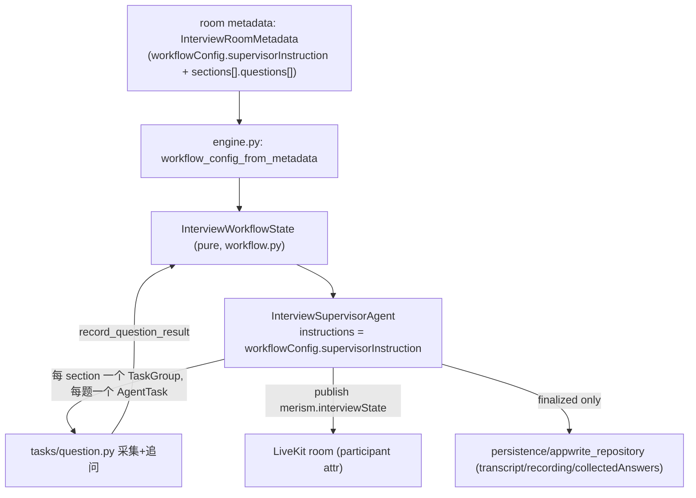

# Design — ai-interview-engine

> 对应 Spec `ai-interview-engine`。纯治理:把既有引擎的契约与边界写成可回归规格,不改代码。

## A. 运行时数据流(全部已存在)

## B. 治理结论(契约,不改实现)

- **B1 纯/副作用分层**:`workflow.py` 纯(无 livekit/appwrite/os 导入),持有 correctness;`engine.py`/`supervisor.py` 做 I/O 并把每次迁移委托 `advance_to`/`record_question_result`/`is_complete`。**新增任何状态语义必须落在 workflow.py 并配单测/属性测**,不得在 supervisor 里就地改 state(`apps/agent/AGENTS.md`)。
- **B2 主持指令注入点**:`supervisor.py::InterviewSupervisorAgent.__init__` 的 `instructions=state.workflowConfig.supervisorInstruction` 是唯一注入点。survey-editor 的 `Survey.moderatorInstruction` 已在 TS 侧经 `buildInterviewWorkflowConfigFromDraft` 合成进该串——**agent 端无需改动**即自动消费(persona + 操作性默认)。问题与指令是 `workflowConfig` 的两个分开字段,同包到达。
- **B3 realtime↔persistence 边界**:见 requirements R5。本设计锁定:`merism.interviewState` attribute + RPC + room metadata 承载实时;`appwrite_repository` 只接 finalized、append-only。
- **B4 provider 边界**:provider 适配器实现各自窄接口;换 provider = 写新适配器,不改调用点;失败分 `TransientProviderError`/`PermanentProviderError` 交 `with_retry`。
- **B5 懒导入**:`agent/interview/*` 顶层不得 import livekit;`create_supervisor_agent_class()` 内懒导入,保证 foundation 测试无 realtime extra 可跑。

## C. 测试设计(四层)

| 层 | 现状 |
|---|---|
| 单元/属性(纯 workflow、镜像往返) | 已有:test_workflow / test_contracts |
| 集成(fake repo / fake livekit) | 已有:test_transcript_persistence / test_recording_persistence / test_providers |
| **live 语音端到端** | **缺**:真 LiveKit + `MERISM_FAKE_PROVIDERS=1` deterministic fake + `MERISM_LIVE_TESTS=1`,跑通 join→分节→逐题→追问→完成→finalize。见 tasks 收口债。 |

## D. 关键决策

- **D1 纯治理**:无新代码;把 ADR-0001 的引擎实现 + 边界写成可回归规格。
- **D2 覆盖度由 AI 动态决定,不做声明式 skip**:Supervisor 依据 supervisorInstruction + 对话进展自行决定追问与跳过,`skipLogic` 死桶不消费(产品决策)。
- **D3 不分叉访谈分类**:abandoned/off-topic 等用既有 `SessionState`/`SessionQualityFlag`,不新增 classifications 字段(由 analyzeSession 在分析侧产出,非引擎)。
