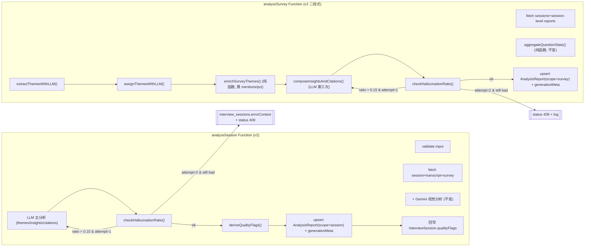

# Design Document — analysis-report-v2

> Prerequisite：`foundation-setup/design.md §Components and Interfaces` 与 §Data Models；`analysis-report/design.md`（已落地的 analyzeSession/analyzeSurvey 双 Function、AnalysisReport collection、`/reports/[surveyId]` RSC 渲染、Morris `analyzeData` 工具）；`docs/adr/0003-analysis-report-architecture.md`。借鉴来源 `/home/jia/posthog/ee/hogai/session_summaries/` 与 `/home/jia/posthog/products/user_interviews/backend/classification.py`，仅作参考实现，**不作为运行时依赖**。

本设计对应 Spec **analysis-report-v2**：在不破坏现有渲染、Morris 工具、ADR-0003 结论的前提下，把分析管线在三个维度加固：质量分类 / 抗幻觉 / 二段式聚合。

## 1. Overview

落点全部在 `apps/functions/analyzeSession/` 与 `apps/functions/analyzeSurvey/`，外加 `packages/contracts` 与 `packages/appwrite-schema` 的契约升级。整体形状：



非目标（与 requirements 排除清单一致）：不引入 chunk + combination 三段式；不改 `/reports/[surveyId]` 渲染；不改 Morris `analyzeData`；不引入 auto-sweep；不动视觉分析层；不重新生成历史报告。

## 2. 借鉴来源对照表（hogai → MerismV2 analysis-report-v2）

| hogai 概念 | hogai 关键文件 | 我们的对应物 | 落地形态 |
|---|---|---|---|
| `HALLUCINATED_EVENTS_MIN_RATIO = 0.15` 整次 reject | `ee/hogai/session_summaries/constants.py` + `llm/consume.py` | `HALLUCINATION_RATIO_THRESHOLD = 0.15` | `apps/functions/<name>/src/constants.ts` + `hallucination.ts` |
| 二段式 (extraction → assignment) + 三段式 combination | `session_summaries/session_group/summarize_session_group.py` | extraction + assignment + composeInsights 三步 LLM | `apps/functions/analyzeSurvey/src/rollup.ts` |
| `EnrichedSessionGroupSummaryPattern.stats` 由代码算 | `session_summaries/session_group/patterns.py::enrich_*` | `enrichSurveyThemes(...)` 纯函数 | `apps/functions/analyzeSurvey/src/rollup.ts` |
| `UserInterview.classifications` (规则 + LLM) | `products/user_interviews/backend/classification.py::derive_auto_classifications` | `qualityFlags` 推导 (规则 mechanical + LLM 语义) | `apps/functions/analyzeSession/src/quality-flags.ts` |
| `SessionSummaryRunMeta` 记录每次运行的 model + token + retry | `posthog/temporal/session_replay/session_summary_group/activities/group_patterns.py` | `generationMeta: { promptVersion, attemptCount, hallucinationRatio, createdWith[] }` | contracts + analysis_reports.generationMeta JSON |
| YAML 输出 + Pydantic 校验 + 失败 ExceptionToRetry | `session_summaries/llm/consume.py` | DeepSeek JSON Schema + zod 校验 + `MaxRetryError` 自重试 | 不变（沿用现有约定，DeepSeek 端走 JSON 更稳） |

## 3. 模块边界与文件清单

```
packages/contracts/src/
├── entities.ts             # 改: InterviewSessionSchema 加 qualityFlags;
│                           #     新增 SessionQualityFlagSchema 枚举与 superRefine 互斥规则
├── api.ts                  # 改: AnalysisReportOutputSchema / SurveyAnalysisReportOutputSchema 加 generationMeta?;
│                           #     新增 GenerationMetaSchema; 私有 ExtractedThemesListSchema / ThemeAssignmentListSchema (不 export)

packages/appwrite-schema/src/
└── schema.ts               # 改: interview_sessions 加 qualityFlags 数组 + by_quality 索引;
                            #     analysis_reports 加 generationMeta string(JSON_SIZE)

apps/functions/analyzeSession/src/
├── handler.ts              # 改: 编排 LLM → hallucination 校验 → quality flags 推导 → 双写
├── hallucination.ts        # 新: checkHallucinationRatio() 纯函数
├── quality-flags.ts        # 新: deriveQualityFlags() (规则 + 调用 LLM 的混合策略)
├── constants.ts            # 新: HALLUCINATION_RATIO_THRESHOLD / SILENT_DURATION_MS / SHORT_TURN_COUNT 等
├── prompts/
│   ├── session-analyze.ts  # 不变
│   ├── quality-flags.ts    # 新: LLM 推导 qualityFlags 的 prompt + zod 输出 schema
│   ├── visual-*.ts         # 不变 (Gemini 视觉分析)
│   └── version.ts          # 新: PROMPT_VERSION = "session.v2.0"
├── deps.ts                 # 改: 新增 Deps 入口 deriveQualityFlagsWithLLM (mock 注入用)
└── tests/
    ├── handler.test.ts     # 改: 加 hallucination + quality-flags 路径
    ├── hallucination.test.ts  # 新
    ├── quality-flags.test.ts  # 新
    └── ...

apps/functions/analyzeSurvey/src/
├── handler.ts              # 改: 编排 aggregate → extract → assign → enrich → compose → hallucination → upsert
├── rollup.ts               # 新: extractThemesWithLLM / assignThemesWithLLM / enrichSurveyThemes / composeInsightsAndCitations
├── hallucination.ts        # 新: 同 analyzeSession 同款,共享逻辑
├── constants.ts            # 新
├── prompts/
│   ├── theme-extraction.ts # 新: 第一阶段 prompt
│   ├── theme-assignment.ts # 新: 第二阶段 prompt
│   ├── compose-insights.ts # 新: 第三阶段 prompt (整合 insights/citations/topics/sentiment/perQuestion summary)
│   ├── survey-rollup.ts    # 删: 旧的单段 prompt (二段式覆盖) — 保留作为 git history reference, 物理删除
│   └── version.ts          # 新: PROMPT_VERSION = "survey.v2.0"
└── tests/
    ├── handler.test.ts     # 改
    ├── rollup.test.ts      # 新
    ├── hallucination.test.ts # 新 (与 analyzeSession 镜像)
    └── ...

tests/properties/analysis-report-v2/
├── p-anl-05-stored-no-hallucination.test.ts
├── p-anl-06-quality-flags-mutex.test.ts
└── p-anl-07-rollup-mentions-pct.test.ts
```

跨 packages 边界检查：本 Spec 只动 contracts、appwrite-schema、两个 Function。不动 web 层、Morris 工具、LiveKit Agent、observability。

## 4. 契约改动（contracts-first）

### 4.1 SessionQualityFlag

```ts
// packages/contracts/src/entities.ts
export const SessionQualityFlagSchema = z.enum([
  // mechanical (rule-derived)
  "silent",          // 受访者一句没说 (与 abandoned state 对偶但更细)
  "too-short",       // 总发言 < 阈值
  "too-long",        // 总发言异常超长 (可能闲聊)
  // semantic (LLM-derived)
  "off-topic",       // 答非所问 / 偏离主题
  "shallow",         // 浮于表面 / 没深度
  "fluent",          // 表达清晰、信息密度高
  "deep-engagement", // 真情流露、给出可操作洞察
  "refused-topic",   // 明确拒绝深入某话题
]);

export const InterviewSessionSchema = z.object({
  // ... 现有 9 字段 ...
  qualityFlags: z.array(SessionQualityFlagSchema).default([]),
}).superRefine((session, ctx) => {
  const flags = new Set(session.qualityFlags);
  // 互斥规则 (P-ANL-06)
  const mutexPairs: Array<[string, string]> = [
    ["silent", "fluent"],
    ["silent", "deep-engagement"],
    ["too-short", "deep-engagement"],
    ["fluent", "shallow"],
  ];
  for (const [a, b] of mutexPairs) {
    if (flags.has(a) && flags.has(b)) {
      ctx.addIssue({ code: "custom", message: `qualityFlags conflict: ${a} 与 ${b} 互斥` });
    }
  }
});
```

`superRefine` 把互斥规则做成**入库前的硬约束**——LLM 输出违反规则不会过 schema，直接被推导层（§3.3）按"规则优先"剔除冲突项。

### 4.2 GenerationMeta

```ts
// packages/contracts/src/api.ts
export const GenerationMetaSchema = z.object({
  promptVersion: z.string(),                 // e.g. "session.v2.0"
  attemptCount: z.number().int().nonnegative(),
  hallucinationRatio: z.number().min(0).max(1),
  createdWith: z.array(z.object({
    stage: z.string(),                        // "extract" / "assign" / "compose" / "session-main" / "quality-flags"
    model: z.string(),                        // "deepseek-chat" / "gemini-3-flash" 等
    inputTokens: z.number().int().nonnegative().optional(),
    outputTokens: z.number().int().nonnegative().optional(),
  })),
}).passthrough();

export const AnalysisReportOutputSchema = z.object({
  // ... 现有字段 ...
  generationMeta: GenerationMetaSchema.optional(),  // 历史记录无此字段, optional 兼容
});
export const SurveyAnalysisReportOutputSchema = z.object({
  // ... 现有字段 ...
  generationMeta: GenerationMetaSchema.optional(),
});
```

`.passthrough()` 让未来扩展键不破坏老消费者。

### 4.3 私有中间态（Function 本地，不上 contracts）

中间态 schema 不进 `packages/contracts` —— 它们不持久化、不出 Function、不跨模块。直接在 `apps/functions/analyzeSurvey/src/rollup.ts` 本地定义：

```ts
// apps/functions/analyzeSurvey/src/rollup.ts (本地, 不 export 出 Function)
import { z } from "zod";

const SegmentRefSchema = z.object({
  transcriptId: z.string(),
  segmentIndex: z.number().int().nonnegative(),
});

export const ExtractedThemeSchema = z.object({
  id: z.string(),
  label: z.string().min(1),
  description: z.string(),
  severity: z.enum(["low", "medium", "high"]).optional(),
  indicators: z.array(z.string()).optional(),
});
export const ExtractedThemesListSchema = z.object({
  themes: z.array(ExtractedThemeSchema),
});

export const ThemeAssignmentSchema = z.object({
  themeId: z.string(),
  sessionIds: z.array(z.string()),
  evidenceRefs: z.array(SegmentRefSchema),
});
export const ThemeAssignmentListSchema = z.object({
  assignments: z.array(ThemeAssignmentSchema),
});

export type ExtractedTheme = z.infer<typeof ExtractedThemeSchema>;
export type ExtractedThemes = z.infer<typeof ExtractedThemesListSchema>;
export type ThemeAssignment = z.infer<typeof ThemeAssignmentSchema>;
export type ThemeAssignments = z.infer<typeof ThemeAssignmentListSchema>;
```

`SegmentRefSchema` 在两处定义有点冗余但成本极低（4 行），换来的是中间态完全私有于 Function——避免在 contracts 引入"半私有"概念，`packages/contracts` 保持只暴露跨模块契约的纯净状态（D14）。

## 5. qualityFlags 推导（R1）

### 5.1 推导策略：规则优先 + LLM 兜底

```
Input:
  transcript: Transcript
  collectedAnswers: collectedAnswers
  surveyContext: SurveyContext

Step 1 — 规则层 (mechanical, 不调 LLM):
  ruleFlags = []
  if respondent_segments.length === 0:           ruleFlags.push("silent")
  if respondent_total_text_chars < 200:          ruleFlags.push("too-short")
  if total_duration_ms > 60 * 60_000:            ruleFlags.push("too-long")
  return ruleFlags

Step 2 — LLM 层 (semantic, 仅当规则层未给出 silent/too-short 时):
  if "silent" in ruleFlags or "too-short" in ruleFlags:
    return ruleFlags  // 已经判定无内容,LLM 跑也无意义,跳过
  llmFlags = await deriveQualityFlagsWithLLM(transcript, surveyContext)
  // llmFlags ⊆ {"off-topic", "shallow", "fluent", "deep-engagement", "refused-topic"}

Step 3 — 合并 + 互斥剔除:
  combined = unique([...ruleFlags, ...llmFlags])
  // 用 P-ANL-06 互斥表迭代剔除: 规则优先 (mechanical 比 semantic 更可信)
  finalFlags = enforceMutex(combined, MUTEX_RULES)
  return finalFlags
```

### 5.2 LLM prompt 形态（精简）

```
SYSTEM:
你是定性研究质量评估助手。给一段访谈 transcript 与题目列表, 你判断这场访谈在内容质量
维度的标签。输出 JSON, 字段为 flags: string[], 取值集合: ["off-topic", "shallow",
"fluent", "deep-engagement", "refused-topic"]. 规则:
- 受访者答非所问 / 大段闲聊 → off-topic
- 受访者答得短、表层、缺细节 → shallow
- 受访者表达清晰、信息密度高 → fluent
- 受访者真情流露 / 给出可操作建议 → deep-engagement
- 受访者明确拒绝深入某话题 → refused-topic
- 同一访谈可有多个标签 (例如 fluent + refused-topic), 但下列对不允许同时出现:
  fluent ∩ shallow / silent ∩ fluent / silent ∩ deep-engagement / too-short ∩ deep-engagement

USER:
调研主题: {{ surveyTitle }}
关键题目:
{{ questions }}

Transcript:
{{ transcript }}

请输出 JSON: { "flags": [...] }
```

LLM 走 DeepSeek `deepseek-chat` (温度 0.2)，输出经 zod schema 校验。失败则返回空 `[]`，回到规则层结果。

### 5.3 互斥规则强制

```ts
const MUTEX_RULES: Array<[SessionQualityFlag, SessionQualityFlag]> = [
  ["silent", "fluent"], ["silent", "deep-engagement"],
  ["too-short", "deep-engagement"], ["fluent", "shallow"],
];

function enforceMutex(flags: SessionQualityFlag[], rules: typeof MUTEX_RULES): SessionQualityFlag[] {
  const set = new Set(flags);
  for (const [a, b] of rules) {
    if (set.has(a) && set.has(b)) {
      // 规则优先: a (mechanical) 留, b (LLM) 删
      // 当两者都属同层级时, 按数组顺序保留前者
      set.delete(b);
    }
  }
  return Array.from(set);
}
```

### 5.4 双写策略

```ts
// handler.ts (片段)
const finalFlags = await deriveQualityFlags(transcript, surveyContext);

await deps.upsertAnalysisReport({ ...reportBody, generationMeta });
try {
  await deps.updateInterviewSessionFlags(sessionId, finalFlags);
} catch (err) {
  // best-effort: AnalysisReport 已落, qualityFlags 双写失败仅 log warn,
  // 不让分析报告失败. 后续 sweep (留给独立 sub-spec) 可补救.
  logger.warn("quality_flags_writeback_failed", { sessionId, err: String(err) });
}
```

理由（D6）：Appwrite 没有跨 collection 事务；让 AnalysisReport 的成功不被 InterviewSession 单字段更新失败拖垮，更符合"finalized artifacts" 的最终一致性原则。

## 6. 抗幻觉校验（R3）

### 6.1 纯函数

```ts
// apps/functions/<name>/src/hallucination.ts
export interface HallucinationCheckResult {
  ratio: number;
  ok: boolean;
  totalRefs: number;
  badRefs: Array<{ transcriptId: string; segmentIndex: number }>;
}

export function checkHallucinationRatio(args: {
  themes: AnalysisReportOutput["themes"];
  citations: AnalysisReportOutput["citations"];
  validRefs: Set<string>;            // "transcriptId#segmentIndex" 规范化字符串
  threshold: number;                 // default 0.15
}): HallucinationCheckResult;
```

`validRefs` 由 handler 在调 LLM 之前从 `transcript.segments` 算出（`new Set(segments.map((_, i) => \`${transcriptId}#${i}\`))`）。`badRefs` 限在前 10 条记录到 `interview_sessions.errorContext.badRefs: Array<{transcriptId: string; segmentIndex: number}>`，避免巨大错误对象撑爆 JSON 字段。

### 6.2 编排：reject + retry once

```ts
// analyzeSession handler 片段
let attemptCount = 0;
let llmResult: AnalysisReportRaw;
let hallucinationCheck: HallucinationCheckResult;
const validRefs = computeValidRefs(transcript);

for (attemptCount = 1; attemptCount <= 2; attemptCount++) {
  const promptVariant = attemptCount === 1
    ? buildSessionAnalyzeUserPrompt(input)
    : buildSessionAnalyzeUserPromptWithHallucinationHint(input, hallucinationCheck!.badRefs);
  llmResult = await deps.analyzeWithLLM(promptVariant);
  hallucinationCheck = checkHallucinationRatio({
    themes: llmResult.themes,
    citations: llmResult.citations,
    validRefs,
    threshold: HALLUCINATION_RATIO_THRESHOLD,
  });
  if (hallucinationCheck.ok) break;
  logger.warn("hallucination_threshold_exceeded", { attemptCount, ratio: hallucinationCheck.ratio });
}

if (!hallucinationCheck!.ok) {
  // R3.4: reject without writing
  await deps.updateSessionErrorContext(sessionId, {
    reason: "hallucination_threshold_exceeded",
    ratio: hallucinationCheck.ratio,
    attemptCount,
    badRefs: hallucinationCheck.badRefs.slice(0, 10),
    promptVersion: PROMPT_VERSION,
  });
  return { status: 409, body: { error: "analysis_rejected", reason: "hallucination_threshold_exceeded" } };
}

// 落库 + qualityFlags 双写。generationMeta.hallucinationRatio 写入"通过那次"
// 的 ratio (不是 max, 不是 last) — 用 hallucinationCheck.ratio 即可, 因为 break
// 之前已经把通过那次的结果写到了循环外的 hallucinationCheck 变量。
```

### 6.3 重试 prompt 的"幻觉提示"

第二次调用时的 prompt 在原 user message 顶部前置一段反思（system prompt 不动，保 prompt cache）：

```
你上一次输出的下列 segmentRef 不存在于 transcript 中, 这是不可接受的:
{{ bad_refs_list }}

请重新输出。规则:
- **替换**, 不要删除: 把 bad refs 替换为 transcript 中真实存在的 (transcriptId, segmentIndex) 二元组。
- 每个 theme 必须保留 ≥ 1 条 valid evidence (P-ANL-01 要求, schema `.min(1)`)。
- 若某 theme 找不到任何 valid refs 可用, 该 theme **整体丢弃**, 而不是返回 0 个 evidence。
- 其余规则(citations.quote 必须逐字, themeIds 必须存在, 等等)保持不变。
```

为什么不直接"删 bad refs": `themes[].evidence: z.array(...).min(1)` 强约束让"只保留 valid 一半"在边界情况下违反 schema (e.g. 一个 theme 只有 1 条 evidence 且为 bad)。"替换 + 丢零 evidence theme" 二选一的语义把这个边界封死。

### 6.4 analyzeSurvey 的 validRefs

```ts
// validRefs 来自 sessionReports 的并集
const validRefs = new Set<string>();
for (const report of sessionLevelReports) {
  for (const c of report.citations) {
    validRefs.add(`${c.segmentRef.transcriptId}#${c.segmentRef.segmentIndex}`);
  }
  for (const t of report.themes) {
    for (const e of t.evidence) {
      validRefs.add(`${e.transcriptId}#${e.segmentIndex}`);
    }
  }
}
// 含义: survey 级报告引用的任何 segmentRef 必须在已落库的 session 级报告中出现过,
// 即 survey 不能凭空"造"出 session 没有的引用.
```

### 6.5 阈值常量

```ts
// constants.ts
export const HALLUCINATION_RATIO_THRESHOLD = 0.15;  // 与 hogai 同款起点; 上线后调
export const SESSION_QUALITY_FLAG_LLM_TEMPERATURE = 0.2;
export const ROLLUP_LLM_TEMPERATURE = 0.3;
export const SILENT_RESPONDENT_MIN_CHARS = 50;
export const TOO_SHORT_RESPONDENT_MAX_CHARS = 200;
export const TOO_LONG_DURATION_MS = 60 * 60_000;     // 60 minutes
```

## 7. analyzeSurvey 二段式 rollup（R4）

### 7.1 三步 LLM 编排

```
fetchSessions → aggregateQuestionStats() (纯函数, 现有)
  ↓
extractThemesWithLLM(sessionReports)         # LLM #1: 找共性 themes, 不带归属
  → ExtractedThemesList { themes: [{id, label, description, severity?, indicators?}] }
  ↓
assignThemesWithLLM(themes, sessionReports)  # LLM #2: 对每条 session 决定归属
  → ThemeAssignmentList { assignments: [{themeId, sessionIds[], evidenceRefs[]}] }
  ↓
enrichSurveyThemes(themes, assignments, totalSessions)  # 纯函数, 算 mentions/pct
  → SurveyThemeBlock[] (最终落库形态)
  ↓
composeInsightsAndCitations(enrichedThemes, sessionReports)  # LLM #3
  → { insights, citations, topics, sentimentBreakdown, perQuestion summary }
  ↓
checkHallucinationRatio() (R3)
  ↓
upsert AnalysisReport(scope=survey) + generationMeta
```

### 7.2 enrichSurveyThemes 纯函数

`SurveyThemeSchema` 的实际字段是 `{ id, label, mentions, pct, sentiment }` — **不含 description / evidenceRefs**(它们是 LLM 中间产物, 不进落库)。所以 `enrichSurveyThemes` 输出**两个东西**: 一个准落库的 `themes`(缺 sentiment, 由后续 compose 阶段填), 一个 Function 内存的 `themeContexts`(给 compose 阶段做上下文用)。

```ts
import type { SurveyTheme } from "@merism/contracts";

/** Function 内存的中间态, 仅给 compose 阶段使用; 不出 Function */
export interface ThemeContext {
  id: string;
  label: string;
  description: string;
  evidenceRefs: { transcriptId: string; segmentIndex: number }[];
}

/** Pre-sentiment 形态; sentiment 由 compose 阶段 LLM 推导后回填 */
export type SurveyThemePreSentiment = Omit<SurveyTheme, "sentiment">;

export interface EnrichedRollupThemes {
  themes: SurveyThemePreSentiment[];   // 落库形态(缺 sentiment, compose 阶段补)
  themeContexts: ThemeContext[];        // Function 内存, 喂 compose 用
}

export function enrichSurveyThemes(
  themes: ExtractedTheme[],
  assignments: ThemeAssignment[],
  totalSessions: number,
): EnrichedRollupThemes {
  const byThemeId = new Map(assignments.map(a => [a.themeId, a]));

  const blocks = themes
    .map(t => {
      const a = byThemeId.get(t.id);
      const sessionIds = a?.sessionIds ?? [];
      const evidenceRefs = a?.evidenceRefs ?? [];
      const mentions = sessionIds.length;
      const pct = totalSessions > 0
        ? Math.min(100, Math.round((mentions / totalSessions) * 10_000) / 100)
        : 0;
      return {
        id: t.id,
        label: t.label,
        description: t.description,
        mentions,
        pct,
        evidenceRefs,
      };
    })
    .filter(b => b.mentions > 0);

  // P-ANL-04 守护: 总和 > 1.0 时按 mentions 降序 normalize
  const totalShare = blocks.reduce((s, b) => s + b.pct / 100, 0);
  if (totalShare > 1.0 + 1e-6) {
    const factor = 1.0 / totalShare;
    blocks.sort((a, b) => b.mentions - a.mentions);
    for (const b of blocks) {
      b.pct = Math.round(b.pct * factor * 100) / 100;
    }
  }

  return {
    themes: blocks.map(b => ({ id: b.id, label: b.label, mentions: b.mentions, pct: b.pct })),
    themeContexts: blocks.map(b => ({
      id: b.id,
      label: b.label,
      description: b.description,
      evidenceRefs: b.evidenceRefs,
    })),
  };
}
```

`enrichSurveyThemes` 没有任何随机性、没有 LLM 调用——P-ANL-07 在这一层就被锁死。

`composeInsightsAndCitations` 在拿到 `{themes, themeContexts}` 后, 根据 themeContexts 把 sentiment 推导回每个 theme, 形成最终落库的完整 `SurveyTheme` 数组。

### 7.3 三个 LLM 阶段 prompt 分工

| 阶段 | Input | Output | 关键约束 |
|---|---|---|---|
| extract | N 份 session-level themes/insights/citations 摘要 | `themes: [{id, label, description, severity?, indicators?}]` | 不带 session 归属;每个 theme 必须在至少一个 session 描述中能找到对应概念 |
| assign | extract 输出的 themes + N 份 session-level reports | `assignments: [{themeId, sessionIds[], evidenceRefs[]}]` | evidenceRefs 必须来自 session-level reports 已有的 segmentRef 集合 (R3 在此处生效) |
| compose | `{themes, themeContexts}` (来自 enrichSurveyThemes) + sessionReports + questionStats | `insights/citations/topics/sentimentBreakdown/perQuestionSummary` + `themeSentiments: Record<themeId, "positive"\|"neutral"\|"negative">` | citations.themeIds 必须指向 themes 中存在的 id;themeSentiments 用于回填到落库 SurveyTheme.sentiment 字段, 与 sentimentBreakdown 同源(逻辑一致) |

### 7.4 失败容忍

- 任一阶段 LLM 调用失败 → 该阶段重试一次（与 R3 机制对齐）；两次都失败 → 整次 rollup 失败，不写部分数据。
- extract 阶段 themes 数 = 0 → 不算失败,走到 assign（assignments 为空）→ enrich 输出空数组 → compose 走"无 themes"路径生成只含 insights/topics 的报告。
- compose 阶段 hallucination 超阈值 → 走 R3 重试；通过则落库。

### 7.5 与渲染层零改动

`SurveyAnalysisReportOutputSchema.themes` 字段结构在二段式后**完全不变**（仍是 `[{ id, label, mentions, pct, sentiment }]` —— 跟现有 contracts 一致, 见 §C1 复审修订）。`/reports/[surveyId]/page.tsx`、`<FindingsSection>`、Morris `analyzeData` 工具都不需要改一行。所有改动只在 Function 内部，对外契约稳定。

## 8. 关键决策

- **D1 qualityFlags 与 SessionState 正交并存**：`SessionState` 仍是系统流程状态（created / in_progress / completed / abandoned / failed），`qualityFlags` 是 AI 推导的内容质量标签。研究员看一场访谈，可以同时是 `state="completed"` 且 `qualityFlags=["off-topic", "shallow"]`。理由：流程状态由 supervisor 推动（确定性），内容质量由 LLM 判定（概率性），二者来源不同且语义不同，强行合并会丢信息。
- **D2 落库形态不变**：`SurveyAnalysisReportOutputSchema.themes` / `insights` / `citations` 等字段结构二段式后**与单段式完全等价**。理由：渲染层零改动 + Morris `analyzeData` 零改动 + 历史数据零迁移；所有改动只在 Function 内部。
- **D3 hallucination 阈值 = 0.15**：与 hogai 同款起点（`HALLUCINATED_EVENTS_MIN_RATIO`），上线后用线上数据调优。理由：低于此值的引用错误属于"模型偶发笔误"，可接受；超过就说明模型在编故事，必须 reject。
- **D4 reject 不写脏 = retry 一次后仍超直接 fail**：不允许"凑合落库"。理由：研究员对 AnalysisReport 的信任假设是"引用都真实"；一旦破坏一次，整个产品的可信度就崩了。失败比错误数据可接受得多。
- **D5 二段式中间态对所有消费者私有**：`ExtractedThemesListSchema` / `ThemeAssignmentListSchema` / `ThemeContext` / `EnrichedRollupThemes` 等中间态只在 `apps/functions/analyzeSurvey/src/rollup.ts` 本地存在(实现细节见 D14),不出 Function。理由：它们是 LLM 调用的中间产物,不该出现在 Web / Morris / Agent 任何地方;最终对外形态只有 `SurveyAnalysisReportOutputSchema` 一种。
- **D6 qualityFlags 双写 best-effort**：AnalysisReport 落库成功后，`InterviewSession.qualityFlags` 单字段更新失败仅 log warn，不让分析报告失败。理由：Appwrite 没有跨 collection 事务；让 finalized AnalysisReport 不被次要双写拖垮，符合"最终一致性 + 后续可补救"原则。
- **D7 promptVersion 硬编码字符串**：`"session.v2.0"` / `"survey.v2.0"` 在各 Function 的 `prompts/version.ts` 中硬编码，prompt 改了必须 bump。理由：版本字符串本身是 Function 的源代码，git history 自动记录变更；不引入 DB 表 / config 服务这种外部状态源。
- **D8 (撤销, 见 D15) 不引入 chunk + combination 三段式**：~~hogai 第三阶段是为应对 N >> chunk_size（10）的情况，我们当前 N 远小于此。YAGNI~~。**已撤销**：实践证明研究员一个 study 收 15-30 个访谈是常态，单次 prompt 拼所有 session-level reports 在 N=15 时就接近 DeepSeek 上下文窗口上限并显著降低 LLM 在 theme 抽取阶段的精度。新决策见 D15。
- **D9 LLM 输出仍走 JSON Schema（不走 YAML）**：DeepSeek 对 JSON Schema 的支持稳定（`response_format: { type: "json_schema" }`），与 hogai 选 YAML 是因为他们用 OpenAI Responses API + o3 不同。理由：栈差异；JSON Schema 在我们这里足以用 zod 校验。
- **D10 推导 qualityFlags 的 LLM 在 silent / too-short 时不调**：规则层判定无内容时，LLM 调用即跳过。理由：节省 token + 避免对空内容做出无意义的 semantic 判断。
- **D11 重试 prompt 只前置 hint，不重写 system**：第二次 LLM 调用时 user message 顶部前置一段反思（"上次输出的下列 segmentRef 不存在"），system prompt 不动。理由：保持 prompt cache 命中（与 morris-agent-hardening D13 一致），避免每次重试都重新计费完整 system 段。
- **D12 历史数据不回填**：v1 路径已存的 AnalysisReport 不被本机制反向作废，不强制重跑。理由：本 Spec 边界控制；回填属于 `analysis-report-sweep` 子 spec 范围，独立做。
- **D13 错误上下文最多 10 条 badRefs**：`InterviewSession.errorContext.badRefs` 切片到前 10 个，不存全量。理由：JSON 字段大小有上限；前 10 条足够定位问题，后续看完整上下文可看 Function 服务端日志。
- **D14 二段式中间态本地定义，不上 contracts**：`ExtractedThemesListSchema` / `ThemeAssignmentListSchema` 与对应类型直接在 `apps/functions/analyzeSurvey/src/rollup.ts` 里定义,**不进 packages/contracts**。理由：它们不持久化、不出 Function、不跨模块;放 contracts 引入"半私有"概念会污染 contracts 作为"跨模块边界"的纯净语义。代价是 `SegmentRefSchema` 的 4 行重复定义,可接受。
- **D15 chunk + combination 三段式（撤销 D8）**：当 `sessionReports.length > EXTRACTION_CHUNK_THRESHOLD` 时启用 hogai 风格的"分块抽取 → LLM 合并 → 分块分派 → 代码聚合"三段式；阈值与 chunk 大小取 `EXTRACTION_CHUNK_THRESHOLD = 10`、`EXTRACTION_CHUNK_SIZE = 10`、`ASSIGNMENT_CHUNK_SIZE = 10`（与 hogai `PATTERNS_ASSIGNMENT_CHUNK_SIZE` 一致）。落地形态：
  - `chunkSessionReports(reports, size)` 纯函数，最后一 chunk 可不满；
  - `extract` 阶段并行跑 `chunks.map(extractThemesWithLLM)`，得 `ExtractedThemes[]`；
  - **新增** `combineThemesWithLLM(rawList) → ExtractedThemes` 把多份去重合并（system prompt 内嵌 hogai `prompt_consolidation_instructions` 同款"feature area / root cause / 2+ indicators 重叠"判定规则）；
  - `assign` 阶段并行跑 `assignChunks.map(assignThemesWithLLM)`，得 `ThemeAssignments[]`；
  - **新增** `mergeThemeAssignments(...)` 纯函数：按 themeId 合并 sessionIds（dedupe）+ 合并 evidenceRefs（dedupe by `transcriptId#segmentIndex`）；
  - `enrichSurveyThemes` 与 `compose` 不变。
  
  N ≤ THRESHOLD 时保持 v2 单次路径不变（不引入 combination LLM call，省一次成本）。理由：阈值以下两路径产出语义等价（P-ANL-08 性质验证），不必为小样本付出额外 token；阈值以上的 chunked 路径解决"上下文窗口 + LLM 精度"双瓶颈，这是 hogai 走过验证有效的形态。代价：多 1 次 combination LLM call + 代码复杂度增加约 100 行；通过 PBT P-ANL-08 锁定与单段式的等价性。

## 9. Correctness Properties（PBT）

- **P-ANL-05** `tests/properties/analysis-report-v2/p-anl-05-stored-no-hallucination.test.ts`：fast-check 生成随机 transcript（含已知 segmentIndex 集合）+ mock LLM 输出（含部分故意错误 segmentRef），断言：
  - 当生成路径的最终输出落库（即 hallucination 校验通过）时，所有 `themes[].evidence[]` 与 `citations[].segmentRef` 必能在 transcript.segments 中找到。
  - 当 mock LLM 持续输出含错误的引用（两次 attempt 均失败）时，handler 返回 `409 analysis_rejected`，且 `analysis_reports` 集合内**没有该 sessionId 的新文档插入**（用内存 deps 验证）。
  - mock 双 attempt 实现: `vi.fn().mockResolvedValueOnce(badResultA).mockResolvedValueOnce(badResultB)` 制造两次都超阈值; `mockResolvedValueOnce(badA).mockResolvedValueOnce(goodB)` 制造"第一次过不了, 第二次通过"路径; `mockResolvedValueOnce(goodA)` 制造"第一次就通过"路径。三种路径都覆盖。
- **P-ANL-06** `tests/properties/analysis-report-v2/p-anl-06-quality-flags-mutex.test.ts`：fast-check 生成随机 `transcript+collectedAnswers`，让 `deriveQualityFlags()` 推导任意 flag 组合，断言：
  - 输出永不同时含 mutex 表中的对（silent×fluent / silent×deep-engagement / too-short×deep-engagement / fluent×shallow）。
  - mechanical flags（silent / too-short / too-long）一旦命中，semantic flags 中冲突项必被剔除。
  - `InterviewSessionSchema.parse({ ..., qualityFlags: 输出 })` 必通过。
- **P-ANL-07** `tests/properties/analysis-report-v2/p-anl-07-rollup-mentions-pct.test.ts`：fast-check 生成随机 `(themes, assignments, totalSessions)`，断言：
  - `enrichSurveyThemes(...).map(b => b.mentions)` 与 `assignments[i].sessionIds.length` 严格一致。
  - 每条 theme 的 `pct = round(mentions / totalSessions × 100, 2)`，范围 `[0, 100]`。
  - 总和 `sum(pct/100) ≤ 1.0 + 1e-6`（P-ANL-04 兼容性）。
  - `mentions === 0` 的 theme 必从输出中被过滤掉。

普通单测（非 PBT）：

- `apps/functions/analyzeSession/tests/quality-flags.test.ts`：覆盖 silent / too-short / fluent / deep-engagement / off-topic / shallow / refused-topic 共 7 类典型样本。
- `apps/functions/analyzeSession/tests/hallucination.test.ts`：ratio 计算 + reject + retry + 第二次仍超的全路径。
- `apps/functions/analyzeSurvey/tests/rollup.test.ts`：三步 LLM mock 接通 + enrichSurveyThemes 与单段式 mock 输出在 schema 字段集等价。
- `apps/functions/analyzeSurvey/tests/handler.test.ts`：编排 fail-fast + 部分阶段失败时不写部分数据。

端到端（轻）：本地 stack 上 `pnpm schema:apply` + 触发 analyzeSession 与 analyzeSurvey，校验 `interview_sessions.qualityFlags` 与 `analysis_reports.generationMeta` 真实落库且字段完整。

## 10. 实施顺序

按"契约 → schema → Function → 测试" 分波次：

```
A 契约 (contracts-first)  ─┬─→  B Schema (新字段 + 索引)
                            ↓
                            C analyzeSession 加固 (qualityFlags + hallucination + generationMeta)
                            ↓
                            D analyzeSurvey 二段式 (extract + assign + enrich + compose + hallucination)
                            ↓
                            E 验证 + PBT (P-ANL-05/06/07)
                            ↓
                            F chunk + combination 三段式 (D15) — N>10 启用 + P-ANL-08
```

详见 `tasks.md`。每个波次完成后跑 `pnpm typecheck && pnpm test && pnpm test:properties` 三件套，全绿才入下一波。

## 11. Wave F: chunk + combination 三段式（D15 落地）

撤销 D8 后新增的实施波次。在 Wave D 二段式之上，根据 `sessionReports.length` 阈值分支：

```
if N <= EXTRACTION_CHUNK_THRESHOLD (10):
    themes        = await extractThemesWithLLM(allReports)              // 单次, v2 现状
else:
    chunks        = chunkSessionReports(allReports, EXTRACTION_CHUNK_SIZE)
    rawThemesList = await Promise.all(chunks.map(extractThemesWithLLM)) // N/10 并行
    themes        = await combineThemesWithLLM(rawThemesList)           // 1 次合并

assignChunks      = chunkSessionReports(allReports, ASSIGNMENT_CHUNK_SIZE)
rawAssignments    = await Promise.all(assignChunks.map(c => assignThemesWithLLM(themes, c)))
assignments       = mergeThemeAssignments(rawAssignments)               // 纯函数, dedupe by themeId+sessionId
enriched          = enrichSurveyThemes(themes, assignments, totalSessions)
compose           = await composeInsightsWithLLM(enriched, allReports)
// 后续 hallucination check / generationMeta / upsert 与 Wave D 一致
```

新增/修改文件：
- `apps/functions/analyzeSurvey/src/constants.ts`：加 `EXTRACTION_CHUNK_THRESHOLD = 10` / `EXTRACTION_CHUNK_SIZE = 10` / `ASSIGNMENT_CHUNK_SIZE = 10`
- `apps/functions/analyzeSurvey/src/rollup.ts`：加 `chunkSessionReports(reports, size)` 与 `mergeThemeAssignments(list)` 两个纯函数 + `ThemeCombinationInputSchema`
- `apps/functions/analyzeSurvey/src/prompts/theme-combination.ts`（新）：`combineThemesPrompt` system + user 提示模板，system prompt 内嵌 hogai `prompt_consolidation_instructions` 同款判定规则；输出 schema 复用 `ExtractedThemesListSchema`（合并后形态与单次抽取等价，避免引入新 schema）
- `apps/functions/analyzeSurvey/src/deps.ts`：加 `combineThemesWithLLM(input)` adapter
- `apps/functions/analyzeSurvey/src/handler.ts`：`AnalyzeSurveyDeps` 加 `combineThemesWithLLM` + 主流程 if-else 分支编排
- `apps/functions/analyzeSurvey/tests/handler.test.ts`：加 N=10 边界 / N=15 多 chunk / combine 失败的覆盖
- `apps/functions/analyzeSurvey/tests/rollup.test.ts`：加 chunkSessionReports + mergeThemeAssignments 单元测试
- `tests/properties/analysis-report-v2/p-anl-08-chunked-rollup-equivalence.test.ts`（新）：见 P-ANL-08

P-ANL-08 不变量：
1. **N ≤ THRESHOLD 时单次与 chunked 路径产出等价**（要求等价的字段：`themes[].id/label/mentions/pct` 集合一致，与 sentiment 顺序无关）。
2. **`mergeThemeAssignments` 满足结合律 + 交换律**：分块顺序不影响最终 `(themeId → sessionIds)` 映射；同一 (themeId, sessionId) 不重计 mentions（保护 P-ANL-07）。
3. **`chunkSessionReports`** 是 `concat ∘ chunkSessionReports = id`（无丢失、无重复）。

风险与缓解：
- **风险 A** combination LLM 把"语义相近但研究员关心的差异"合并掉。**缓解**：prompt 中显式列出 hogai "保留独立" 规则（不同 feature area / 不同 root cause 不合并），并在合并后保留 `mentions=0` 的 placeholder theme（assignment 阶段如未匹配会被 `enrichSurveyThemes` 自动过滤）。
- **风险 B** 多 chunk 抽取的 themeId 在合并阶段冲突。**缓解**：每 chunk 抽取的 theme.id 由 LLM 生成（chunk-local），combination 阶段产出的 theme.id 重新由 LLM 给（survey-global）；`assignThemesWithLLM` 在合并后 themes 的基础上 assign，从根源避免冲突。
- **风险 C** N = THRESHOLD + 1（11） 时拆成 [10, 1]，第二 chunk 只 1 个 session 影响 LLM 抽取质量。**缓解**：单 session chunk 的 themes 在 combination 阶段会被合并到主 chunk，非阻塞；P-ANL-08 用 N=11 边界作为最小多 chunk 等价测试。

