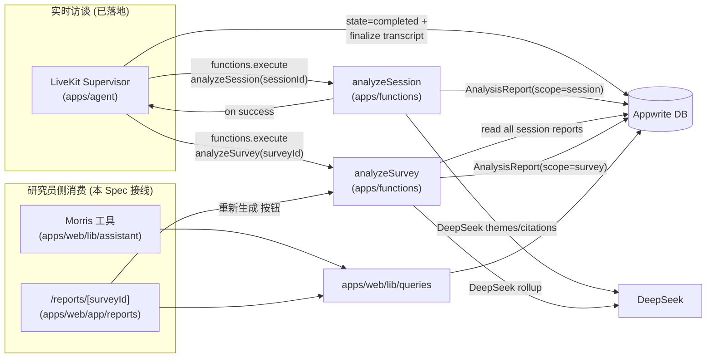

# Design Document — analysis-report

> Prerequisite: `foundation-setup/design.md §Components and Interfaces`、`docs/adr/0001-livekit-supervisor-interview-workflow.md`、`docs/adr/0002-page-assistant-vercel-ai-sdk.md`、`docs/adr/0003-analysis-report-architecture.md`。

本设计文档对应 Spec **analysis-report**。决策详情见 ADR-0003（D1–D5）；本文档展开"如何把决策落到具体的 Function、查询层、UI、契约与权限设计"。

## 1. Overview

本 Spec 干两件事：

1. 把"完成访谈 → 报告"这条线打通：在 agent worker 把 session 标记为 completed 时，链式触发两个 Appwrite Function（`analyzeSession` 与 `analyzeSurvey`），把 transcript / collected answers 转译为 session 级与 survey 级的 `AnalysisReport`，落 Appwrite。
2. 把研究员侧的两个消费面（Morris 工具 + `/reports/[surveyId]` 页面）从 mock 切到 Appwrite 真实数据。共享一个统一的 `apps/web/lib/queries/` 读出层。

非目标：实现 PDF/Markdown 导出、引入流式 UI、改动编辑器栈、扩张 Morris 工具的写能力（写仍然只通过 Function）。

## 2. 数据流总图



`Insight` 走研究员独立的"提问→DeepSeek→落 Appwrite"路径（apps/web/lib/actions/insights.ts 重写），与上图正交。

## 3. analyzeSession Function

### 3.1 文件结构

```
apps/functions/analyzeSession/
  src/
    handler.ts      # 纯核心：(rawInput, Deps) => { status, body }，无 SDK 引用
    main.ts         # SDK 包装：构建 Deps（Appwrite client、DeepSeek client）、调 handler、映射结果
    deps.ts         # Deps 接口定义（findSession、findTranscript、findSurvey、callDeepSeekAnalyze、upsertReport）
    prompts/
      session-analyze.ts  # DeepSeek prompt 模板（独立文件便于测试）
  tests/
    handler.test.ts        # 用 in-memory Deps 跑单元测试
  package.json
  tsconfig.json
  README.md
```

风格与 `apps/functions/issueLivekitToken/` 完全一致；handler 不能 import `node-appwrite` 或 `@ai-sdk/*`。

### 3.2 输入 / 输出契约

输入：`AnalyzeSessionRequestSchema`（contracts 已存在）：

```
{ sessionId: string }
```

输出：`AnalyzeSessionResponseSchema`（已存在）：

```
{ reportId: string, scope: "session" }
```

错误码：`session_not_found`(404)、`session_not_completed`(409)、`internal_error`(5xx)。

### 3.3 Deps 接口

```ts
interface Deps {
  findSession(id: string): Promise<InterviewSession | null>;
  findTranscript(sessionId: string): Promise<Transcript | null>;
  findSurvey(surveyId: string): Promise<{
    survey: Survey;
    sections: SurveySection[];
    questionBlocks: QuestionBlock[];
  } | null>;
  analyzeSession(input: AnalysisReportInput): Promise<AnalysisReportOutput>;
  upsertSessionReport(input: {
    sessionId: string;
    surveyId: string;
    body: AnalysisReportOutput;
  }): Promise<{ reportId: string }>;
}
```

注意：`upsertSessionReport` 用 `(sessionId, scope=session)` 作为唯一键做 upsert（参考 `issueLivekitToken` 的并发策略）。

### 3.4 LLM 调用结构

prompt 链一次性结构化输出：

1. system：研究助理人设、严格基于 transcript、citation 必须含 segmentIndex。
2. user：survey title + question prompts（含 type）+ transcript segments（含 segmentIndex）+ collectedAnswers。
3. response_format：`AnalysisReportOutputSchema`（contracts 已定义）。

DeepSeek 走 `@ai-sdk/deepseek` 的 `generateText` + `experimental_output: Output.object({ schema })`。最大重试 = 2，失败时 handler 返回 5xx，**不**写报告。

### 3.5 幂等性

upsert 行为：用 `(sessionId, scope=session)` 找现有 row；存在则更新 `themes / insights / citations / generatedAt`，不改 `$id`；不存在则插入。返回 `reportId = $id`。

> Appwrite Database 没有原生 upsert，工程上用 `(sessionId, scope)` 作复合 unique 索引；先 query→update / insert，必要时容忍 `409 document_already_exists` 用 retry-as-update。详见 `packages/appwrite-schema` 实施。

## 4. analyzeSurvey Function

### 4.1 文件结构

与 §3.1 同形：`apps/functions/analyzeSurvey/src/{handler.ts,main.ts,deps.ts,prompts/survey-rollup.ts}` + `tests/`。

### 4.2 输入 / 输出契约

输入（新增 contract）`AnalyzeSurveyRequestSchema`：

```
{ surveyId: string }
```

输出（新增 contract）`AnalyzeSurveyResponseSchema`：

```
{ reportId: string, scope: "survey" }
```

错误码：`survey_not_found`(404)、`no_completed_sessions`(409)、`internal_error`(5xx)。

### 4.3 计算分两段：纯数据 reduction + LLM rollup

**第一段（纯数据）**：从 Appwrite 读所有 `state=completed` 的 session + 各自 `AnalysisReport(scope=session)`，按题目类型聚合：

- `choice` 题：count、pct、按 option 分布
- `rating` 题：avg、score 分布
- `nps` 题：promoters / passives / detractors / nps score
- `voice_only` 题：单独保留 perQuestionSummary（不出图，文字汇总从 LLM 阶段产出）

这一段不调 LLM；纯函数 `aggregateQuestionStats(sessions, surveyDef)` 即可单测。

**第二段（LLM）**：把每份 session 报告的 themes / insights 喂给 DeepSeek，要它做：

1. 跨 session 的 theme 归并（合并近义、统计 mentions / pct / sentiment）
2. 顶层 insights（含 0..1 confidence）
3. citations 重新映射到具体 transcript segment（保持 P-DATA-04）

prompt 结构与 §3.4 类似但 system 强调"跨 session rollup、不引入新主题"。

### 4.4 输出 schema：`SurveyAnalysisReportOutputSchema`（新增）

```
{
  surveyId: string,
  surveyTitle: string,
  totalRespondents: number,        // # of completed sessions
  completedRespondents: number,    // 同上（保留两个字段以便未来区分 attempted vs completed）
  avgDurationLabel: string,
  studyCount?: number,             // 暂为 1，预留多 study 聚合
  lastUpdatedLabel: string,
  topics: string[],                // survey 设定的 research 目标列表（来自 SurveyDraft.researchGoal）
  questionStats: QuestionStat[],   // discriminated union: choice | rating | nps
  sentimentBreakdown: { positive: number; neutral: number; negative: number },
  themes: { id; label; mentions; pct; sentiment }[],
  insights: { id; title; text; confidence }[],
  citations: { segmentRef: { transcriptId; segmentIndex }; quote; themeIds: string[] }[],
  rendered: { storageFileId: string; format: string } | null,
}
```

`QuestionStat` 是判别联合，对应 mock-report.ts 中的三种形态（choice、rating、nps）。

### 4.5 幂等性

upsert：`(surveyId, scope=survey)` 唯一键。重新生成等价于刷新一整份。

## 5. 读出层 apps/web/lib/queries

### 5.1 文件结构

```
apps/web/lib/queries/
  client.ts             # 单例 node-appwrite Client + Databases / Functions
  studies.ts            # listStudies / getStudy
  sessions.ts           # listSessions / getSession
  transcripts.ts        # searchTranscriptSegments
  reports.ts            # getLatestAnalysisReport
  insights.ts           # listInsights / getInsightById
  index.ts              # re-export
```

注意：本读出层用 **node-appwrite Server SDK**，不是浏览器侧 Appwrite Web SDK。原因：

- Morris tools 的 `execute` 跑在 Next.js Node runtime，server 上下文。
- 报告页是 RSC + Server Action，server 上下文。
- ownership 校验更可靠（不依赖浏览器 session 的 hijack 风险）。

身份方案：每个 `Client()` 实例化时设置 server key（来自 `APPWRITE_API_KEY` env），并在每个查询里显式带上 `Query.equal("ownerUserId", currentUserId)` 的 filter。`currentUserId` 由 Next.js `auth()` 或 cookie session 解析得到（具体方案在 §10 Open Questions 收口）。

### 5.2 类型与契约

每个 query 返回的对象都用 contracts 中的 zod schema `safeParse` 一遍后返回；类型来自 `@merism/contracts`。这一层不提供"任意写"路径——所有写都通过 Function 或 RPC。

```ts
export async function listStudies(ownerUserId: string): Promise<Survey[]>
export async function getStudy(ownerUserId: string, surveyId: string): Promise<{ survey: Survey; sections: SurveySection[]; questions: QuestionBlock[] } | null>
export async function listSessions(ownerUserId: string, surveyId: string): Promise<InterviewSession[]>
export async function searchTranscriptSegments(ownerUserId: string, params: { query: string; surveyId?: string; limit?: number }): Promise<Array<{ sessionId: string; speaker: string; text: string; startMs: number; endMs: number }>>
export async function getLatestAnalysisReport(ownerUserId: string, params: { surveyId: string; scope: "session" | "survey"; sessionId?: string }): Promise<AnalysisReport | null>
export async function listInsights(ownerUserId: string): Promise<Insight[]>
export async function getInsightById(ownerUserId: string, id: string): Promise<Insight | null>
```

## 6. 报告路由 /reports

### 6.1 路由

```
app/reports/
  page.tsx              # 列表：所有有 completed session 的 surveys
  [surveyId]/
    page.tsx            # 详情：D5 三态（empty / loading / rendered）
    actions.ts          # "重新生成" server action（调 analyzeSurvey Function）
```

`app/report/page.tsx`（旧）删除；任何站内链接迁到 `/reports/[surveyId]`。

### 6.2 D5 三态决策表

| 条件 | UI 状态 | 动作 |
|---|---|---|
| `listSessions(surveyId).length === 0` | empty | 显示"尚无完成的访谈"，不调用任何 Function |
| `sessions.length > 0 && getLatestAnalysisReport(survey) === null` | loading | 显示 skeleton + "报告生成中…"；server-side polling 间隔 5s，最多 2 分钟 |
| `report !== null` | rendered | 复用 components/report/* 渲染；右上角"重新生成"按钮 |

"重新生成"按钮调 `actions.ts` 中的 server action，server action 调 `analyzeSurvey` Function；成功后 `revalidatePath("/reports/[surveyId]")`。

### 6.3 components/report/* 的迁移

5 个组件（report-header / summary-section / highlights-section / analysis-section / findings-section）当前从 `lib/mock-report.ts` import 类型。迁移：

- 把 `SurveyReport / QuestionStat / ChoiceDatum / RatingDatum / SentimentDatum / Theme / Insight` 的类型来源改为 `@merism/contracts` 的 `SurveyAnalysisReportOutputSchema` 推导出的类型。
- mock-report.ts 文件删除。
- 组件本身不需要改实现（数据结构对齐后即可）。

## 7. Morris 工具改造

`apps/web/lib/assistant/tools.ts` 的 4 个工具：

| 工具 | 当前 | 本 Spec 后 |
|---|---|---|
| `listStudies` | `STUDIES`（agent-data.ts） | `await queries.listStudies(currentUserId)` |
| `searchInterviewData` | `searchSnippets()`（agent-data.ts） | `await queries.searchTranscriptSegments(currentUserId, { query, surveyId })` |
| `analyzeData` | `analyzeStudy()`（agent-data.ts） | `await queries.getLatestAnalysisReport(currentUserId, { surveyId, scope: "survey" })`，未命中返回 `{ error: true, message: "尚无报告，请先生成或等待完成访谈" }` |
| `createStudyDraft` | mock | **保持 mock + TODO 注释**（依赖 survey-editor） |

工具内部错误兜底（catch → `{ error: true, message }`）保持。`agent-data.ts` 删除。

`lib/assistant/system-prompt.ts` 增补一句关于 `createStudyDraft` 当前是预览能力的说明。

## 8. Insights 迁到 Appwrite

### 8.1 Appwrite collection

`packages/appwrite-schema` 增加 `Insight` collection：

```
collection: insight
attributes:
  studyId: string (indexed)
  studyTitle: string
  question: string
  headline: string
  summary: string
  confidence: enum(high, medium, low)
  sampleSize: integer
  report: json  // InsightReport 的完整结构
  ownerUserId: string (indexed)
  createdAt: datetime (indexed)
permissions:
  read: user:{ownerUserId}
  write: user:{ownerUserId} (Function 写入时使用 server key 并显式注入 ownerUserId)
indexes:
  - (ownerUserId, createdAt desc)
  - (ownerUserId, studyId, createdAt desc)
```

### 8.2 contracts InsightSchema

```ts
export const InsightSchema = z.object({
  $id: z.string(),
  studyId: z.string(),
  studyTitle: z.string(),
  question: z.string(),
  headline: z.string(),
  summary: z.string(),
  confidence: z.enum(["high", "medium", "low"]),
  sampleSize: z.number().int().nonnegative(),
  report: insightReportSchema,  // 复用 lib/insights.ts 中已定义的报告内容 schema
  ownerUserId: z.string(),
  createdAt: z.string().datetime(),
});
```

`insightReportSchema`（headline / directAnswer / themes / divergences / actions）从 `apps/web/lib/insights.ts` 移到 `packages/contracts/src/api.ts` 或新建 `packages/contracts/src/insight.ts`，作为 LLM 输出 schema 与 InsightSchema.report 共用。

### 8.3 重写 lib/actions/insights.ts

四个 server action 全部走 node-appwrite：

- `listInsights()` → `queries.listInsights(currentUserId)`
- `getInsightById(id)` → `queries.getInsightById(currentUserId, id)`
- `createInsight({ studyId, question })` → DeepSeek 调用保持，落库改为 `databases.createDocument(...)`
- `deleteInsight(id)` → `databases.deleteDocument(...)` + ownership 校验

`buildStudyContext` 改为：

```ts
async function buildStudyContext(ownerUserId: string, studyId: string): Promise<string> {
  const surveyReport = await queries.getLatestAnalysisReport(ownerUserId, { surveyId: studyId, scope: "survey" });
  const snippets = await queries.searchTranscriptSegments(ownerUserId, { query: "", surveyId: studyId, limit: 30 });
  return [serializeReport(surveyReport), serializeSnippets(snippets)].join("\n\n");
}
```

未命中（survey 报告还没生成）时降级到只用 snippets。

### 8.4 删除 Drizzle 痕迹

- `apps/web/lib/db/schema.ts` 删除 `insight pgTable`、`InsightRow` 类型 export；`study` 仍保留（编辑器范畴）。
- `apps/web/package.json` 中 `drizzle-orm`、`pg`、`@types/pg` 暂不删除（study 还在用），但要在 docs/AGENTS.md 现有 "gaps and known drifts" 段补一条："Insight 已迁出 Drizzle，仅 study 表残留"。

## 9. agent worker 链式触发

### 9.1 触发点

agent 的 wrap-up 阶段当前已有"写最终 transcript / 关联 recording / 把 session 标 completed"的链路（`apps/agent/agent/persistence/appwrite_repository.py` + supervisor wrap-up）。在该链路最后增加：

```python
async def trigger_post_session_analysis(session_id: str, survey_id: str) -> None:
    await self.functions.create_execution(FN_ANALYZE_SESSION, json.dumps({"sessionId": session_id}))
    await self.functions.create_execution(FN_ANALYZE_SURVEY, json.dumps({"surveyId": survey_id}))
```

调用是 fire-and-await（等 Function 完成）但失败不回滚 session。失败时 logger 记录 `traceId`，下次研究员进 `/reports/[surveyId]` 仍可手动"重新生成"。

### 9.2 权限

agent server key（`APPWRITE_API_KEY`）的 scope 增加：

- `functions.execute` 限定到 `analyzeSession`、`analyzeSurvey` 两个 Function ID
- `databases.write` 已有（写 transcript），扩到 `AnalysisReport`、`Insight` collection（Insight 是为对称，agent 当前不写 Insight）

`packages/appwrite-schema` 中的 permissions 声明同步更新。

### 9.3 Function 内部的鉴权

Functions 用 server key 跑（不带研究员身份），handler 在内部读取 `Survey.ownerUserId` 并把它写到生成的 `AnalysisReport.ownerUserId`，保证后续读出层的 ownership filter 能命中。Function 自身不暴露给浏览器直接调用——研究员侧"重新生成"通过 server action（`apps/web/app/reports/[surveyId]/actions.ts`）调用，server action 在 server 上下文内执行，附带研究员身份校验。

## 10. 错误处理与降级

| 类别 | 处置 |
|---|---|
| `analyzeSession` LLM 调用失败 | 重试 2 次后返回 5xx；agent 仍把 session 标 completed；研究员后续可手动重生成 |
| `analyzeSurvey` 失败 | 同上；UI 在 D5 loading 态超时（2 分钟）后回退为"生成失败，重试"按钮 |
| Function 写 Appwrite 失败 | handler 返回 5xx；不留半完成的 Report row（用 transaction 风格：先准备结果，最后一次 upsert） |
| 读出层查询失败 | Morris 工具兜底为 `{ error: true, message }`；报告页显示错误态而非崩溃 |
| 越权读 | Appwrite Permission 拦截（ownerUserId 不匹配返回空）；应用层不二次判断 |
| DeepSeek 输出不符合 schema | `experimental_output: Output.object({ schema })` 失败 → handler 重试 1 次；仍失败返回 5xx |

## 11. Correctness Properties

延续 foundation `design.md §Correctness Properties` 的命名规则。本 Spec 落地：

- **P-ANL-01**（已声明）：`AnalysisReport.themes` 中每个 theme 至少 1 条 `evidence` (segmentRef)。
- **P-ANL-02**（已声明）：`AnalysisReport.perQuestionSummary[]` 覆盖所有题目。
- **P-ANL-03**（新）：`SurveyAnalysisReport.completedRespondents == count(AnalysisReport(scope=session, surveyId))`。
- **P-ANL-04**（新）：`SurveyAnalysisReport.themes[].share` 之和 ≤ 1.0（防止 LLM 幻觉出过度抽风的占比）。
- **P-DATA-04**（已声明）：每个 `citation.segmentRef` 都能在对应 transcript 中索引到。
- **P-SEC-04**（扩展）：anonymous 与非 owner researcher 调用 Function 或访问 Insight / AnalysisReport 时返回 403 / 空集。

PBT 用 fast-check 生成 transcript / survey 输入，配合 mock LLM 适配器（返回结构化样本），避免 PBT 跑真实 DeepSeek。代码位于 `tests/properties/analysis-report/`。

## 12. Open Questions

留给实现阶段决议或在后续小 spec 中收口：

1. **Researcher 身份解析**：Morris 工具 `execute` 中如何拿到 `currentUserId`？方案候选：(a) Appwrite `account.get()` via cookie session；(b) `req` 透传到 ToolLoopAgent；(c) `prepareStep` 注入 context。倾向 (b)：`createAgentUIStreamResponse` 接受 `headers/cookies`，工具通过 closure 拿到 userId。
2. **Functions 调用 SDK**：`@ai-sdk/deepseek` 在 Appwrite Function（Node 20 runtime）下能否直接 import？需先验证 Function bundler。如不可行，备选用 `fetch` 直接打 DeepSeek REST API。
3. **Survey 数据来源**：编辑器还在 Drizzle，本 Spec 的 `listStudies` 读 Appwrite 必然空。落地时需约定一份"测试 survey"先手工创建在 Appwrite（或写 seed 脚本）；待 `survey-editor` 子 spec 完成迁移后这层接口自动接通。
4. **Session 报告 → Survey 报告的 LLM 上下文上限**：若 N 场访谈拼起来超过 DeepSeek 上下文窗口，需要分块 + map-reduce 模式。v1 假设 N ≤ 30、每场 transcript ≤ 5k tokens，简单全量喂入；超出时降级为只喂 themes/insights，不回读 transcript。
5. **重新生成的并发**：研究员点击"重新生成"按钮时，agent 链式触发也可能在跑。两者命中同一份 report 行；需要在 handler 中加 `version` 字段或基于 `(surveyId, generatedAt)` 做 last-write-wins。倾向 last-write-wins，原因是 LLM 输出不需要严格序列化。
6. **PBT 与真实 LLM 隔离**：LLM 适配器需要支持 mock 注入（test-only）。方案：在 `apps/functions/analyzeSession/src/deps.ts` 把 `analyzeSession` 设计为接口而非具体实现，handler.test.ts 提供 in-memory adapter；main.ts 注入真实 DeepSeek adapter。

## 13. References

- `foundation-setup/design.md §4 Data Models` & §6 Cross-Module Contracts
- `docs/adr/0001-livekit-supervisor-interview-workflow.md`
- `docs/adr/0002-page-assistant-vercel-ai-sdk.md`
- `docs/adr/0003-analysis-report-architecture.md`
- `apps/functions/issueLivekitToken/`（pure-core / SDK-wrapper 范式）
- `packages/contracts/src/{entities,api}.ts`（已存在的 Analysis 相关 schema）
- `apps/web/lib/{mock-report,agent-data,insights}.ts`（迁移目标）
