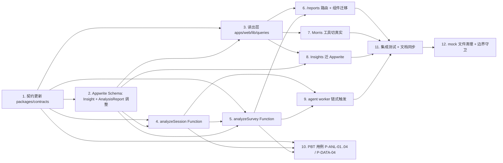

# Implementation Plan — analysis-report

## Introduction

> **状态 (2026-06-06)**: T1-T10 已完成实现并通过单测/PBT。T11(集成测试 + 文档同步) 与 T12(范围守卫 + 残留扫描) 已就位文档与守卫部分;**端到端 smoke**(本地 Appwrite + LiveKit 栈下手工跑通完整链路)需在本地拉起栈后由开发者手工执行,完成后把"端到端 smoke" 项也勾上。

本任务清单对应 Spec **analysis-report**，把 MerismV2 的访谈成果接到真实 Appwrite 数据，并删除 mock 支撑（`apps/web/lib/agent-data.ts`、`apps/web/lib/mock-report.ts`、`apps/web/lib/insights.ts` 的 mock grounding）。共 12 项任务，按依赖图分波次执行。每个任务标注 `Validates: Requirements N`，作为 PBT/单测的目标 Requirement 编号。

> 实现时务必遵守 `AGENTS.md` 与 ADR-0003 的"Out of scope"清单：本 Spec **不动**编辑器栈（`components/studies/*`、`lib/{guide,db}/*`、`lib/actions/{studies,guide-ai}.ts`），**不动** Morris 第 4 个工具 `createStudyDraft`，**不**实现 PDF/Markdown 导出。

## 依赖图

## Tasks

- [x] 1. 契约更新 `packages/contracts`
  - 修订 `AnalysisReportSchema`：`sessionId` 改为 optional；新增 superRefine：`scope==session` 必填 sessionId；`scope==survey` 必填 surveyId 且 sessionId 必须缺省。
  - 新增 `SurveyAnalysisReportOutputSchema` 描述 survey 级输出（discriminated `QuestionStat`：choice / rating / nps；`sentimentBreakdown / themes / insights / citations / rendered`）。
  - 新增 `AnalyzeSurveyRequestSchema` 与 `AnalyzeSurveyResponseSchema`。
  - 新增 `InsightSchema` entity；把 `apps/web/lib/insights.ts: insightReportSchema` 移到 `packages/contracts/src/insight.ts` 作为 LLM 输出 schema（保留 export，应用层继续 import）。
  - 在 `apps/agent/agent/contracts.py` 同步加 `Insight` pydantic 镜像（agent 当前不读 Insight，但保持 schema 名称对齐）。
  - 跑 `pnpm -F @merism/contracts build`、`pnpm -F @merism/contracts typecheck`、`pnpm test:py` 全部绿。
  - **Validates: Requirements 8**

- [x] 2. Appwrite Schema 调整
  - 在 `packages/appwrite-schema/src/schema.ts` 新增 `Insight` collection（attributes / indexes / permissions 见 design.md §8.1）。
  - 修订 `AnalysisReport` collection：`sessionId` 改 optional；新增 unique 复合索引 `(scope, sessionId)`（仅 scope=session 时使用）与 `(scope, surveyId)`（仅 scope=survey 时使用）。
  - 修订 permission：agent server key 增加 `Insight` 与 `AnalysisReport` 写权限；`functions.execute` 限定到 `analyzeSession` / `analyzeSurvey`。
  - `pnpm schema:apply` 在本地栈上幂等通过；`pnpm schema:verify` 输出 OK。
  - **Validates: Requirements 6.1, 7.4**

- [x] 3. 读出层 `apps/web/lib/queries`
  - 按 design.md §5.1 文件结构创建：`client.ts`（node-appwrite 单例）、`studies.ts`、`sessions.ts`、`transcripts.ts`、`reports.ts`、`insights.ts`、`index.ts`。
  - 每个查询的输入参数包含 `ownerUserId`，内部用 `Query.equal("ownerUserId", ...)` 强制 filter；返回前用契约 schema `safeParse`。
  - `searchTranscriptSegments` 支持 query 关键字与可选 surveyId；命中按 (sessionId, segmentIndex) 唯一去重。
  - 提供 `apps/web/lib/queries/__tests__/` 单测（用 in-memory fake Databases 与 fixture 数据），覆盖正常 + 越权 + 空集三类场景。
  - **Validates: Requirements 3, 5.5（Permission 兜底）**

- [x] 4. `analyzeSession` Function
  - 在 `apps/functions/analyzeSession/` 按 design.md §3 文件结构落地（pure handler / SDK wrapper / Deps / prompts）。
  - handler 单测覆盖：completed session 正常路径、404、409、DeepSeek 输出不符合 schema 时的重试与失败、idempotent upsert。
  - main.ts 通过 `withErrorBoundary` 包装；通过 `pnpm -F @merism/issueLivekitToken-... build` 风格的命令验证打包通过（实际命令名以仓库现有为准）。
  - 跑本地 smoke：手工准备一份 completed session + transcript，调 Function 拿到 reportId，去 Appwrite 看到 `AnalysisReport(scope=session)` row。
  - **Validates: Requirements 1, 8**

- [x] 5. `analyzeSurvey` Function
  - 同 §4 结构在 `apps/functions/analyzeSurvey/` 落地。
  - 实现 §4.3 的两段式：纯函数 `aggregateQuestionStats(sessions, surveyDef)` + LLM rollup（独立 prompt 文件 `prompts/survey-rollup.ts`）。
  - handler 单测覆盖：no_completed_sessions、survey_not_found、aggregateQuestionStats 三种题型、LLM 失败重试、idempotent upsert。
  - 本地 smoke：在第 4 步基础上调 `analyzeSurvey`，验证 questionStats 数值与 fixture 一致、completedRespondents 等于 session-level report 数。
  - **Validates: Requirements 2, 8**

- [x] 6. 报告路由 `/reports` + 组件迁移
  - 创建 `apps/web/app/reports/page.tsx`（列表）、`apps/web/app/reports/[surveyId]/page.tsx`（详情）、`apps/web/app/reports/[surveyId]/actions.ts`（重新生成 server action）。
  - 详情页按 D5 三态实现 empty / loading / rendered；loading 用 5s polling 最多 2 分钟；超时回退失败态。
  - `components/report/*` 五个组件类型 import 切到 `@merism/contracts`；删除 `apps/web/lib/mock-report.ts` 的 type 依赖。
  - 删除 `apps/web/app/report/page.tsx`；如有站内链接指向旧路径，一并改到 `/reports`。
  - **Validates: Requirements 4**

- [x] 7. Morris 工具切真实
  - 改 `apps/web/lib/assistant/tools.ts` 的 3 个工具按 design.md §7 表切到 query 层；保留 `{ error: true, message }` 兜底。
  - `createStudyDraft` 保留 mock，但 `description` 与 system prompt 中明确"该能力依赖 survey-editor 子 spec 落地"。
  - 解决 currentUserId 注入问题（design.md §10 Open Question 1）：在 `apps/web/app/api/assistant/route.ts` 解析 cookie session 拿到 userId，通过 `createAgentUIStreamResponse` 的 context 透传给 tools。
  - 工具单测：mock query 层返回结果，断言工具输出结构与现有 `tool-results.tsx` 渲染契约严格一致。
  - **Validates: Requirements 5**

- [x] 8. Insights 迁 Appwrite
  - 把 `lib/insights.ts: insightReportSchema` 的 export 改为 re-export 自 `@merism/contracts`（保持 backward 兼容直到所有 import 切完）。
  - 重写 `apps/web/lib/actions/insights.ts`：4 个 server action 全部走 node-appwrite + query 层；删除 drizzle-orm 与 lib/db 的 import。
  - 重写 `lib/insights.ts: buildStudyContext` 走 query 层（design.md §8.3），并实现"survey 报告未生成"时的降级（只用 snippets）。
  - 删除 `apps/web/lib/db/schema.ts` 中的 `insight pgTable` 与 `InsightRow` export；保留 `study` 表（编辑器范畴）。
  - 跑 `pnpm typecheck` 确认编辑器以外没有 broken import。
  - **Validates: Requirements 6**

- [x] 9. agent worker 链式触发
  - 在 `apps/agent/agent/persistence/appwrite_repository.py`（或新建 `function_dispatcher.py`）增加 `trigger_post_session_analysis(session_id, survey_id)` 方法，调用 Appwrite Functions API。
  - 在 supervisor wrap-up 链路尾部调用：先 `analyzeSession`，成功后 `analyzeSurvey`；任一失败用 `agent.logging.create_logger(scope)` 记录 traceId，但不影响 session completed 状态的持久化。
  - Python 单测用 fake Functions client 验证：成功路径调两次、第一步失败时不调第二步、第二步失败时不影响 session。
  - 同步把 `apps/agent/.env.example` 与 `infra/docker/docker-compose.yml` 的 agent server key scope 注释更新（仅注释，scope 实际由 Appwrite 控制台或 schema 配）。
  - **Validates: Requirements 7**

- [x] 10. PBT 用例 P-ANL-01..04 / P-DATA-04
  - 在 `tests/properties/analysis-report/` 新建 PBT 目录与首批用例：每个 Property 对应一个 `*.test.ts`。
  - 用 fast-check 生成合法/非法 transcript + survey 输入；调 analyzeSession / analyzeSurvey 的 pure handler；mock LLM adapter 返回结构化样本（避免跑真实 DeepSeek）。
  - P-SEC-04 扩展用例放在同目录：模拟 anonymous / 非 owner 调用 Function 与 query 层，断言空集 / 403。
  - `pnpm test:properties` 跑通；`MERISM_LIVE_TESTS=1 pnpm test:properties` 在本地栈上也跑通。
  - **Validates: Requirements 9**

- [ ] 11. 集成测试 + 文档同步
  - 端到端 smoke：手工建一份 survey + 模拟一场完成访谈 → agent 触发 analyzeSession + analyzeSurvey → 进 `/reports/[surveyId]` 看到渲染好的报告 → Morris 工具 `analyzeData` 返回同一份报告 → `createInsight` 正常落 Appwrite。
  - 更新 `.kiro/specs/analysis-report/` 三份文档：把实施过程中暴露的问题反馈进 design.md 的 Open Questions（如有）；tasks.md 标记完成的 task。
  - 更新 `AGENTS.md` 的"Current gaps and known drifts"：删除"Insight 在 Drizzle"那条；保留"study 仍在 Drizzle"。
  - 在 `README.md` 的 Sub-spec roadmap 表 `analysis-report` 行末注明完成状态。
  - **Validates: 所有上游 Requirements 的整体一致性**

- [ ] 12. mock 文件清理 + 边界守卫
  - 删除 `apps/web/lib/agent-data.ts`、`apps/web/lib/mock-report.ts`。
  - 不动 `apps/web/lib/mock-session.ts`（属 D 类问题，留给后续 spec）。
  - 跑 `pnpm scope-guard` 确认无 teams / collaboration / sharing / billing 等概念；任一违规阻断合并。
  - 跑全局 grep `mock-(report|agent-data)` 与 `lib/db/.*insight`，确认没有 orphan import。
  - **Validates: Requirements 10**

## 任务交付边界

每个任务在 PR 中独立交付前必须满足：

1. 该任务的 Acceptance Criteria 全部满足（用 PBT / 单测 / smoke 验证）。
2. 变更不引入 AGENTS.md 禁止的范围（teams / billing / 等）。
3. 变更不动编辑器栈（components/studies/* / lib/{guide,db}/* / lib/actions/{studies,guide-ai}.ts）；如果不可避免，停下并扩 Spec。
4. 契约变更（T1）必须先合并，后续任务再合并；T1 合并后 `pnpm typecheck` 一定要在所有消费者上呈现破坏性影响。
5. 新增依赖（如有）锁定具体版本，不引入新的 LLM / ASR / TTS provider（违反 AGENTS.md 与 ADR-0002）。
