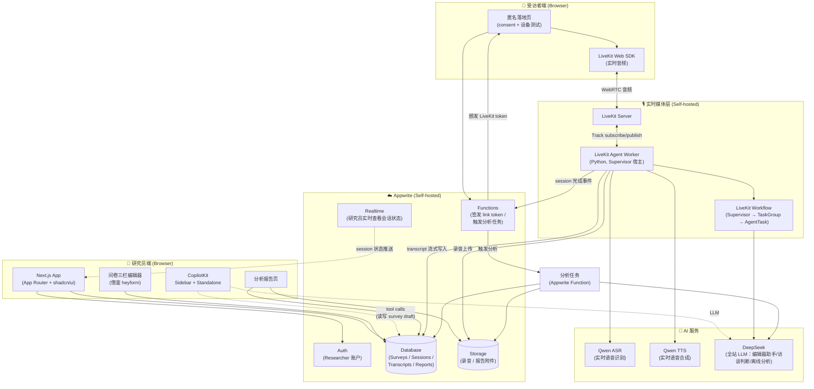
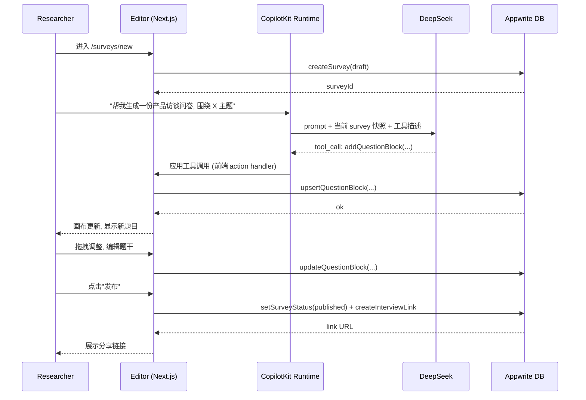
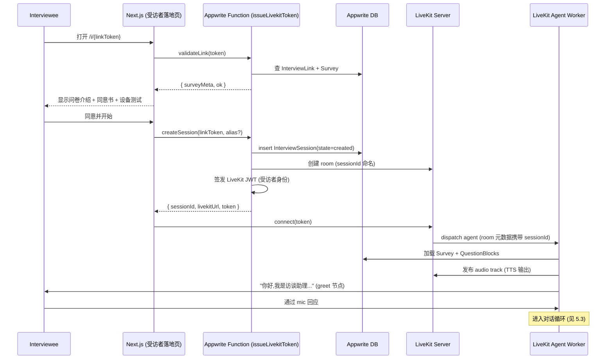
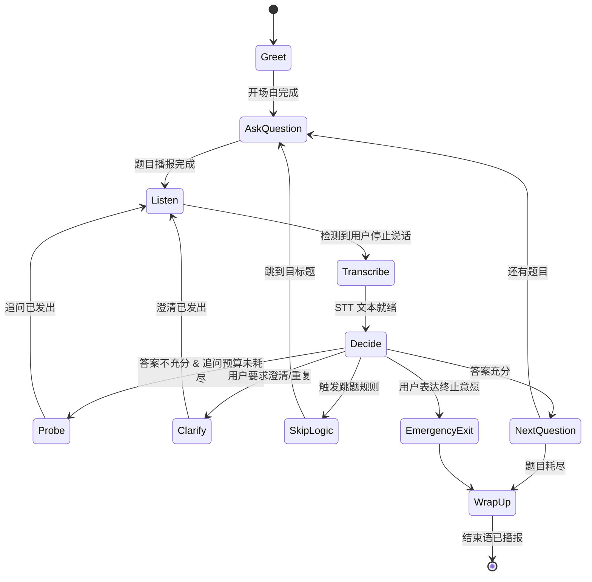
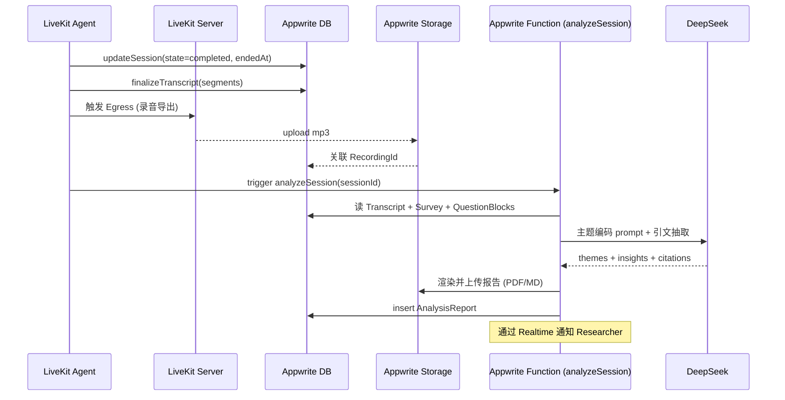

# MerismV2 架构总览设计文档

> 本文档为 MerismV2 平台的**架构基线 (Architecture Baseline)**，只交付高层设计：组件拓扑、核心数据模型、跨模块契约、技术选型决策、子 Spec 划分。各功能模块的低层设计（具体 API、组件代码、算法）放在后续子 Spec（survey-editor / ai-interview-engine / analysis-report / interviewee-portal）中展开。

> **架构更新（2026-06-01）**: `ai-interview-engine` 的实时访谈主控从 LangGraph 调整为 LiveKit Agents 原生 `Supervisor / TaskGroup / AgentTask`。一场问卷包含多个 `SurveySection`，每个 section 对应一个 `TaskGroup`，每个问题对应一个 `AgentTask`。LangGraph 不再作为实时语音访谈主流程控制器；后续若用于离线分析或实验性流程，必须另行记录 ADR。详见 `docs/adr/0001-livekit-supervisor-interview-workflow.md`。

---

## Overview

MerismV2 是一个**端到端的 AI 语音访谈平台**，参考 [openinterviewer](https://github.com/linxule/openinterviewer) 的产品流程，面向用户研究、产品调研、HR 面试等场景：

1. **研究员 (Researcher)** 登录平台，使用三栏式编辑器创建结构化访谈问卷；编辑过程中可由 CopilotKit 驱动的页面 Agent 协助生成/修改题目。
2. **受访者 (Interviewee)** 通过研究员分享的**匿名链接**进入访谈页面，无需注册账号，完成同意书后进入 LiveKit 实时房间。
3. **AI 访谈 Agent** 由 LiveKit Agents 原生 `Supervisor / TaskGroup / AgentTask` 编排，加入 LiveKit 房间，与受访者进行**双向语音对话**：Qwen ASR 实时转写 → DeepSeek 在 Supervisor/Task 内完成访谈推进与结果归纳 → Qwen TTS 合成语音播放，支持打断 (barge-in)。
4. 访谈结束后，转写文本与录音持久化至 Appwrite Storage / Database；分析模块借鉴 openinterviewer 等开源实现的方法学（主题编码 / 引文标注 / 洞察归纳），生成结构化的**访谈分析报告**。

### 1.1 设计原则

- **模块化**: 问卷编辑、AI 访谈引擎、分析报告、受访者门户四大模块通过明确契约解耦，可独立演进。
- **后端单一来源**: Appwrite 自托管承担 Auth / Database / Storage / Realtime / Functions 全部职责，避免引入额外后端。
- **实时优先**: 访谈过程的媒体、turn handling 与任务编排走 LiveKit Agents workflow，不经过 Appwrite，以保证延迟与并发。
- **匿名受访者**: 受访者侧零注册，凭一次性 link token 接入，体验贴近问卷链接而非登录系统。
- **可观测正确性**: 所有关键流程定义可执行的正确性属性 (Correctness Properties)，后续以 Property-Based Testing 验证。

### 1.2 范围与非目标

**包含 (In Scope)**:
- 研究员账户体系（注册、登录、个人空间）
- 问卷创建/编辑（三栏式编辑器，借鉴 heyform 交互）
- 页面 Agent (CopilotKit, sidebar + standalone 双形态)
- 匿名访谈链接生成与受访者门户
- AI 实时语音访谈（LiveKit Supervisor / TaskGroup / AgentTask）
- 访谈转写、录音存储
- 访谈分析报告生成（主题编码、引文、洞察）

**排除 (Out of Scope, 永久不进项目)**:
- ❌ 多人协作（团队空间、问卷共享、评论）
- ❌ 计费 / 订阅 / 计量
- ❌ 公开问卷市场 / 模板商城（保留为后期可能性，但不在本架构范围内）

---

## 2. 术语表 (Glossary)

| 术语 | 含义 |
|---|---|
| **Researcher** | 平台登录用户，创建问卷与查看分析报告 |
| **Interviewee** | 通过匿名链接进入的受访者，无账号 |
| **Survey / Form** | 问卷定义（section 集合 + 题目集合 + 流程规则） |
| **SurveySection** | 问卷中的 section；在语音访谈中映射为一个 LiveKit `TaskGroup` |
| **Question Block** | 问卷中的单个题目单元；在语音访谈中映射为一个 LiveKit `AgentTask` |
| **Interview Link** | 一次性或可复用的匿名访谈邀请链接 |
| **Interview Session** | 一次具体的访谈实例（一位受访者的一次完整对话） |
| **Transcript** | 访谈语音的文本转写（含说话人、时间戳） |
| **Analysis Report** | 基于 Transcript + Survey 生成的结构化洞察文档 |
| **LiveKit Room** | 一次访谈对应的实时媒体房间 |
| **LiveKit Supervisor** | 在房间内代表 AI 的长期主控 Agent，指导整场访谈 |
| **TaskGroup** | LiveKit workflow 中的一组有序任务；Merism 中一个 section 对应一个 TaskGroup |
| **AgentTask** | LiveKit workflow 中的单个任务；Merism 中一个问题对应一个 AgentTask |
| **CopilotKit Sidebar / Standalone** | 页面右侧浮层式 / 独立全屏式的 Agent 对话 UI |

---

## Architecture

> 系统拓扑、参与者职责、关键流程图。

### 3.1 总体架构图



### 3.2 关键参与者职责

| 组件 | 部署形态 | 主要职责 |
|---|---|---|
| **Next.js Web App** | Vercel 或自托管 Node 容器 | 研究员 UI（问卷编辑、报告查看）+ 受访者匿名落地页 |
| **Appwrite** | 自托管 Docker | Auth / Database / Storage / Realtime / Functions |
| **LiveKit Server** | 自托管 (Docker / K8s) | WebRTC SFU，承载实时音频房间 |
| **LiveKit Agent Worker** | 自托管 Python 进程 | 每个 Session 拉起一个 Agent 实例，宿主 Supervisor / TaskGroup / AgentTask workflow，桥接 ASR/LLM/TTS |
| **LiveKit Supervisor Workflow** | 嵌入 Agent Worker 进程内 | Supervisor 控制整场访谈；每个 SurveySection 生成一个 TaskGroup；每个 QuestionBlock 生成一个 AgentTask |
| **LLM (DeepSeek)** | 公有云 API | 实时访谈判断与 task result 归纳；离线分析也复用 DeepSeek |
| **Qwen ASR / Qwen TTS** | 公有云 API | 实时语音识别与合成 |
| **CopilotKit Runtime** | 与 Next.js 同进程（API Route） | 页面 Agent 后端，处理工具调用 |

---

## Data Models

所有持久化数据存于 **Appwrite Database**。下面是 Collection 层级的高层 ER 设计；字段类型与索引细节在子 Spec 中确定。

### 4.1 ER 图

```mermaid
erDiagram
    USER ||--o{ PROJECT : owns
    PROJECT ||--o{ SURVEY : contains
    SURVEY ||--o{ SURVEY_SECTION : has
    SURVEY_SECTION ||--o{ QUESTION_BLOCK : has
    SURVEY ||--o{ INTERVIEW_LINK : exposes
    INTERVIEW_LINK ||--o{ INTERVIEW_SESSION : "instantiates"
    INTERVIEW_SESSION ||--|| TRANSCRIPT : produces
    INTERVIEW_SESSION ||--o| RECORDING : produces
    INTERVIEW_SESSION ||--o| ANALYSIS_REPORT : "yields (1:0..1)"
    SURVEY ||--o{ ANALYSIS_REPORT : "aggregates over"

    USER {
        string $id PK
        string email
        string name
        datetime createdAt
    }
    PROJECT {
        string $id PK
        string ownerUserId FK
        string name
        string description
        datetime createdAt
    SURVEY {
        string $id PK
        string projectId FK
        string title
        string status "draft|published|archived"
        json   flowConfig "全局流程配置 (开场白/结束语/追问策略默认值)"
        int    version
        datetime updatedAt
    }
    SURVEY_SECTION {
        string $id PK
        string surveyId FK
        string title
        string description
        int    order
        string supervisorInstruction "可选：补充给整场 Supervisor 的 section 目标"
        string sectionInstruction "可选：本 section TaskGroup 的执行说明"
    }
    QUESTION_BLOCK {
        string $id PK
        string surveyId FK
        string sectionId FK
        int    order
        int    orderInSection
        string type "text|open_ended|single_choice|multi_choice|rating|nps|ranking|info"
        string prompt "题目文案"
        json   config "题型相关配置 (选项/分值/必答)"
        json   probeConfig "可选追问配置 (level/instruction/maxRounds)"
        json   stimulus "可选刺激物 (image/video/text)"
        json   probingPolicy "兼容旧字段，后续迁移到 probeConfig"
        json   skipLogic "跳题逻辑 (基于上一题答案)"
    }
    INTERVIEW_LINK {
        string $id PK
        string surveyId FK
        string token "URL 中的随机 token"
        string mode "single_use|reusable"
        int    maxUses
        int    usedCount
        datetime expiresAt
    }
    INTERVIEW_SESSION {
        string $id PK
        string surveyId FK
        string linkId FK
        string intervieweeAlias "受访者自填昵称(可选)"
        string state "created|in_progress|completed|abandoned|failed"
        string livekitRoom
        json   collectedAnswers "按 question_block 收敛的答案"
        datetime startedAt
        datetime endedAt
    }
    TRANSCRIPT {
        string $id PK
        string sessionId FK
        json   segments "[{speaker, startMs, endMs, text}, ...]"
        string language
        datetime finalizedAt
    }
    RECORDING {
        string $id PK
        string sessionId FK
        string storageFileId "Appwrite Storage file id"
        int    durationMs
        string format "mp3|opus|wav"
    }
    ANALYSIS_REPORT {
        string $id PK
        string sessionId FK "session 级报告 (单次访谈)"
        string surveyId FK  "survey 级报告 (跨多次访谈聚合, 可选)"
        string scope "session|survey"
        json   themes "主题编码结果"
        json   insights "关键洞察"
        json   citations "引文 → transcript segment 映射"
        string storageFileId "渲染好的报告文件 (PDF/MD)"
        datetime generatedAt
    }
```

### 4.2 设计要点

- **Project 层级保留但极简**：本期一个研究员一个默认 Project 即可，预留多 Project 的扩展空间，但**不引入任何协作概念**。
- **Survey / SurveySection / QuestionBlock 分表**：一场问卷包含多个 section；每个 section 在语音访谈中生成一个 LiveKit `TaskGroup`；每道题生成一个 `AgentTask`。分表便于编辑器拖拽 section、题目重排和后续按 section 聚合分析。
- **InterviewLink 与 Session 分离**：一条 link 可对应多次 session（reusable 模式），便于追踪某条链接的转化情况。
- **Transcript 设计为 segment 数组**：每条 segment 含说话人、起止时间、文本，作为分析模块的最小引文单元。
- **AnalysisReport 双 scope**：`session` 级（单次访谈快报）+ `survey` 级（跨多次访谈聚合洞察）。survey 级在 MVP 可后置。
- **录音可选**：`RECORDING` 与 `INTERVIEW_SESSION` 是 0..1 关系，受访者可拒绝录音但不影响转写。

### 4.3 Storage 桶规划

| Bucket | 内容 | 访问控制 |
|---|---|---|
| `recordings` | 访谈录音文件 | 仅 owner researcher 可读 |
| `reports` | 渲染好的 PDF / Markdown 报告 | 仅 owner researcher 可读 |
| `survey-assets` | 问卷题目可能用到的图片/媒体 | 公开读（链接受访者可访问） |

---

## Components and Interfaces

> 本节合并"核心流程"与"跨模块契约"：左侧呈现各组件交互（流程图），右侧给出组件之间的接口/契约形态。

### 5.1 研究员创建问卷（CopilotKit 协助）



**要点**:
- CopilotKit 通过 `useCopilotAction` 暴露受控的"问卷增改"工具集；Agent 不直接写库，统一经前端 action handler，便于撤销/审计。
- Sidebar 模式：编辑器右侧驻留对话面板，针对当前选中题目做"改写""增加追问策略""调整选项"等局部操作。
- Standalone 模式：独立页面 `/copilot`，从零生成整份问卷骨架，再"导入"为新 Survey。

### 5.2 受访者进入访谈



**要点**:
- Token 颁发只在 Appwrite Function 中执行，LiveKit API Secret 永不暴露给浏览器。
- Session 创建与 Room 创建在同一 Function 内原子完成，失败回滚 Session 状态为 `failed`。
- Agent dispatch 通过 LiveKit Agents 框架的自动派发机制，依据 room 元数据匹配。

### 5.3 实时对话循环 (LangGraph 状态机)



**节点契约（高层）**:

| 节点 | 输入 | 输出/副作用 | 决策依据 |
|---|---|---|---|
| `Greet` | session 元数据 | 通过 TTS 播放开场白 | survey.flowConfig.opening |
| `AskQuestion` | 当前 question_block | TTS 播放题干 | order + skipLogic 计算下一题 |
| `Listen` | LiveKit 入站音频 | VAD 检测 + 缓冲音频 | 静音阈值 / 最大时长 |
| `Transcribe` | 音频 buffer | 文本片段 + 写入 Transcript | STT provider |
| `Decide` | 当前题 + 答案文本 + 追问历史 | 路由决策 | LLM (DeepSeek) 结构化输出 |
| `Probe` | Decide 产出的追问 prompt | TTS 播放追问 | probingPolicy.maxRounds |
| `Clarify` | 用户的澄清请求 | TTS 重述题目 | 关键词 + LLM 判断 |
| `WrapUp` | 已收集答案 | 致谢 + 关闭 room | flowConfig.closing |

**Barge-in 处理**: Listen / Probe / Clarify 节点皆订阅 VAD 事件，受访者打断时立即停止 TTS 播放，跳转到 Listen。

### 5.4 访谈结束 → 转写 → 分析



---

### 6. 跨模块契约 (Cross-Module Contracts)

> 本节定义子 Spec 必须遵守的边界。具体字段名/HTTP 路径在子 Spec 中细化，但**契约的形态与角色**在此固定。

### 6.1 Frontend ↔ Appwrite 数据访问

| 场景 | 访问方式 | 理由 |
|---|---|---|
| Researcher 读写自己的 Survey / Project / Report | **Appwrite Web SDK 直连** + Permission 规则 | 简单、低延迟、利用 Appwrite 内置鉴权 |
| 受访者发起 Session、获取 LiveKit Token | **Appwrite Function** (server-side) | 涉及私钥 / Token 签发 / 跨实体原子写入 |
| 触发分析任务、跨多 session 聚合 | **Appwrite Function** | 业务编排，便于后续加重试与队列 |
| 实时订阅 Session 状态变更 | **Appwrite Realtime** | 研究员仪表盘看实时进度 |

**Permission 模型**:
- `Survey`, `QuestionBlock`, `Project`, `AnalysisReport`: `read/write = user:{ownerId}`
- `InterviewSession`, `Transcript`, `Recording`: 仅 owner researcher 可读；Agent Worker 通过 API Key 写入
- `InterviewLink`: 受访者侧仅通过 Function 校验，不开放直接读权限

### 6.2 LiveKit Token 颁发契约

```
POST /functions/issueLivekitToken
  body: { linkToken: string, alias?: string }
  → 200 { sessionId, livekitUrl, token, surveyMeta }
  → 410 link expired / used up
  → 404 link not found
```

Token claim 约定:
```
identity: "interviewee:<sessionId>"
metadata: { sessionId, surveyId, role: "interviewee" }
grants:
  roomJoin: true
  room: <sessionId>
  canPublish: true
  canSubscribe: true
```

### 6.3 LiveKit Agent ↔ LangGraph 契约

- **每个 Session 一个 LangGraph 实例**：Agent Worker 在 `on_room_connected` 时构建 LangGraph `StateGraph` 并初始化状态。
- **State Schema (高层)**：
  ```
  InterviewState {
    sessionId, surveyId
    questionBlocks: QuestionBlock[]
    cursor: int                   // 当前题目索引
    collectedAnswers: Map<qid, AnswerDraft>
    transcriptBuffer: Segment[]
    probeHistory: Map<qid, ProbeRound[]>
    flowConfig
    terminationRequested: bool
  }
  ```
- **节点的副作用规则**：
  - 写音频 → 经 LiveKit Agents 提供的 `audio_source` 接口
  - 写 DB → 仅在 `Transcribe`(增量) 与 `WrapUp`(最终化) 节点；中间节点禁止写库
  - 调 LLM → `Decide` / `Probe` / `Clarify` 节点

### 6.4 CopilotKit 工具契约 (Researcher 编辑器内)

页面 Agent 暴露的 actions（在 `survey-editor` 子 Spec 细化签名）:

| Action | 用途 |
|---|---|
| `addQuestionBlock(spec)` | 在指定位置插入题目 |
| `updateQuestionBlock(id, patch)` | 修改题目内容/配置 |
| `removeQuestionBlock(id)` | 删除题目 |
| `reorderBlocks(orderList)` | 调整顺序 |
| `setFlowConfig(patch)` | 修改开场白 / 结束语 / 全局追问策略 |
| `suggestProbingPolicy(qid)` | 针对一题给出推荐追问策略（只读建议，不直接写） |

**安全边界**: 工具调用只能影响"当前研究员拥有的草稿 Survey"。前端在 handler 中校验 ownership 再 dispatch 到 Appwrite。

### 6.5 分析模块输入/输出契约

**输入**:
```
{
  sessionId,
  survey: { title, flowConfig, questionBlocks },
  transcript: { segments: [{speaker, startMs, endMs, text}] },
  collectedAnswers
}
```

**输出 (AnalysisReport)**:
```
{
  scope: "session",
  themes: [{ id, label, description, evidence: [segmentRef] }],
  insights: [{ id, statement, supportingThemes: [themeId], confidence }],
  citations: [{ segmentRef, quote, themeIds }],
  perQuestionSummary: [{ questionId, summary, sentiment }],
  rendered: { storageFileId, format }
}
```

`segmentRef` 定义为 `{ transcriptId, segmentIndex }`，保证引文可追溯回原始片段。

---

## 7. 技术选型决策表 (Decision Log)

| ID | 决策 | 选择 | 理由 | 替代方案 / 风险 |
|---|---|---|---|---|
| D-01 | 后端基础设施 | **Appwrite (自托管)** | 用户既定约束；一次性满足 Auth/DB/Storage/Realtime/Function | 自托管运维成本；通过 Docker Compose 标准部署缓解 |
| D-02 | 实时媒体 | **LiveKit (自托管)** | 开源 SFU + 与 LangGraph 集成成熟的 LiveKit Agents 框架；中文延迟可控 | LiveKit Cloud（更省心但被排除：托管要求） |
| D-03 | AI 编排 | **LangGraph** | 状态机模型贴合"按问卷推进 + 自适应追问"；可视化与持久化 checkpoint 友好 | 手写 FSM；OpenAI Realtime API（端到端但状态可控性差） |
| D-04 | 全站 LLM | **DeepSeek** (`deepseek-chat` / `deepseek-reasoner`) | 用户已锁定：所有 LLM 调用统一使用 DeepSeek，包括 CopilotKit、访谈判断、task result 归纳和离线分析 | 多 LLM 分流会增加调优复杂度，当前排除 |
| D-05 | ASR | **Qwen ASR** | 用户已锁定；实时语音识别由 Qwen 负责 | 其他 ASR provider 仅作为后续适配可能 |
| D-06 | TTS | **Qwen TTS** | 用户已锁定；实时语音合成由 Qwen 负责 | 其他 TTS provider 仅作为后续适配可能 |
| D-08 | 前端框架 | **Next.js 15 App Router** | 同时承载研究员后台与受访者落地页；API Route 承接 CopilotKit Runtime | Remix；Vite + React Router |
| D-09 | UI 库 | **shadcn/ui + TailwindCSS** | 组件可拆可改；与 CopilotKit 默认样式兼容 | Ant Design；Mantine |
| D-10 | 状态管理 | **Zustand**（编辑器局部） + **TanStack Query**（服务态） | 轻量、与 Appwrite SDK 易整合 | Redux Toolkit（重）；Jotai（同级备选） |
| D-11 | 编辑器交互范式 | **三栏式 (借鉴 heyform)**: 左侧块库 / 中间画布 / 右侧属性 | 用户既定；符合表单工具行业心智 | 单栏 inline 编辑；Notion 式 slash 菜单 |
| D-12 | 页面 Agent | **CopilotKit (sidebar + standalone)** | 用户既定；内置 useCopilotAction / chat UI；可双形态 | 自建 Vercel AI SDK 对话面板（可控但工作量大） |
| D-13 | 受访者身份 | **匿名一次性 link token** | 借鉴 openinterviewer；零摩擦提升完成率 | 短信/邮箱 OTP（增加门槛） |
| D-14 | LangGraph Checkpointer | **Appwrite DB collection** 作为自定义 checkpointer | 与现有数据栈一致，便于断线恢复 | Postgres / Redis（需额外部署） |
| D-15 | 录音导出 | **LiveKit Egress → Appwrite Storage** | 标准管线；可选关闭 | 浏览器端 MediaRecorder（不可靠） |

> **注**: 本架构层锁定“DeepSeek = 唯一 LLM provider；Qwen = ASR/TTS provider”。后续仍应保留 provider adapter 边界，但默认实现不得再把 Qwen 用作 LLM。

---

## 8. 参考实现 (Reference Implementations)

### 8.1 整体流程参考

- **[linxule/openinterviewer](https://github.com/linxule/openinterviewer)** — 端到端开源 AI 访谈员，重点借鉴：
  - 匿名链接 → 同意书 → 设备测试 → 实时访谈 → 分析报告 的产品骨架
  - 访谈状态机的节点划分（greet / ask / probe / wrap_up）
  - 受访者匿名身份模型

### 8.2 问卷编辑器参考

- **[heyform/heyform](https://github.com/heyform/heyform)** — 三栏式可视化表单/问卷编辑器，借鉴：
  - 题型块库 + 拖拽画布 + 右侧属性面板的布局
  - 题型抽象（QuestionBlock 的 type/config/logic 解耦）
  - 跳题逻辑 (skipLogic) 的数据建模

### 8.3 实时语音 Agent 参考

- **LiveKit Agents 官方示例 (Python)** — `voice-pipeline-agent` / `multimodal-agent` 模板，作为 Agent Worker 的脚手架。
- **LangGraph 官方文档 — Multi-actor stateful agents** — 节点+条件边的实现范式与 checkpointer 用法。

### 8.4 访谈分析模块参考

调研后建议作为分析子 Spec 的方法学输入（最终选型在 `analysis-report` 子 Spec 决定）：

- **openinterviewer 自带的 analysis pipeline** — 主题归纳 + 引文回溯的最小实现，作为 baseline。
- **[BlossomKes/qualitative-coding](https://github.com/BlossomKes/qualitative-coding)** 类项目（或同类质性编码工具） — 代码本(codebook) → 主题归纳的方法学。
- **学术参考**: Braun & Clarke 的 *Reflexive Thematic Analysis* 六步法（熟悉数据 → 生成初始 code → 搜索主题 → 复核 → 命名 → 撰写报告），用作分析 prompt 的结构。
- **报告渲染**: 借鉴 [Marker](https://github.com/VikParuchuri/marker) / [react-pdf](https://react-pdf.org/) 等做 Markdown → PDF 输出。

> 子 Spec `analysis-report` 启动时应再次调研最新开源项目并更新此清单。

---

## Correctness Properties

以下属性以"对所有合法输入皆成立"的形式陈述，作为后续 Property-Based Testing 的目标契约。具体测试代码在各子 Spec 中实现，本架构层只固化属性清单与边界。

### Property 1: Survey 题目顺序唯一无空洞 (P-DATA-01)

任意 `Survey` 至少包含一个 `QuestionBlock`，且其下属 `QuestionBlock.order` 在该 Survey 内唯一、连续、从 0 起无空洞。
- 范围: survey-editor
- 验证手段: 增删改重排操作后均断言不变量；fast-check 生成随机操作序列。
- **Validates: Requirements 2.1, 2.6**

### Property 2: 答案只引用同问卷的题目 (P-DATA-02)

`InterviewSession.collectedAnswers` 的 key 必须存在于该 Session 关联 `surveyId` 的 `QuestionBlock.id` 集合中。
- 范围: ai-interview-engine
- **Validates: Requirements 2.1, 2.4**

### Property 3: 完成态必有非空 Transcript (P-DATA-03)

若 `InterviewSession.state == completed`，则必存在对应的 `Transcript` 且 `Transcript.segments` 非空。
- 范围: ai-interview-engine
- **Validates: Requirements 2.1**

### Property 4: 引文可回溯 (P-DATA-04)

`AnalysisReport.citations` 中的每个 `segmentRef` 都能在对应 `Transcript.segments` 中索引到。
- 范围: analysis-report
- **Validates: Requirements 2.1, 4.2**

### Property 5: InterviewLink 使用次数受限 (P-DATA-05)

`InterviewLink.usedCount ≤ maxUses`（reusable 模式）；`single_use` 模式下 `usedCount ≤ 1`。并发请求下也成立（原子计数）。
- 范围: interviewee-portal
- **Validates: Requirements 3.4, 3.5**

### Property 6: 必答题至少被提问一次 (P-FLOW-01)

所有标记为"必答"的 `QuestionBlock` 在 `state == completed` 的 Session 中至少出现于 Transcript 一次（被 Agent 提问过）。
- 范围: ai-interview-engine
- **Validates: Requirements 2.1**

### Property 7: 状态机不死锁 (P-FLOW-02)

LangGraph 状态机不存在死锁：从任意可达状态都存在到达 `WrapUp` 或 `EmergencyExit` 的路径。
- 范围: ai-interview-engine
- 验证手段: 基于状态图静态可达性分析 + 模拟运行 PBT。
- **Validates: Requirements 4.2, 4.4**

### Property 8: 追问轮数受限 (P-FLOW-03)

单题追问轮数 ≤ `probingPolicy.maxRounds`（含全局与题目级覆盖，取较小值）。
- 范围: ai-interview-engine
- **Validates: Requirements 2.1**

### Property 9: 跳题不形成环 (P-FLOW-04)

`skipLogic` 不会引起跳题环；cursor 只能向前推进或按 skip 规则跳过若干题，不会回退到已应答题。
- 范围: ai-interview-engine
- **Validates: Requirements 2.1**

### Property 10: 终止意愿快速生效 (P-FLOW-05)

受访者明确表达终止意愿后，状态机在 ≤ 1 轮决策内进入 `EmergencyExit → WrapUp`。
- 范围: ai-interview-engine
- **Validates: Requirements 6.4, 6.5**

### Property 11: 首句开场白延迟 (P-RT-01)

受访者首次连接 LiveKit Room 后，Agent 在 ≤ 5 秒内发出第一句开场白（TTS 首包到达）。
- 范围: ai-interview-engine
- **Validates: Requirements 3.2**

### Property 12: Barge-in 响应 (P-RT-02)

Barge-in 触发后，TTS 播放在 ≤ 300ms 内停止并进入 Listen 节点。
- 范围: ai-interview-engine
- **Validates: Requirements 6.3**

### Property 13: Transcript 完整率 (P-RT-03)

Transcript 端到端完整率 ≥ 99%（已发出的语音片段中，被持久化为 segment 的比例）。
- 范围: ai-interview-engine
- **Validates: Requirements 2.1, 6.3**

### Property 14: 断线可恢复 (P-RT-04)

网络中断重连后（≤ 30s 窗口），Session 状态可被恢复，已收集答案不丢失。
- 范围: ai-interview-engine
- **Validates: Requirements 6.4, 6.5**

### Property 15: 资源所有权隔离 (P-SEC-01)

任意非 owner 的 researcher 账户无法读到他人 Survey/Session/Report。
- 范围: foundation-setup
- 验证手段: 枚举 (actor, resource, action) 组合的 Permission 矩阵测试。
- **Validates: Requirements 2.4, 5.2, 5.3**

### Property 16: LiveKit Secret 不泄露 (P-SEC-02)

LiveKit JWT 永不在浏览器源码或网络响应中泄露 API Secret；客户端只接收一次性短期 token。
- 范围: foundation-setup
- **Validates: Requirements 3.6, 3.7, 5.5**

### Property 17: 失效链接拒绝签发 (P-SEC-03)

已过期或已耗尽的 `InterviewLink` 调用 `issueLivekitToken` 必返回 410，且不创建新 Session。
- 范围: interviewee-portal
- **Validates: Requirements 3.3, 3.4, 3.5**

### Property 18: CopilotKit 写操作越权拒绝 (P-SEC-04)

CopilotKit Action handler 拒绝任何不属于当前 researcher 的 `surveyId` 写操作。
- 范围: survey-editor
- **Validates: Requirements 4.5, 5.2**

### Property 19: Theme 必有证据 (P-ANL-01)

`AnalysisReport.themes` 中每个 theme 至少有一条 `evidence` (segmentRef) 支持。
- 范围: analysis-report
- **Validates: Requirements 4.2**

### Property 20: 题目摘要覆盖率 (P-ANL-02)

`perQuestionSummary` 覆盖该 Session 中所有被实际提问到的 QuestionBlock。
- 范围: analysis-report
- **Validates: Requirements 4.2**

### Property 21: 报告引文锚点有效 (P-ANL-03)

报告渲染输出 (PDF/MD) 可被解析回结构化数据，且引文链接锚点有效。
- 范围: analysis-report
- **Validates: Requirements 4.2**

---

## 10. 子 Spec 划分 (Sub-Spec Roadmap)

本架构 Spec (foundation-setup) 完成后，按以下顺序推进子 Spec。每个子 Spec 必须在其设计文档开头引用本架构作为前置约束。

| 序 | Spec 名 | 范围 | 依赖 |
|---|---|---|---|
| 1 | **foundation-setup** (本) | 架构总览、技术选型、数据模型、跨模块契约、CI/CD 与本地开发脚手架 | 无 |
| 2 | **survey-editor** | 三栏式编辑器；题型库（open_ended / single_choice / multi_choice / rating / nps / info）；跳题逻辑配置；CopilotKit sidebar + standalone 集成；问卷预览；草稿/发布生命周期 | foundation-setup |
| 3 | **interviewee-portal** | 匿名链接落地页（`/i/[linkToken]`）；同意书与设备测试；Session 创建；LiveKit 加入流程；断线重连 UI | foundation-setup |
| 4 | **ai-interview-engine** | LiveKit Agent Worker（Python）；LangGraph 状态机实现；STT/TTS Provider 抽象与选型落地；追问/澄清/跳题策略；Checkpointer；Transcript 流式持久化；录音 Egress | foundation-setup, survey-editor (问卷 schema), interviewee-portal (Session 入口) |
| 5 | **analysis-report** | DeepSeek 主题编码 prompt 链；引文回溯；perQuestionSummary；PDF/MD 渲染；Researcher 报告查看页 | foundation-setup, ai-interview-engine (Transcript) |

每个子 Spec 自行交付：requirements.md / design.md / tasks.md，并对本架构层定义的 Correctness Properties 子集编写 PBT。

---

## Error Handling

本架构层只规定**跨模块的错误处理范式**，具体异常码与重试参数在子 Spec 中固化。

### 错误分类与处置原则

| 类别 | 示例 | 处置 |
|---|---|---|
| **用户输入错误** | 链接已过期 / 同意书未勾选 / 受访者拒绝麦克风 | UI 友好提示 + 不创建 Session；Function 返回 4xx |
| **外部服务瞬时失败** | LLM 限流 / STT 流式中断 / TTS 单次合成失败 | Provider 适配层自动重试（指数退避，最多 3 次）；超过则降级 |
| **外部服务永久失败** | LLM 账户余额不足 / API key 失效 | LangGraph 节点抛出错误 → Agent 触发 `EmergencyExit` 并标记 Session `failed`，保留已有 Transcript |
| **状态机冲突** | 不可达跳转 / cursor 越界 | 视为 bug：Agent 写入 `failed`，并落 `errorContext` 字段供事后分析 |
| **Appwrite 写入失败** | 网络抖动 / 权限拒绝 | DB 操作必须在 Function 中包装事务式逻辑；写失败回滚关联实体 |
| **媒体层失败** | LiveKit Room 连接断开 | 客户端自动重连（≤30s 内）；超时则前端显示恢复界面，Agent 维持 Session 可恢复状态 |

### 关键不变量

- **失败的 Session 不产出 AnalysisReport**：`analyzeSession` Function 入口校验 `state == completed`。
- **错误不影响其他 Session**：每个 Agent 实例独立进程/协程，单次 LangGraph 异常不污染共享状态。
- **任何用户可见错误必有 trace id**：Function 与 Agent 日志统一打 `sessionId + traceId`，便于受访者反馈时定位。

### 降级策略

- **TTS 不可用**：回退到文字字幕（Web 端显示文本），Session 仍可推进。
- **STT 不可用**：Agent 提示受访者切换为表单填写并优雅结束当前 Session。
- **DeepSeek 不可用**：所有 LLM 能力暂停或进入后台重试；不降级到其他 LLM。分析侧保留 Transcript，标记 Report `pending`，后台重试队列处理。

---

## Testing Strategy

测试以**正确性属性 (§ Correctness Properties)** 为锚点，分为四层。本 Spec 只交付脚手架与契约测试；功能性测试在子 Spec 落地。

### 测试金字塔

| 层级 | 范围 | 工具 | 在哪个 Spec 落地 |
|---|---|---|---|
| **单元测试** | 纯函数（schema 校验、跳题计算、分析后处理） | Vitest (TS) / pytest (Py) | 各子 Spec |
| **属性测试 (PBT)** | 数据/流程/状态机不变量 (P-DATA-*, P-FLOW-*, P-SEC-*) | fast-check (TS) / hypothesis (Py) | 各子 Spec，用例集合并到 `tests/properties/` |
| **集成测试** | Agent ↔ LangGraph ↔ Mock LLM/STT/TTS；Function ↔ Appwrite Emulator | Vitest + Appwrite test container；Python integration tests | ai-interview-engine, foundation-setup |
| **端到端测试** | 受访者真实链接 → 完整访谈 → 报告生成 | Playwright + LiveKit test mode | foundation-setup 提供框架；功能验收在各子 Spec |

### 本 Spec 的测试交付物

1. **Appwrite Schema 契约测试**：所有 Collection 的字段、索引、Permission 规则用代码声明，并在 CI 中以"声明 ↔ 实际部署"diff 校验。
2. **Permission 矩阵测试 (P-SEC-01)**：枚举 `(actor, resource, action)` 组合，断言只有 owner 可读写。
3. **跨模块契约 schema 测试**：`issueLivekitToken` 请求/响应、AnalysisReport 输入输出 schema 用 zod / pydantic 双向校验。
4. **本地开发栈冒烟测试**：脚本拉起 Appwrite + LiveKit 后，跑一条最小路径（创建 Researcher → 建 Survey → 发链接 → Mock 受访者加入）确保栈可用。

### 测试数据管理

- 使用 Faker 生成 Survey / Transcript 样本，固定 seed 保证 PBT 复现。
- 录音/媒体类测试统一使用 `tests/fixtures/audio/` 下短音频（≤ 5s）避免 CI 慢。

---

## Open Questions

留给后续子 Spec 决议、本架构层不强行收口：

1. **STT / TTS 最终选型** — 在 `ai-interview-engine` 中以 < 5 分钟原型对比火山 / 豆包 / MiniMax 在中文延迟、打断响应、情感拟真上的差异。
2. **LangGraph Checkpointer 实现** — 自定义 Appwrite Collection 还是退回 SQLite/Redis？取决于断线恢复的频率与运维成本。
3. **录音是否默认开启** — 涉及隐私合规与 Storage 成本，建议默认关，受访者明确勾选才录。
4. **Survey 级聚合分析** — 跨多次 Session 的主题归并算法（重复 theme 合并、引文加权），列入 `analysis-report` 的第二迭代。
5. **i18n / 多语言访谈** — MVP 仅中文；英文支持作为后续迭代，接口预留 `survey.language` 字段。
6. **Appwrite Function 运行时限制** — DeepSeek 长文分析可能超过 Function 默认超时，需在 `analysis-report` 评估是否拆分为外部 worker。
