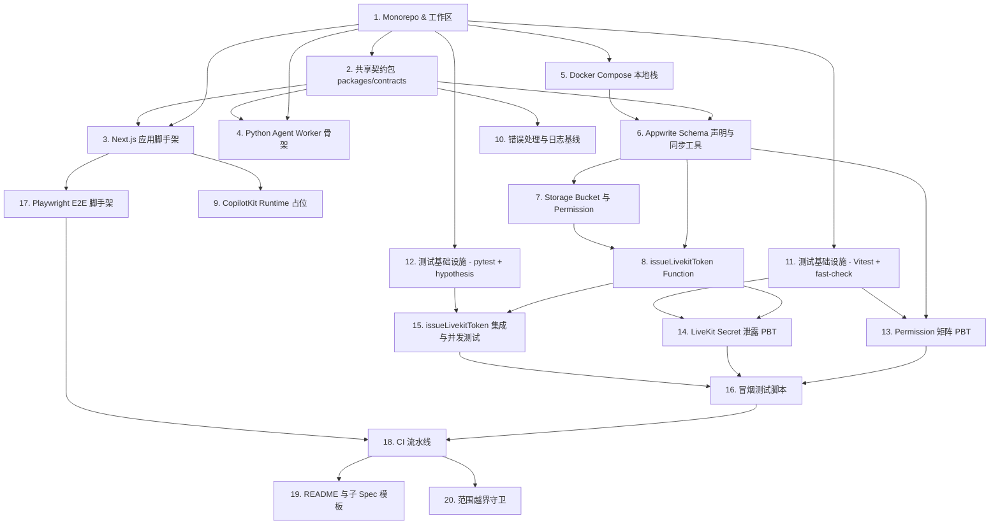

# Implementation Plan

## Overview

本任务清单对应 Spec **foundation-setup**，交付 MerismV2 平台的架构基线：本地开发栈（Appwrite + LiveKit）、共享契约包、Next.js 与 Python Agent 脚手架、Appwrite Schema 与 Permission、`issueLivekitToken` Function、错误处理与日志基线、四层测试脚手架（Vitest + fast-check / pytest + hypothesis / Playwright / 冒烟脚本）、CI 流水线、README 与子 Spec 起步模板、以及范围越界守卫。共 20 项任务，按依赖图分波次执行；标注的 Property 编号与 Requirement 编号供后续 PBT 落地与子 Spec 引用。

## Task Dependency Graph



```json
{
  "waves": [
    { "wave": 1, "tasks": ["1"] },
    { "wave": 2, "tasks": ["2", "5", "11", "12"] },
    { "wave": 3, "tasks": ["3", "4"] },
    { "wave": 4, "tasks": ["6", "9", "10"] },
    { "wave": 5, "tasks": ["7"] },
    { "wave": 6, "tasks": ["8", "13"] },
    { "wave": 7, "tasks": ["14", "15"] },
    { "wave": 8, "tasks": ["16", "17"] },
    { "wave": 9, "tasks": ["18"] },
    { "wave": 10, "tasks": ["19", "20"] }
  ]
}
```

## Tasks

- [x] 1. 初始化 monorepo 与工作区结构
  - 在仓库根创建 pnpm workspace 配置 (`pnpm-workspace.yaml`)，划分 `apps/web`、`apps/agent` (Python)、`packages/contracts`、`packages/appwrite-schema`、`infra/docker`、`scripts/`、`tests/properties/` 子目录占位。
  - 配置根 `package.json` 暴露统一脚本入口 (`dev`、`build`、`lint`、`typecheck`、`test`、`test:py`、`smoke`)。
  - 提交根 `.gitignore`（覆盖 node_modules、.env*、Python venv、Appwrite/LiveKit 数据卷）。
  - **Validates: Requirements 1.2, 4.1**

- [x] 2. 建立共享契约包 `packages/contracts`
  - 安装 zod，导出与 design.md §Data Models 一一对应的 schema：`User`、`Project`、`Survey`、`SurveySection`、`QuestionBlock`、`InterviewLink`、`InterviewSession`、`Transcript`、`Recording`、`AnalysisReport`。
  - 导出 `IssueLivekitTokenRequest/Response`、`AnalyzeSessionRequest/Response`、`AnalysisReportInput/Output` schema。
  - 导出 LiveKit workflow 的 `InterviewWorkflowConfig`、`SectionTaskGroupConfig`、`QuestionTaskConfig`、`QuestionTaskResult`、`InterviewWorkflowState` 高层 TypeScript 类型（结构化字段，不含运行时实现）。
  - 配置 tsup/tsc 输出 ESM + d.ts；通过 `pnpm -F @merism/contracts build` 可成功产出。
  - **Validates: Requirements 4.2, 4.3, 4.6**

- [x] 3. 建立 Next.js 应用脚手架 `apps/web`
  - 初始化 Next.js 15 (App Router) + TypeScript + Tailwind + shadcn/ui，跑通 `dev`/`build`/`lint`/`typecheck`。
  - 引入 Appwrite Web SDK，封装 `lib/appwrite/client.ts` 读取 `NEXT_PUBLIC_APPWRITE_*` 环境变量。
  - 引入 TanStack Query 与 Zustand，建立 `app/providers.tsx`。
  - 添加最小路由：`/`（首页占位）、`/auth/login`（登录表单调用 Appwrite Auth，提交后回到首页）。UI 仅满足 Requirement 5.1 的"可调用"，不做样式打磨。
  - **Validates: Requirements 4.1, 5.1**

- [x] 4. 建立 Python Agent Worker 骨架 `apps/agent`
  - 使用 uv 或 poetry 初始化 Python 3.11 项目，添加依赖：`livekit-agents`、`pydantic`、`httpx`、`appwrite`。
  - 编写 `agent/main.py`：注册一个 hello-world Agent，在加入 Room 时通过日志打印 `sessionId` 元数据，无需真实 STT/TTS。
  - 编写 `agent/contracts.py`：用 pydantic 复刻 `packages/contracts` 中关键 schema（`InterviewWorkflowConfig`、`QuestionTaskResult`、`IssueLivekitTokenResponse` 等），并提供与 zod schema 名称对齐的注释。
  - 提供 `apps/agent/README.md` 说明本地启动命令与环境变量列表。
  - **Validates: Requirements 4.3, 4.4**

- [x] 5. Docker Compose 本地栈 `infra/docker`
  - 编写 `docker-compose.yml`，包含 `appwrite`（含其内嵌依赖 mariadb / redis / influxdb / 等）、`livekit`。
  - 暴露端口：Appwrite `http://localhost:8080`、LiveKit `ws://localhost:7880`。
  - 卷规划：`appwrite_data`、`livekit_data` 挂载到命名卷以便清理脚本控制。
  - 编写 `scripts/stack-up.sh`、`scripts/stack-down.sh`、`scripts/stack-reset.sh`，分别完成"拉起+健康检查"、"停止保留数据"、"停止+删除卷"。
  - 编写 `scripts/check-env.sh`：在拉起前校验 `.env` 中必填变量存在，缺失时以非零退出并打印缺项。
  - 编写 `.env.example`：覆盖 `APPWRITE_ENDPOINT/PROJECT_ID/API_KEY`、`LIVEKIT_URL/API_KEY/API_SECRET`、`DEEPSEEK_API_KEY`、`DEEPSEEK_BASE_URL`、`DEEPSEEK_MODEL`、`QWEN_API_KEY`（ASR/TTS）、`STT_PROVIDER_KEY`、`TTS_PROVIDER_KEY`，全部为占位值。
  - **Validates: Requirements 1.1, 1.2, 1.3, 1.4, 1.5**

- [x] 6. Appwrite Schema 声明与同步工具 `packages/appwrite-schema`
  - 用 TypeScript 声明所有 Collection（字段、类型、必填、默认值、索引），与 `packages/contracts` 的 zod schema 字段对齐；同一命名规范下导出。
  - 实现 `scripts/apply-schema.ts`：读取声明，调用 Appwrite Server SDK 创建/同步数据库、Collection、字段、索引；幂等执行。
  - 实现 `scripts/verify-schema.ts`：拉取 Appwrite 实际部署，与声明做 diff，输出可读报告，差异时退出码非零。
  - 在 `apply-schema` 中检测破坏性字段类型变更（如 string → integer），拒绝执行并打印冲突列表。
  - 在 `package.json` 暴露 `pnpm schema:apply` 与 `pnpm schema:verify`。
  - **Validates: Requirements 2.1, 2.2, 2.3, 2.6**

- [x] 7. 应用 Permission 与 Storage Bucket
  - 在 `packages/appwrite-schema` 内为每个 Collection 声明 Permission 规则（document-level 或 collection-level）：
    - `Project / Survey / SurveySection / QuestionBlock / AnalysisReport`: `read/write = user:{ownerId}`。
    - `InterviewSession / Transcript / Recording`: `read = user:{ownerResearcherId}`，写入仅服务端 API Key。
    - `InterviewLink`: 全部禁止客户端直读直写。
  - 声明并由 `apply-schema` 创建 Storage Bucket：`recordings`、`reports`（owner 可读）、`survey-assets`（公开读，受控写）。
  - 扩展 `verify-schema` 校验 Permission 与 Bucket。
  - **Validates: Requirements 2.4, 2.5, 5.4**

- [x] 8. 实现 `issueLivekitToken` Appwrite Function
  - 在 `apps/functions/issueLivekitToken/` 创建 Function 入口（Node.js 20 runtime），从 `packages/contracts` 导入 schema 校验 input。
  - 实现流程：(a) 通过 Server SDK 查 `InterviewLink`；(b) 校验存在/未过期/未达 maxUses；(c) 原子地：插入 `InterviewSession(state=created)` + 增 `usedCount`（用 Appwrite Atomic Update 或重试式 CAS）+ 调用 LiveKit REST 创建 Room + 用 LiveKit JWT lib 签发 token；(d) 返回 `{ sessionId, livekitUrl, token, surveyMeta }`。
  - 错误路径：404（不存在）、410（过期/耗尽）、5xx（内部失败时回滚 Session 状态为 `failed` 或不持久化，删除已创建 Room）。
  - JWT TTL 限定为 30 分钟；只授予 `roomJoin / canPublish / canSubscribe` 且 `room` claim 等于 `sessionId`。
  - 保证 LiveKit `apiSecret` 仅从 Function 环境变量读取，且响应体/日志仅记录 token 前缀掩码。
  - **Validates: Requirements 3.1, 3.2, 3.3, 3.4, 3.5, 3.6, 3.7, 3.8, 5.5**

- [x] 9. CopilotKit Runtime 占位
  - 在 `apps/web/app/api/copilotkit/route.ts` 接入 `@copilotkit/runtime`，使用 DeepSeek 的 OpenAI 兼容接口（提供 `DEEPSEEK_API_KEY` / `DEEPSEEK_BASE_URL` / `DEEPSEEK_MODEL` 环境变量）。
  - 暴露空的 actions 数组，确保 GET/POST 200 响应。
  - 在 `apps/web` 中安装 `@copilotkit/react-core` + `@copilotkit/react-ui`，但不渲染任何对话 UI（留给 survey-editor 子 Spec）。
  - 添加 `apps/web/app/api/copilotkit/route.test.ts` 用 Vitest 调用 handler 验证 200 + 空 actions。
  - **Validates: Requirements 4.5**

- [x] 10. 错误处理与可观测性基线
  - 在 `packages/contracts` 或新建 `packages/observability` 中定义统一日志格式：`{timestamp, level, sessionId?, traceId, message, ...}`。
  - 提供 `createLogger(scope)` 工厂用于 Function（TS）；Python Agent 提供等价 `agent/logging.py`。
  - 提供 `withRetry({maxAttempts:3, backoff:'exponential'})` 工具，TS + Python 双侧实现，覆盖 LLM/STT/TTS 调用场景；区分 `TransientProviderError` 与 `PermanentProviderError`。
  - 在 `issueLivekitToken` 与 Agent 的 `main.py` 中替换为该 logger，保证响应/日志中不出现完整 secret。
  - 为 Function 框架包装统一异常 → 5xx + 响应体 `{error, traceId}`。
  - **Validates: Requirements 5.5, 6.1, 6.2, 6.3, 6.4, 6.5**

- [x] 11. 测试基础设施 (TS) - Vitest + fast-check
  - 在仓库根配置 Vitest workspace，覆盖 `apps/web`、`packages/contracts`、`packages/appwrite-schema`、`apps/functions/*`。
  - 引入 fast-check，约定 PBT 用例统一存放在 `tests/properties/<scope>/`，并暴露 `pnpm test:properties` 别名。
  - 编写 `tests/properties/_template.test.ts` 作为子 Spec 复制起点。
  - **Validates: Requirements 7.1, 7.2, 7.6**

- [x] 12. 测试基础设施 (Python) - pytest + hypothesis
  - 在 `apps/agent` 配置 pytest（pyproject.toml 或 pytest.ini），引入 hypothesis。
  - 在仓库根 `scripts/test-py.sh` 串联各 Python 子项目测试；根 `package.json` 通过 `pnpm test:py` 调起。
  - 提供 `apps/agent/tests/properties/_template_test.py` 作为子 Spec 起点。
  - **Validates: Requirements 7.1, 7.2, 7.6**

- [x] 13. Permission 矩阵 PBT (P-SEC-01)
  - 在 `tests/properties/foundation-setup/permission-matrix.test.ts` 中，使用 fast-check 枚举 actor (`owner / other_researcher / anonymous`) × resource (7 类) × action (`read/write`)。
  - 通过 Appwrite Server SDK 在测试 setup 中临时创建两个 researcher 与对应实体，运行结束清理。
  - 断言：所有 (owner, *, *) 通过；所有 (other_researcher, *, *) 与 (anonymous, *, *) 被拒绝。
  - 总组合数 ≥ 42，使用真实 Appwrite 实例（CI 通过 docker-compose 服务）。
  - **Validates: Requirements 5.2, 5.3, 5.4 — Property 15**

- [x] 14. LiveKit Secret 不泄露 PBT (P-SEC-02)
  - 在 `tests/properties/foundation-setup/livekit-secret-leak.test.ts` 中，对 `issueLivekitToken` 使用 fast-check 生成多种合法/非法输入。
  - 启动 Next.js 构建产物的静态扫描（`apps/web/.next` + 公开 chunk）+ 收集 Function 响应体/日志，断言永不出现 `process.env.LIVEKIT_API_SECRET` 的实际值。
  - 提供测试时注入的可识别 secret 值（如 `TEST_SECRET_LEAK_GUARD_xxxx`），便于扫描时精确匹配。
  - **Validates: Requirements 3.6, 3.7, 5.5 — Property 16**

- [x] 15. issueLivekitToken 集成与并发测试 (P-DATA-05 / P-SEC-03)
  - 在 `tests/properties/foundation-setup/issue-livekit-token.test.ts` 中，针对真实 Function 部署测试以下属性：
    - 合法链接首次调用 → 200 且 Session 已创建。
    - 失效/不存在链接 → 404；过期/耗尽 → 410。
    - 并发调用同一 `single_use` 链接 N (≥10) 次：仅 1 次 200，其他 410，DB 中只产生 1 条 Session、`usedCount==1`。
    - reusable 链接：`usedCount` 单调递增且 ≤ `maxUses`。
  - 测试运行依赖 `scripts/stack-up.sh` 与 `pnpm schema:apply` 已先行；CI 中作为前置步骤。
  - **Validates: Requirements 3.3, 3.4, 3.5, 3.8 — Properties 5, 17**

- [x] 16. 本地开发栈冒烟测试脚本
  - 编写 `scripts/smoke.sh`，串联：`stack-up` → `schema:apply` → 创建一个 researcher（直接调 Appwrite Server SDK）→ 创建一个最小 Survey + 一个 SurveySection + 一道 QuestionBlock + 一个 InterviewLink → 调用 `issueLivekitToken` → 断言返回 `sessionId` 与 token。
  - 整个流程在本地干净环境下 ≤ 2 分钟完成；脚本结尾输出 `SMOKE OK` 并可选 `stack-reset`。
  - 暴露根命令 `pnpm smoke`。
  - **Validates: Requirements 7.3**

- [x] 17. Playwright E2E 脚手架
  - 在 `apps/web/e2e/` 安装 Playwright；编写 `home.spec.ts`：访问 `/` 期望 200 且无 console error。
  - 在根 `package.json` 暴露 `pnpm e2e`。
  - **Validates: Requirements 7.4**

- [x] 18. CI 流水线
  - 编写 `.github/workflows/ci.yml`：在 push/PR 触发，矩阵化运行 lint、typecheck、Vitest、pytest、`pnpm schema:verify`（针对 ephemeral Appwrite 容器）、`pnpm smoke`、Playwright（headless）。
  - 任何步骤失败标记失败；失败时上传 docker-compose 日志为 artifact 便于排错。
  - **Validates: Requirements 7.5**

- [x] 19. README 与子 Spec 起步模板
  - 编写仓库根 `README.md`：项目介绍、本地启动指引、命令一览、目录结构图、子 Spec 列表与各自范围链接。
  - 编写 `docs/sub-spec-template.md`：列出子 Spec 创建步骤（引用本架构契约、复制 `tests/properties/_template`、引用对应 Property 编号、登记新增正确性属性的位置）。
  - 在每个子 Spec 的"前置约束"段落示例中显式引用 `foundation-setup/design.md §Components and Interfaces`。
  - **Validates: Requirements 8.1, 8.2, 8.3, 8.4**

- [x] 20. 范围越界守卫
  - 编写 `scripts/scope-guard.ts`：对仓库源码与 schema 文件 grep 关键词列表（`team`, `share`, `comment`, `billing`, `subscribe`, `quota`, `plan`, `seat`, `usage[-_]meter`），命中即失败。
  - 对 `packages/appwrite-schema` 声明做静态检查，禁止出现 `teamId / sharedWith / planId / quota` 字段。
  - 在 CI 中作为独立 job 执行；失败时打印命中文件与行号，提示越界。
  - **Validates: Requirements 9.1, 9.2, 9.3, 9.4**

## Notes

- **执行顺序与并行性**: 上方 `Task Dependency Graph` 的 mermaid 给出有向依赖；JSON wave 给出可并行调度的批次。同一 wave 内的任务无相互依赖，可由编排器并发派发。
- **Property 与 Requirement 双向追溯**: 每条任务的 `Validates: Requirements X.Y` 引用对应 `requirements.md`；标注了 `Property N` 的任务直接落地 `design.md §Correctness Properties` 中的不变量为 PBT。
- **范围红线**: Task 20（范围越界守卫）在 CI 中阻止任何"团队 / 协作 / 共享 / 评论 / 计费 / 订阅 / 计量"相关字段或代码合入；与 Requirement 9 配对生效。
- **子 Spec 入口**: 本 Spec 的 Task 19 输出 `docs/sub-spec-template.md`，后续启动 `survey-editor / interviewee-portal / ai-interview-engine / analysis-report` 时从该模板开始。
- **测试数据隔离**: PBT 与集成测试在 ephemeral Appwrite 实例上运行（CI 通过 docker-compose 服务），不要复用生产或开发者本地数据库。
- **机密管理**: `.env*` 永不入库；`.env.example` 仅含占位符。Function 与 Agent 的运行时机密通过 Appwrite Function 环境变量与容器编排层注入。
