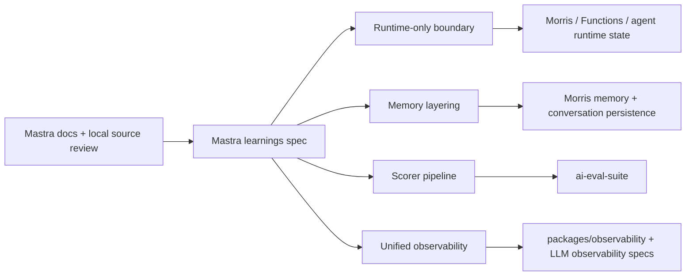

# Design Document

## 1. Overview

Mastra's source review points to a conservative borrowing strategy: keep the product boundaries, but import the structural lessons. The design here does not add Mastra as a dependency; it turns four observations into explicit MerismV2 architecture notes and follow-up specs.

## 2. Borrowed shape

### Runtime-only boundary

Mastra's `RunScope` pattern is the right level of abstraction to copy in spirit: runtime values are allowed to exist, but they do not cross serialization or persistence boundaries. MerismV2 needs the same rule for request-local state, run-local state, and agent-session scratch state.

### Memory layering

Mastra separates message history, working memory, observational compression, and recall. MerismV2 should keep the same conceptual split even if the underlying storage differs. Raw history and derived memory are different products and must stay different in documentation and code.

### Scorer pipeline

Mastra treats scorers as composable evaluation components. MerismV2's `ai-eval-suite` should follow the same idea: one scorer implementation can support nightly regression checks, trace replay, and selective live checks.

### Unified observability

Mastra joins tracing, logging, and metrics. MerismV2 already has pieces of that system; the next step is to make the correlation model explicit so eval results can join the same trace context as production behavior.

## 3. Repository impact map

| Area | Current home | Expected follow-up |
|---|---|---|
| Runtime-only boundary | Mostly implicit across web, functions, and agent code | New spec / ADR for runtime scope rules |
| Memory layering | `morris-memory`, `morris-conversation-persistence` | Update spec language to distinguish raw and derived memory |
| Scorer pipeline | `ai-eval-suite` | Expand design toward reusable scorers |
| Unified observability | `morris-llm-observability`, `packages/observability` | Define a shared correlation model |

## 4. What not to borrow

- Mastra Observational Memory as a full subsystem.
- Framework-scale package breadth.
- Cross-process orchestration just because the framework has it.

## 5. Design principle

Borrow the problem boundary, not the framework shape. If MerismV2 already has a domain artifact for the job, refine that artifact instead of creating a parallel concept.
