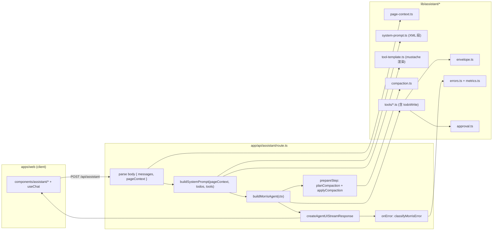

# Design Document — morris-agent-hardening

> Prerequisite：`foundation-setup/design.md §Components and Interfaces`、`analysis-report/design.md`（Morris 当前工具与 read layer）、`docs/adr/0002-page-assistant-vercel-ai-sdk.md`（Vercel AI SDK 6 / DeepSeek 栈）、`.kiro/steering/design-system.md`（Mauve Quiet）。借鉴来源 `/home/jia/posthog/ee/hogai/`，仅作参考实现，**不作为运行时依赖**。

本设计对应 Spec **morris-agent-hardening**：在不更换框架的前提下，把 Morris 的工具协议、上下文注入、提示词、错误分类、长会话压缩、TodoWrite 与 Approval 框架做齐。

## 1. Overview

落点全部在 `apps/web/lib/assistant/*` 与 `apps/web/app/api/assistant/route.ts`，外加一条最小 `confirm` 端点和一个前端占位组件。整体形状：



非目标（与 requirements 排除清单一致）：不引入 ModeManager / Subagent / 新 LLM provider；不动 Appwrite schema；不持久化对话历史。

## 2. 借鉴来源对照表（hogai → MerismV2 Morris）

| hogai 概念 | hogai 关键文件 | 我们的对应物 | 落地形态 |
|---|---|---|---|
| `MaxTool._arun_impl` 返回 `(content, artifact)` | `ee/hogai/tool.py` `MaxTool` | `ToolResultEnvelope<T>` | `lib/assistant/envelope.ts`（已有，巩固） |
| `MaxTool.context_prompt_template` | `ee/hogai/tool.py` `format_context_prompt_injection` | 工具的 `contextPromptTemplate` 字段 + 路由层渲染 | `lib/assistant/tool-template.ts` + 工具声明 |
| 静态在前 / 动态在后 / XML 段 | `ee/hogai/PROMPTING_GUIDE.md` | `buildSystemPrompt` 拼接器 | `lib/assistant/system-prompt.ts` |
| LLM 错误分类 | `ee/hogai/utils/exceptions.py` + `core/runner.py` 的 try/except 链 | `MorrisError` + `classifyMorrisError` | `lib/assistant/errors.ts`、`metrics.ts` |
| 工具错误的模型行为协议 | hogai 的 root prompt 与 `MaxToolError` | `<error_protocol>` 段 + `verify-don't-guess` | `lib/assistant/system-prompt.ts` |
| 对话压缩（CONVERSATION_WINDOW_SIZE 摘要 + 边界） | `ee/hogai/core/agent_modes/compaction_manager.py` | `planCompaction` / `applyCompaction` 纯函数 + DeepSeek 摘要 | `lib/assistant/compaction.ts` |
| TodoWrite 元工具 | `ee/hogai/tools/todo_write.py` | `todoWrite` tool + `<current_todo>` prompt 段 | `lib/assistant/tools/todo-write.ts` |
| `interrupt(ApprovalRequest)` + `Command(resume=...)` | `ee/hogai/tool.py` `_handle_dangerous_operation` + `core/runner.py` interrupt 处理 | `proposeApproval` + `confirm` 端点 + 前端占位卡片 | `lib/assistant/approval.ts`、`app/api/assistant/confirm/route.ts`、`components/assistant/approval-card.tsx` |

## 3. 模块边界与文件清单

```
apps/web/
├── app/api/assistant/
│   ├── route.ts                  # 改: parse pageContext + buildSystemPrompt + classifyMorrisError
│   └── confirm/route.ts          # 新: POST /api/assistant/confirm 占位(501),含 schema 校验
├── lib/assistant/
│   ├── envelope.ts               # 新: ToolResultEnvelope<T> + toolResult / toToolError / NOT_SIGNED_IN
│   ├── page-context.ts           # 新: PageContextSchema + buildPageContextSection
│   ├── tool-template.ts          # 新: renderContextPromptTemplate(template, ctx)
│   ├── system-prompt.ts          # 改: 静态 XML 段常量 + buildSystemPrompt(...) 拼接器
│   ├── errors.ts                 # 新: MorrisError 联合 + classifyMorrisError + userMessageFor
│   ├── metrics.ts                # 新: MorrisErrorCounter 内存实现 + getCounts()
│   ├── compaction.ts             # 新: planCompaction / applyCompaction / estimateTokens / summarizeMessages
│   ├── approval.ts               # 新: proposeApproval / ApprovalEnvelope / hasPendingApproval stop 条件
│   ├── agent.ts                  # 改: buildMorrisAgent 接 prepareStep -> applyCompaction; stopWhen 加 hasPendingApproval
│   ├── tools.ts                  # 改: 把 4 个工具迁到 tools/ 目录, 每个工具声明 contextPromptTemplate
│   ├── tools/
│   │   ├── list-studies.ts       # 拆: 原 listStudies
│   │   ├── search-interview-data.ts
│   │   ├── analyze-data.ts
│   │   ├── create-study-draft.ts
│   │   └── todo-write.ts         # 新: TodoWrite 元工具
│   └── __tests__/                # envelope / prompt / errors / compaction / approval 单测
└── components/assistant/
    ├── approval-card.tsx          # 新: 占位组件, 识别 pending_approval 渲染骨架
    └── conversation.tsx           # 改(轻): useChat body 携带 pageContext
```

跨 packages 边界检查：本 Spec 不动 `packages/contracts`、`packages/observability`、`packages/appwrite-schema`，也不动 `apps/agent` 与 `apps/functions`。Morris 的工具协议是 web 内部约定，不属于跨模块契约。

## 4. 工具结果双通道协议（巩固 R1）

`envelope.ts` 输出三个公开符号：

```ts
export type ToolErrorArtifact = { error: true; message: string };
export type ToolResultEnvelope<TArtifact> = {
  content: string;
  artifact: TArtifact | ToolErrorArtifact;
};
export function toolResult<T>(content: string, artifact: T): ToolResultEnvelope<T>;
export function toToolError(label: string, err: unknown): ToolResultEnvelope<ToolErrorArtifact>;
export const NOT_SIGNED_IN: ToolResultEnvelope<ToolErrorArtifact>;
```

约束：

- 所有工具的 `execute` 类型签名收紧为 `Promise<ToolResultEnvelope<TArtifact>>`，不再允许返回任意结构。
- `toToolError(label, err)` 用 `err instanceof Error ? err.message : String(err)` 拼 message，并把 `error: true` 与 `message` 同时写入 artifact，使 P-AI-01 成立。
- `NOT_SIGNED_IN` 是 frozen 单例，工具未登录短路时统一引用。
- 现有 4 个工具已返回兼容形状，本 Spec 把"返回任意结构"的可能性在类型上彻底关闭即可。

## 5. PageContext + contextPromptTemplate（R2）

### 5.1 PageContext 形状

```ts
// lib/assistant/page-context.ts
export const PageContextSchema = z.object({
  path: z.string().optional(),                 // e.g. "/studies/abc/guide"
  surveyId: z.string().optional(),             // 当页主对象
  sessionId: z.string().optional(),            // 转录详情页等
  recentSessionIds: z.array(z.string()).max(8).optional(),
  selectedSegmentIds: z.array(z.string()).max(32).optional(),
  // 后续 Spec 想加新字段(如 reportScope), 在此 schema 扩展即可, 旧客户端缺字段不破坏
}).strict();
export type PageContext = z.infer<typeof PageContextSchema>;
```

`strict()` 防止前端误传未声明字段进 prompt（避免数据泄漏）。客户端在 `useChat` 的 `body` 中提交：

```ts
// components/assistant/conversation.tsx (改)
useChat({
  api: "/api/assistant",
  body: () => ({ pageContext: getCurrentPageContext() }),
});
```

`getCurrentPageContext()` 由所在路由的客户端组件就近构造（最稳的做法是 `app/(app)/layout.tsx` 提供 React context，由各页面的 setter 注入 `surveyId` / `sessionId` 等）。

### 5.2 工具自带模板

每个工具改写为：

```ts
import { tool } from "ai";
import { renderContextPromptTemplate } from "../tool-template";

export const buildSearchInterviewDataTool = (ctx) => ({
  contextPromptTemplate:
    "当前页面: {path}. 主调研: {surveyId}. 若用户未指定 studyId, 优先用 surveyId.",
  spec: tool({
    description: "在指定调研的访谈 transcript 中检索原话片段; studyId 必填.",
    inputSchema: z.object({ query: z.string(), studyId: z.string() }),
    execute: async ({ query, studyId }) => { /* 同现有实现 */ },
  }),
});
```

工具集合统一形状 `{ contextPromptTemplate?: string; spec: ToolSpec }`，由 `buildAssistantTools(ctx)` 返回。`agent.ts` 把 `spec` 取出供 ToolLoopAgent 使用，路由层把 `contextPromptTemplate` 渲染拼到 prompt 末尾（见 §6）。

### 5.3 模板渲染规则

`renderContextPromptTemplate(template, ctx)` 只替换 `{key}` 形式（key 满足 `[A-Za-z_][A-Za-z0-9_]*`）：

- 命中 ctx 的 string / number / boolean → 直接 `String(value)`。
- 命中 ctx 的对象 / 数组 → `JSON.stringify(value)`（保 prompt 内可读）。
- 未命中 → 替换为字面量 `None` 并 `console.warn` 一条（含 toolName + missing key）。
- 不展开嵌套占位（`{a.b}` 不支持），保持渲染规则简单可证。
- 与 hogai 的 `_CONTEXT_PLACEHOLDER_RE` 行为对齐（`{{ }}` 字面量转义可暂不支持，因当前模板都不需要花括号字面）。

## 6. 系统提示词结构化（R3）

### 6.1 段顺序与内容

`buildSystemPrompt({ todos, pageContext, toolContexts })` 按顺序拼以下段（缺省段整段省略）：

```
<agent_info>          静态: 角色与能力一句话定义
<tools_overview>      静态: 4 个内置工具 + todoWrite 的一行 description
<workstyle>           静态: 步骤化原则; 何时应当先 listStudies; ≥3 步任务先 todoWrite
<style>               静态: 简体中文/语气克制/不啰嗦
<error_protocol>      静态: 见 R5 三条 (artifact.error / verify-don't-guess / 同工具二连失败止步)
<current_todo>        动态: todos 非空时按 - [STATUS] title 渲染, 空则省略
<page_context>        动态: 仅渲染 PageContextSchema 校验通过的字段; 全空则省略
<tool_context>        动态: 各工具 contextPromptTemplate 渲染结果, 用 <tool name="..."> 子标签包裹; 全空则省略
```

静态段在前是为了让 DeepSeek 端的 prompt cache 命中（同会话连续请求时静态前缀字节级一致）。所有静态文本来自 `system-prompt.ts` 的 `const` 字符串，禁止包含时间戳 / 随机串 / 用户名等可变量。

### 6.2 拼接器签名

```ts
// lib/assistant/system-prompt.ts
export function buildSystemPrompt(args: {
  todos: TodoItem[];
  pageContext: PageContext;
  toolContexts: { toolName: string; rendered: string }[]; // rendered 为空字符串则跳过
}): string;
```

每段渲染为 `<tag>...</tag>`（与 hogai PROMPTING_GUIDE 风格一致），段之间空一行。`current_todo` 段 hash 可暴露给前端做调试（非本 Spec 重点）。

### 6.3 与 ToolLoopAgent 的结合

```ts
// agent.ts (改)
export function buildMorrisAgent(ctx: AssistantToolContext) {
  return new ToolLoopAgent({
    model: CHAT_MODEL,
    instructions: buildSystemPrompt({
      todos: ctx.todos ?? [],
      pageContext: ctx.pageContext ?? {},
      toolContexts: ctx.toolContexts ?? [],
    }),
    tools: buildAssistantTools(ctx),
    stopWhen: [stepCountIs(8), budgetExceeded, hasPendingApproval],
    maxRetries: 2,
    prepareStep: makePrepareStep(ctx),
  });
}
```

每次请求由 `route.ts` 构造 `ctx` 后传入；`instructions` 是字符串（prompt cache 命中靠静态前缀稳定，不靠 ToolLoopAgent 内部缓存）。

## 7. LLM 错误分类（R4）

### 7.1 类型与判定

```ts
// lib/assistant/errors.ts
export type MorrisErrorKind = "client" | "transient" | "api" | "transport" | "unknown";

export interface MorrisError {
  kind: MorrisErrorKind;
  userMessage: string;     // 已脱敏的用户文案
  detail: string;          // 服务端日志用的简短说明 (不含 stack/api key)
  cause?: unknown;         // 仅给 server log 用, 不送客户端
}

export function classifyMorrisError(err: unknown): MorrisError;
```

判定规则（优先级从上到下，命中即返回，使 P-AI-04 互斥）：

1. **`client`** — HTTP 4xx / 422，`name === 'AI_InvalidArgumentError'`，message 含 `context length`、`maximum context`、`invalid_request`、`tool_use_failed`。文案："对话过长或参数无效，请新建对话试试。"
2. **`api`** — HTTP 401 / 403，message 含 `api key`、`unauthorized`、`forbidden`、`model not found`。文案："AI 服务鉴权或配置失败，请联系管理员。"
3. **`transient`** — HTTP 429 / 5xx，message 含 `rate limit`、`overloaded`、`server_error`、`timeout`、`timed out`、AbortError。文案："AI 服务暂时不可用，请稍后再试。"
4. **`transport`** — `TypeError: fetch failed`、`ECONNRESET`、`ECONNREFUSED`、`ETIMEDOUT`、`ENOTFOUND`、`UND_ERR_*`。文案："网络连接不稳定，请稍后再试。"
5. **`unknown`** — 兜底。文案："AI 助手处理时出现问题，请重试。"

判定输入是 `unknown`，实现里读 `err?.status`、`err?.code`、`err?.name`、`String(err?.message ?? "")`，统一 `lowercase()` 后做 `includes` 匹配。**不读 stack**，避免泄漏。

### 7.2 计数器接口

```ts
// lib/assistant/metrics.ts
export interface MorrisErrorCounter {
  inc(kind: MorrisErrorKind): void;
}
export const morrisErrorCounter: MorrisErrorCounter;     // 进程内默认实现
export function getCounts(): Record<MorrisErrorKind, number>;
export function resetCounts(): void;                     // 仅给测试用
```

默认实现是简单的 `Map`，挂在模块顶层（per process）。后续若要上 Prom/OTel，把 `morrisErrorCounter` 替换为新实现即可。

### 7.3 路由层接线

```ts
// app/api/assistant/route.ts (改)
return await createAgentUIStreamResponse({
  agent,
  uiMessages: messages,
  onError: (error) => {
    const m = classifyMorrisError(error);
    morrisErrorCounter.inc(m.kind);
    // 服务端结构化日志(已存在的 console.error 升级为带 kind/detail)
    console.error("[assistant] %s: %s", m.kind, m.detail);
    return m.userMessage;
  },
});
```

`onError` 返回的字符串被 createAgentUIStreamResponse 注入到流内的错误事件给前端。文案保持中文，且永远不含原 stack。

## 8. 对话压缩（R6）

### 8.1 纯函数协议

```ts
// lib/assistant/compaction.ts
export interface CompactionOpts {
  tokenBudget: number;     // 例: 12000 (留给 system prompt + 工具结果的预算)
  minKeepTurns: number;    // 例: 3 (≤这个数的 human turn 不压缩)
  tailKeep: number;        // 例: 8 (压缩时保留尾部 N 条 messages)
}

export type CompactionPlan =
  | { action: "noop" }
  | {
      action: "compact";
      keep: UIMessage[];                // 尾部连续子序列
      dropped: UIMessage[];              // 待摘要 (planner 决定的丢弃集)
      needSummary: boolean;
    };

export function planCompaction(messages: UIMessage[], opts: CompactionOpts): CompactionPlan;

export interface Summarizer {
  (messages: UIMessage[]): Promise<string>;   // 失败则 reject
}

export async function applyCompaction(
  plan: CompactionPlan,
  summarizer: Summarizer,
): Promise<UIMessage[]>;

export function estimateTokens(messages: UIMessage[]): number;   // 字符 / 4 估算
```

### 8.2 行为规则

- `planCompaction` 完全纯函数，不做异步工作。`estimateTokens` 走"字符数 ÷ 4"hogai 风格估算（误差可接受，这一层不需要精确）。
- 当 `humanTurns(messages) <= minKeepTurns` 或 `estimateTokens(messages) <= tokenBudget` → `noop`。
- 否则 `keep = messages.slice(-tailKeep)`，`dropped = messages.slice(0, -tailKeep)`，`needSummary = true`。
- `applyCompaction(plan, summarizer)`：
  - `noop` → 直接返回原 messages（同一引用）。
  - `compact && needSummary` → `await summarizer(dropped)` 拿摘要字符串 → 包成 `system` role 的 `UIMessage`（id 形如 `summary-<hash>`） → `[summary, ...keep]`。
  - 摘要失败（reject 或返回空串）→ 退化为 `[fallbackSummary, ...keep]`，`fallbackSummary.content = "（早期对话已省略）"`。

### 8.3 摘要器

`summarizeMessages` 用同一 `deepseek-chat` 模型，温度 0.2，单次调用，超时 10s（`AbortController`）。提示词模板（精简）：

```
<task>把以下研究员对话历史压缩为 ≤200 字的中文摘要。</task>
<rules>
- 只保留事实/已决定的事项/已使用过的具体 surveyId 与 sessionId
- 不臆造数据
- 不复述工具结果原文, 提炼关键结论即可
</rules>
<conversation>
{{messages_compact_form}}
</conversation>
```

调用失败的捕获面 = 只 `try/await`，捕到错误后让 `applyCompaction` 走 fallback；不传给 `classifyMorrisError`（后者只服务路由 `onError`）。

### 8.4 与 prepareStep 集成

```ts
// agent.ts (改)
function makePrepareStep(ctx: AssistantToolContext) {
  return async ({ messages, steps, stepNumber }) => {
    const patch: PrepareStepPatch = {};
    const compacted = await applyCompaction(
      planCompaction(messages, { tokenBudget: 12_000, minKeepTurns: 3, tailKeep: 8 }),
      summarizeMessages,
    );
    if (compacted !== messages) patch.messages = compacted;
    if (hadToolError(steps) || stepNumber >= 5) {
      patch.model = REASONING_MODEL;
      patch.toolChoice = "none";
    }
    return patch;
  };
}
```

现有 `messages.length > 24 → slice(-16)` 的硬截断 **删除**。reasoner 降级路径保留（与 ADR-0002 一致）。

## 9. TodoWrite 元工具（R7）

### 9.1 状态通道

ToolLoopAgent 本身没有"agent 持久状态"概念。我们用 **per-request 闭包变量** 承载 todos：

```ts
// agent.ts (改)
export function buildMorrisAgent(ctx: AssistantToolContext) {
  let todos: TodoItem[] = ctx.initialTodos ?? [];
  const todoState = {
    get: () => todos,
    set: (next: TodoItem[]) => { todos = next; },
  };

  return new ToolLoopAgent({
    // ...
    instructions: () => buildSystemPrompt({ todos: todoState.get(), ... }),
    tools: buildAssistantTools({ ...ctx, todoState }),
  });
}
```

- ToolLoopAgent 的 `instructions` 支持函数形态（每步取最新值），保证 `<current_todo>` 始终反映最新 todos。
- todos 的生命周期 = 单次 HTTP 请求；下一次请求重新构建 agent 实例，`todos = []`。
- 不持久化到 Appwrite（保持 web 内部约定，与 R6 排除一致）。

### 9.2 工具签名

```ts
// lib/assistant/tools/todo-write.ts
const TodoItemSchema = z.object({
  id: z.string().min(1),
  title: z.string().min(1).max(120),
  status: z.enum(["pending", "in_progress", "done"]),
  note: z.string().max(200).optional(),
});
export type TodoItem = z.infer<typeof TodoItemSchema>;

export const buildTodoWriteTool = (ctx) => ({
  contextPromptTemplate: undefined,    // 不需要 page context
  spec: tool({
    description: "写入或更新当前任务的 todo 列表 (整体覆盖). 用于跨多步任务追踪进度.",
    inputSchema: z.object({ todos: z.array(TodoItemSchema).max(20) }),
    execute: async ({ todos }) => {
      ctx.todoState.set(todos);
      return toolResult(`已更新 todo (${todos.length} 项).`, { todos });
    },
  }),
});
```

### 9.3 提示词协议

`<workstyle>` 段加入：

```
对≥3 步的复合任务: 先用 todoWrite 列出步骤(每条 1 行), 然后逐步推进;
每完成一步, 再用 todoWrite 把该步标 done 并把下一步标 in_progress.
todoWrite 仅维护任务进度, 不读 Appwrite.
```

`<current_todo>` 渲染：每条一行 `- [STATUS] title` （`STATUS` ∈ `pending/in_progress/done`）。todos 为空 → 整段省略。

## 10. Approval 框架（R8，骨架）

### 10.1 Envelope

```ts
// lib/assistant/approval.ts
export interface ApprovalEnvelope {
  status: "pending_approval";
  proposalId: string;
  toolName: string;
  preview: string;
  payload: Record<string, unknown>;
  createdAt: string;
}

export function proposeApproval(args: {
  toolName: string;
  preview: string;
  payload: Record<string, unknown>;
}): ApprovalEnvelope;
```

危险工具（本 Spec 不引入实际危险工具，但留协议）的 `execute` 形如：

```ts
execute: async (args, { request }) => {
  const approvalToken = request?.headers?.get("x-morris-approval-token") ?? null;
  if (!approvalToken && isDangerous(args)) {
    return proposeApproval({
      toolName: "editQuestion",
      preview: await previewDiff(args),
      payload: args,
    });
  }
  // 实际写动作 (本 Spec 不实现, 由消费端 Spec 接)
}
```

### 10.2 stop 条件

```ts
// lib/assistant/approval.ts
export const hasPendingApproval: StopCondition<unknown> = ({ steps }) =>
  steps.some((s) => (s.toolResults ?? []).some((r) =>
    typeof r.output === "object" && r.output !== null
      && (r.output as any).artifact?.status === "pending_approval"
  ));
```

`agent.ts::buildMorrisAgent` 把它加入 `stopWhen: [stepCountIs(8), budgetExceeded, hasPendingApproval]`。

### 10.3 confirm 端点（占位 501）

```ts
// app/api/assistant/confirm/route.ts (新)
export async function POST(req: Request) {
  const body = await req.json();
  const parsed = ConfirmSchema.safeParse(body);
  if (!parsed.success) return Response.json({ error: "invalid_input" }, { status: 400 });
  return Response.json({ error: "not_implemented_yet" }, { status: 501 });
}

const ConfirmSchema = z.object({
  proposalId: z.string().uuid(),
  decision: z.enum(["approve", "reject"]),
  edits: z.record(z.string(), z.unknown()).optional(),
  feedback: z.string().max(500).optional(),
});
```

消费端 Spec（如 survey-editor）实现具体写动作时，扩展该端点的处理逻辑（按 `proposalId` 找回 payload，应用 edits，调对应 Function）。本 Spec 只确保 schema 与端点存在。

### 10.4 前端占位卡片

`components/assistant/approval-card.tsx`：

- 接 `ToolResult` 流，识别 `artifact.status === "pending_approval"`。
- 渲染：标题（`Approval needed: <toolName>`）、preview 区（markdown 渲染）、`primary` 按钮"批准"、`outline` 按钮"拒绝（弹 Dialog 二次确认 + 反馈框）"。
- 用户点击触发 `fetch("/api/assistant/confirm", ...)`；当前端点返 501 时，UI 渲染一条"功能待实施"提示，不破坏对话。
- 视觉遵循 `.kiro/steering/design-system.md`（mauve primary、ink-900 outline、shadow-popover）。

## 11. 关键决策

- **D1 不引入新框架**：所有改造在 ToolLoopAgent 之上。理由：本 Spec 改进的是协议/拼接器/纯函数层，框架层（loop / stream / tool 调用）现有 SDK 已经够。引入新框架（LangGraph 类）会破坏 ADR-0002。
- **D2 工具协议改为 `{ contextPromptTemplate?, spec }` 包装**：而不是把 `contextPromptTemplate` 塞到 `tool({...})` 里。理由：AI SDK 6 的 `tool({...})` 没有这个字段，强行附加会让类型扩散；包装层让两个关注点解耦。
- **D3 PageContext 用 `z.strict()`**：拒绝未声明字段进入 prompt。理由：Morris 通过 prompt 把页面状态泄漏到 LLM 是一个攻击面（前端 bug 或恶意脚本可能写入敏感字段）；strict 把这扇门关上。新增字段必须改 schema。
- **D4 错误分类用 message 字符串包含匹配（小写）**：而不是反序列化 SDK 错误对象。理由：DeepSeek 经过 `@ai-sdk/deepseek` 与底层 fetch 后，错误形态多样且不稳定；字符串匹配在维护成本与判断力之间取得平衡，配合 P-AI-04 的样本表防止退化。
- **D5 计数器先做内存实现**：Prom/OTel 接入推迟到上线之后。理由：Morris 当前流量小，早期目标是分类正确，等真有运维诉求再选 metrics 后端，避免现在就锁死技术选型。
- **D6 压缩用纯函数 plan + 异步 apply 两段式**：而不是把摘要 LLM 调用混进 plan。理由：plan 必须可单测、可属性测（P-AI-03 要求单调性）；apply 处理副作用（LLM 调用 + 失败回退）。这是 hogai 同款拆分，工程上反复证明有效。
- **D7 摘要失败必须降级、不抛**：把"早期对话已省略"作为占位 system 消息。理由：摘要是优化项，不能成为对话不可用的单点。模型即便没有摘要也能继续工作（虽然会丢早期细节）。
- **D8 todos 不持久化**：留在 per-request 闭包内。理由：（a）Morris 当前对话本身也不持久（前端 useChat 状态）；（b）持久化引发 Appwrite schema 变更与权限设计，超出本 Spec 范围。未来若引入对话持久化，再单独 Spec。
- **D9 Approval 框架 confirm 端点先返 501**：留 schema 与路径。理由：本 Spec 不引入实际危险工具；消费端 Spec（survey-editor）落地写工具时一接就能用，避免双向约定漂移。
- **D10 不复用 hogai 的 `interrupt()` 语义**：因为 ToolLoopAgent 没有"图暂停"概念。换为"工具返回 pending_approval → stopWhen 终止 → 前端单独 confirm 请求"两次 round-trip 模型，达到等价语义。
- **D11 TodoWrite 不读 Appwrite**：是元工具。理由：与 hogai 的 todo_write 同款定位，避免 todo 维护本身需要鉴权或副作用。
- **D12 prompt 渲染对花括号严格**：只替换 `{[A-Za-z_][A-Za-z0-9_]*}`。理由：与 hogai `_CONTEXT_PLACEHOLDER_RE` 行为对齐；防止把 `fun onEvent(event) { ... }` 之类静态文本当模板替换。
- **D13 静态段绝对前缀稳定**：禁止包含时间戳/随机串。理由：DeepSeek 端 prompt cache 命中条件就是字节级前缀稳定；任何漂移都直接抹掉缓存收益。

## 12. Correctness Properties（PBT）

- **P-AI-01** `tests/properties/morris-agent-hardening/envelope-invariant.test.ts`：fast-check 生成随机 args 与随机注入异常，验证所有工具的 `execute` 返回都是 `ToolResultEnvelope`。
- **P-AI-02** `tests/properties/morris-agent-hardening/prompt-order.test.ts`：fast-check 生成随机 todos × 随机 PageContext × 随机 toolContexts，断言 `buildSystemPrompt` 输出中静态段 `<agent_info> ... <error_protocol>` 顺序固定，且任何动态段必出现在最后一个静态段之后；缺省段不出现空标签。
- **P-AI-03** `tests/properties/morris-agent-hardening/compaction-monotone.test.ts`：fast-check 生成随机 messages 序列，断言 `applyCompaction(planCompaction(...))` 满足：tokens 单调不增；keep 是原序列尾部连续子序列；若插入 summary，role 为 system 且位置在 keep 之前。
- **P-AI-04** `tests/properties/morris-agent-hardening/error-classify.test.ts`：维护一张样本表（≥20 例），fast-check 选样断言每个错误恰落入一类；shuffle 顺序不影响判定。
- **P-AI-05** `tests/properties/morris-agent-hardening/approval-stop.test.ts`：mock 一个 fake `ToolLoopAgent` step 流，注入返回 `pending_approval` 的工具结果，断言 `hasPendingApproval` stop 条件触发；后续不再产生新 step。

普通单测（非 PBT）放 `apps/web/lib/assistant/__tests__/`：

- `envelope.test.ts`：`toolResult` / `toToolError` / `NOT_SIGNED_IN` 形状。
- `system-prompt.test.ts`：每段 on/off、整段省略、字节级稳定（snapshot）。
- `tool-template.test.ts`：占位替换、缺键 `None`、嵌套不展开、花括号字面不误替换。
- `errors.test.ts`：四类共 ≥8 个具体错误样本的分类断言。
- `metrics.test.ts`：`inc` / `getCounts` / `resetCounts`。
- `compaction.test.ts`：`planCompaction` 三种 action、`applyCompaction` 摘要失败回退。
- `approval.test.ts`：`proposeApproval` 字段完整 + `hasPendingApproval` 真值表。

端到端（轻）：`apps/web/app/api/assistant/__tests__/route.test.ts` 校验合法/非法 PageContext 都能 200、`onError` 文案不含敏感字符串、计数器自增。

## 13. 实施顺序

按"每步独立 PR、可回退、不破坏 typecheck"分波次：

```
A 工具协议巩固   → B 错误分类       → C PageContext 注入
                ↘                ↗
                  D Prompt 拼接器
                ↗                ↘
E 对话压缩       → F TodoWrite      → G Approval 骨架 → H 验证
```

详见 `tasks.md`。每个波次完成后运行 `pnpm typecheck && pnpm test && pnpm test:properties` 三件套，满足才入下一波。

