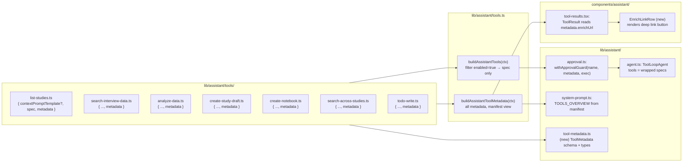

# Design Document — morris-tool-metadata

> Prerequisite：`morris-agent-hardening/design.md`（工具拆分到 `tools/<name>.ts`、ToolResultEnvelope、ApprovalEnvelope、PageContext、static prompt 拼接器；本 Spec 在其基础上**新增 metadata 字段**，不动其形状）；`analysis-report/design.md`（read tools 与 `lib/queries/*` 读出层）；`notebooks/design.md`（`createNotebook` 与 `searchAcrossStudies` 工具）；`docs/adr/0002-page-assistant-vercel-ai-sdk.md`（Vercel AI SDK 6 / DeepSeek 栈）；`.kiro/steering/scope.md`（borrow-or-build flow，已论证不暴露 MCP server）。借鉴来源 `/home/jia/posthog/products/*/mcp/tools.yaml`，仅作参考实现，**不作为运行时依赖**。

本设计对应 Spec **morris-tool-metadata**：把 Morris 7 个工具的元数据从"散在 system prompt 文本 + `approval.ts` 硬编码 + Card 内硬写 deep link"的隐式状态收紧到每个 builder 显式声明的 `ToolMetadata` 结构。9 个 Requirement 落地全部在 `apps/web/lib/assistant/*` 与 `apps/web/components/assistant/tool-results.tsx`，不动其它包。

## 1. Overview



数据流变化（与 morris-agent-hardening 现状对比）：

- **现状**：`buildAssistantTools(ctx)` 把每个工具 builder 的 `spec` 直接 return；approval 没有触发条件（destructive 工具尚未存在，骨架空转）；`tool-results.tsx` 在每个 Card 内自己拼 `<Link>`；`<tools_overview>` 是手写 7 行常量。
- **新状**：所有工具的 `metadata` 字段被 `buildAssistantToolMetadata(ctx)` 集中起来；`buildAssistantTools(ctx)` 在过 `withApprovalGuard` 时读 manifest 的 `annotations.destructive` 决定是否包装；`tool-results.tsx` 通过统一的 `EnrichLinkRow` 读 `metadata.enrichUrl` 渲染按钮；`<tools_overview>` 由 manifest 自动生成（manifest 改了 prompt 自动跟）。

非目标（与 requirements 排除清单一致）：不引入 yaml / OpenAPI scaffold / feature flag / `include_params` 转译 / MCP server provider；不改契约/Functions/Agent/Appwrite schema；不改任何工具的 `inputSchema` 与 `execute` 实现。

## 2. 借鉴来源对照表（PostHog tools.yaml → MerismV2 ToolMetadata）

PostHog `products/*/mcp/tools.yaml` 出现过的字段总集 ~32 个；本 Spec **筛后采纳 7 个**，明确**拒绝 9 个**，剩余 16 个不适用。表里只列前两类。

| PostHog 字段 | 我们的对应 | 落地形态 | 取舍理由 |
|---|---|---|---|
| `annotations.{readOnly,destructive,idempotent}` | `ToolMetadata.annotations` 同名三元组 | `tool-metadata.ts` interface 定义 | 决定 approval 流 + LLM 决策的核心元信息，必采。|
| `enabled` (默认 false) | `ToolMetadata.enabled: boolean` 必填 | 每个 builder 显式给值 | 借鉴"默认禁用 + 显式启用"哲学（PostHog 60% 默认 false），但当前 7 工具全 true。|
| `scopes` | `ToolMetadata.requiredScopes: readonly string[]` | 每个 builder 声明 | 现在不强制（用 `ownerUserId` 闭包），但记下来供未来 MCP / personal API key 接入时审计。|
| `enrich_url` | `ToolMetadata.enrichUrl?: string` | builder 声明 + `tool-results.tsx::EnrichLinkRow` 消费 | 替代当前 Card 内硬编码 `<Link>`。|
| `title` | `ToolMetadata.title: string` | builder 声明 | 给 UI / `<tools_overview>` / 文档生成器复用。|
| `description` (含格式提示) | `ToolMetadata.description: string` ≥ 120 字符 | builder 声明 + 单测强制最小长度 + 内容合约 | 借鉴 PostHog `notebooks-create` 写"chart 节点必须是 ph-query 形状"的范式。|
| `type: list/detail/custom` | `ToolMetadata.type: "read" \| "write" \| "draft" \| "meta"` | builder 声明 + `as const` 单元类型 | 重命名为 Merism 用例（PostHog `list/detail` 是 CRUD 视角；我们是研究员-LLM 交互视角）。|

| 拒绝采纳的字段 | 拒绝理由 |
|---|---|
| `operation` | OpenAPI operationId；我们工具是手写 zod，没有 OpenAPI 来源。 |
| `description_file: ./prompts/...md` | 我们 7 个工具描述都能塞进 TS 字符串（最长的 `createNotebook` 也 < 800 字符），引入外置文件是过度工程。 |
| `feature_flag` + `feature_flag_behavior` | 项目尚无 feature flag 系统；引入是先有锤后造钉。等真有需要时新开 spec。 |
| `include_params` / `exclude_params` | PostHog 是为了 yaml ↔ DRF 转译；我们 zod schema 直接由 builder 控制，不需要这层。 |
| `param_overrides` / `inject_body` / `rename_params` | 同上，zod 直接覆盖即可。 |
| `ui_apps` / `view_component` / `view_prop` / `link_prop` / `click_prop` / `detail_args` / `detail_tool` | PostHog 用于 ext-apps 协议下渲染独立 UI 面板，我们走 chat 内联 Card，不需要解耦层。 |
| `requires_ai_consent` | PostHog 区分"通用工具"与"读用户敏感数据的工具"；我们所有工具都需要 researcher login，统一用 `ownerUserId` 闭包，没有这种区分需要。 |
| `system_prompt_hint` | 我们用 `contextPromptTemplate` + `<tool_context>` 段已经覆盖等效语义。 |
| `soft_delete` | 当前 7 工具无删除路径；未来加删除工具时在 design 单独引入。 |

## 3. 模块边界与文件清单

```
apps/web/
├── lib/assistant/
│   ├── tool-metadata.ts          # 新: ToolMetadata 类型 + ToolType 联合 + MIN_DESCRIPTION_CHARS 常量 + 校验谓词
│   ├── tools.ts                  # 改: buildAssistantTools 过 withApprovalGuard; 新增 buildAssistantToolMetadata
│   ├── approval.ts               # 改: 新增 withApprovalGuard(toolName, metadata, execute)
│   ├── system-prompt.ts          # 改: TOOLS_OVERVIEW 从手写常量改为 buildToolsOverview(manifest)
│   ├── tools/
│   │   ├── list-studies.ts        # 改: 加 metadata 字段
│   │   ├── search-interview-data.ts  # 改: 加 metadata 字段
│   │   ├── analyze-data.ts        # 改: 加 metadata 字段
│   │   ├── create-study-draft.ts  # 改: 加 metadata 字段
│   │   ├── create-notebook.ts     # 改: 加 metadata 字段; description 已经写得不错, 只补 enrichUrl
│   │   ├── search-across-studies.ts  # 改: 加 metadata 字段
│   │   └── todo-write.ts          # 改: 加 metadata 字段 (type=meta)
│   └── __tests__/
│       └── metadata.test.ts       # 新: K-METADATA-01..08
└── components/assistant/
    └── tool-results.tsx           # 改: 新增 EnrichLinkRow + ToolResult 通过 manifest 渲染按钮
tests/properties/morris-tool-metadata/
└── manifest.test.ts               # 新: PBT, fast-check 100 次随机 ctx 测 manifest invariant
```

跨 packages 边界检查：本 Spec 不动 `packages/contracts`、`packages/observability`、`packages/appwrite-schema`，也不动 `apps/agent` 与 `apps/functions`。Morris 工具 metadata 是 web 内部约定，不上升到跨模块契约。

## 4. ToolMetadata schema（R1, R2, R3）

`lib/assistant/tool-metadata.ts` 新增（公共类型，避免循环 import）：

```ts
/** 工具语义分类。MUST 用 as const 单元类型联合, 禁止 string 宽化。 */
export type ToolType = "read" | "write" | "draft" | "meta";

/** 工具语义三元组, 给 approval / LLM 决策用。 */
export interface ToolAnnotations {
  readonly readOnly: boolean;
  readonly destructive: boolean;
  readonly idempotent: boolean;
}

/** 单个工具的完整元数据。每个 builder 必须返回。 */
export interface ToolMetadata {
  readonly title: string;
  readonly description: string;
  readonly annotations: ToolAnnotations;
  readonly requiredScopes: readonly string[];
  readonly enrichUrl?: string;
  readonly type: ToolType;
  readonly enabled: boolean;
}

/** description 最低长度 (字符), 单测强制。 */
export const MIN_DESCRIPTION_CHARS = 120;

/** ASCII 标识符占位符, 与 page-context.ts / tool-template.ts 保持一致。 */
export const ENRICH_URL_PLACEHOLDER_RE = /\{[A-Za-z_][A-Za-z0-9_]*\}/;

/**
 * 元数据自洽校验, 测试与 buildAssistantToolMetadata 共享。
 * 返回 issue 列表; 空列表表示元数据合规。
 */
export function validateToolMetadata(toolName: string, m: ToolMetadata): string[] {
  const issues: string[] = [];
  if (!m.title.trim()) issues.push(`${toolName}.title is empty`);
  if (m.description.length < MIN_DESCRIPTION_CHARS) {
    issues.push(`${toolName}.description.length=${m.description.length}, expected >= ${MIN_DESCRIPTION_CHARS}`);
  }
  // R1 §3..§6: type ↔ annotations / requiredScopes 互斥约束
  if (m.type === "read" || m.type === "draft" || m.type === "meta") {
    if (m.annotations.readOnly !== true) {
      issues.push(`${toolName}.type=${m.type} requires annotations.readOnly === true`);
    }
  }
  if (m.type === "read" && m.annotations.destructive !== false) {
    issues.push(`${toolName}.type=read requires annotations.destructive === false`);
  }
  if (m.type === "meta" && m.requiredScopes.length !== 0) {
    issues.push(`${toolName}.type=meta requires requiredScopes === []`);
  }
  if (m.enrichUrl !== undefined && !ENRICH_URL_PLACEHOLDER_RE.test(m.enrichUrl)) {
    issues.push(`${toolName}.enrichUrl="${m.enrichUrl}" lacks placeholder, drop the field instead`);
  }
  return issues;
}
```

每个 `tools/<name>.ts` 现状 `{ contextPromptTemplate?, spec }` 上加第三个 key `metadata: ToolMetadata`。具体 7 工具的 metadata 见 §5 表。

设计取舍：

- `ToolType` 用 `as const` 单元联合而不是 `enum`：避免 `enum` 编译产物在 tree-shaking 上的隐性成本，且和现有 `ToolResultEnvelope` 风格一致。
- `requiredScopes` 现在不强制（`approval.ts` / `withApprovalGuard` 不读它），但设为必填字段 + 空数组允许：让维护者每次加新工具都明确"将来 MCP / API key 化时这个工具需要什么"。借鉴自 PostHog `cohorts/mcp/tools.yaml::scopes` 字段的"先记录后启用"模式。
- `enabled` 不带默认值（不写 `enabled?: boolean = true`）：强制每个 builder 显式表态，避免新增工具时"忘了写就默认开放"。借鉴 PostHog 60% 默认 false 的哲学。
- `ToolMetadata` 的 `readonly` 修饰符全开：metadata 是值对象，不允许调用方就地修改。`buildAssistantToolMetadata(ctx)` 每次都返回新实例（或者 `as const` 字面量），不允许跨请求共享可变引用。
- `validateToolMetadata` 是纯函数, 在测试与 `buildAssistantToolMetadata` 内部都被调用一次（R7 §1 的 K-METADATA-* 全部走它），保证"声明时校验"与"测试校验"完全一致。

## 5. 7 个工具的 metadata 落地表（R1 §1 + R5）

| 工具 | type | annotations (R/D/I) | requiredScopes | enrichUrl | enabled | description 主体补充（与现状对比） |
|---|---|---|---|---|---|---|
| `listStudies` | `read` | T/F/T | `["study:read"]` | （无） | true | 现状 90 字符不达标，扩到 ≥120：补"返回字段含 id / title / status / version / updatedAt 供后续 analyzeData 串联"段。|
| `searchInterviewData` | `read` | T/F/T | `["study:read","interview:read"]` | （无；结果是多条 snippet） | true | 现状 80 字符不达标，扩到 ≥120：补"studyId 必填; 若用户在 study 详情页, 优先用 PageContext.surveyId; 返回 quote 片段含 sessionId / segmentIndex 用于 createNotebook 的 merism-quote tag"。|
| `analyzeData` | `read` | T/F/T | `["study:read","report:read"]` | `/reports/{surveyId}` | true | 已含"返回该调研最新 survey 级聚合报告"，扩到 ≥120：补"如该调研没有 survey-scope report, 返回的 envelope 含 error: true, message 提示先跑 analyzeSurvey Function; 不要假装有数据"。|
| `createStudyDraft` | `draft` | T/F/F | `[]`（草稿不写库） | （无；草稿不落库） | true | 现状描述写"[临时] mock 输出", 扩到 ≥120：补"audience 可为 null 表示未指定; questionCount 在 [3..10] 闭区间; 返回 questions 数组按 order 升序; 等 survey-editor 子 spec 落地后接通 Appwrite, 届时 type 升级为 write。"|
| `createNotebook` | `write` | F/F/F | `["notebook:write"]` | `/notebooks/{notebookShortId}` | true | 现状 description 已经达 250+ 字符且含格式提示, 仅补 metadata 字段, description 文案不动。|
| `searchAcrossStudies` | `read` | T/F/T | `["notebook:read"]` | （无；结果是多条匹配） | true | 现状 description ≥ 200 字符已合规, 仅补 metadata; fallback 字段含义保持。|
| `todoWrite` | `meta` | T/F/F | `[]` | （无；纯 agent 自管） | true | 现状 description 极短, 扩到 ≥120：补"调用语义为整体覆盖（不 patch）; 每个 TodoItem 含 id/title/status; 一次写满整份列表; agent 自管不持久化"。|

字符长度校验在 K-METADATA-02 / K-METADATA-04 落地。

destructive 列在 7 个工具中均为 false（current state；本 Spec 不引入新写工具）。当 survey-editor sub-spec 把 `createStudyDraft` 升级到真正写 Appwrite 时，应当把 `idempotent` 设为 false（不同 goal 输入产出不同 draft），`destructive` 保持 false（创建动作不破坏现有数据）。

## 6. Approval 元数据驱动（R4）

### 6.1 `withApprovalGuard` 包装函数

`lib/assistant/approval.ts` 新增公开函数：

```ts
import type { ToolMetadata } from "./tool-metadata";
import { proposeApproval, type ApprovalEnvelope } from "./approval";
import type { ToolErrorArtifact, ToolResultEnvelope } from "./envelope";

type ToolExecute<TInput, TArtifact> = (
  input: TInput,
) => Promise<ToolResultEnvelope<TArtifact | ToolErrorArtifact>>;

/**
 * 把一个工具的 execute 套上 approval 守卫。
 *
 * 行为:
 * - metadata.annotations.destructive === false → 直接 return execute (零开销, 类型不变)。
 * - metadata.annotations.destructive === true 且 input 不带 approvalToken → 不调 execute, 直接
 *   返回 proposeApproval(...) 形态的 envelope (artifact 为 ApprovalEnvelope)。
 * - destructive === true 且 input.approvalToken 已知有效 → 调原 execute (本 Spec 仅准备骨架,
 *   验证 token 的逻辑落到 confirm 端点; 当前 7 工具都不会走到这里)。
 */
export function withApprovalGuard<TInput extends { approvalToken?: string }, TArtifact>(
  toolName: string,
  metadata: ToolMetadata,
  execute: ToolExecute<TInput, TArtifact>,
): ToolExecute<TInput, TArtifact | ApprovalEnvelope> {
  if (!metadata.annotations.destructive) return execute as ToolExecute<TInput, TArtifact | ApprovalEnvelope>;

  return async (input) => {
    if (input.approvalToken) {
      // confirm 端点回流: 真正执行。本 Spec 仅占位; survey-editor 等消费 spec 接通真正校验。
      return execute(input);
    }
    const proposal = proposeApproval({
      toolName,
      preview: `执行 ${metadata.title}`,
      payload: input as Record<string, unknown>,
    });
    return {
      content: `已提议 ${metadata.title}, 等待研究员确认。`,
      artifact: proposal,
    };
  };
}
```

### 6.2 `buildAssistantTools` 自动包装

`tools.ts::buildAssistantTools(ctx)` 改造（仅示意核心改动）：

```ts
export function buildAssistantTools(ctx: AssistantToolsCtx) {
  const todoState = ctx.todoState ?? makeDefaultTodoState();
  const ownerCtx: AssistantToolContext = { ownerUserId: ctx.ownerUserId };
  const list = buildListStudiesTool(ownerCtx);
  const sea = buildSearchInterviewDataTool(ownerCtx);
  // ... 其它 5 个 ...

  // 关键改动: 每个 spec 的 execute 在交给 ToolLoopAgent 前过 withApprovalGuard。
  return Object.fromEntries(
    [list, sea, /* ... */].filter((b) => b.metadata.enabled).map((b) => [
      keyOf(b),
      {
        ...b.spec,
        execute: withApprovalGuard(keyOf(b), b.metadata, b.spec.execute),
      },
    ]),
  );
}
```

设计取舍：

- 包装是**默认行为**，不允许工具 builder 自己手动调 `proposeApproval`（escape hatch 留给"半危险"工具：未来如有需要在 ToolMetadata 上加 `customApproval?: () => ApprovalEnvelope` 字段，本 Spec 不预先引入）。
- `withApprovalGuard` 在 `destructive === false` 时是**零开销** identity wrapper（直接 return）；TypeScript 类型层用 narrowing 保证 wrapped type 不引入额外的 union 分支干扰下游。
- approvalToken 通过 input 字段传入（而不是 ToolLoopAgent context 旁路），是为了和 confirm 端点的 POST body 形状一致：confirm 端点 → 重新调用同一工具，input 多了 `approvalToken` 字段，guard 识别并放行。
- 当前 7 工具 destructive 全 false，本 Spec 实施后 K-APPROVAL-* property test（R7 §2 的 fast-check）跑下来 100 次 destructive=false 路径，有效路径覆盖率为 0——这是预期的（骨架就位等未来真写工具落地）。

### 6.3 `hasPendingApproval` stop 条件

`hasPendingApproval` 形状不变（morris-agent-hardening 已实现），`agent.ts::buildMorrisAgent::stopWhen` 不动。

## 7. enrichUrl 模板渲染（R5）

### 7.1 `EnrichLinkRow` 组件

`components/assistant/tool-results.tsx` 新增（在 `ToolCard` 同文件内）：

```tsx
import Link from "next/link";
import { ArrowRight } from "lucide-react";

const PLACEHOLDER_RE = /\{([A-Za-z_][A-Za-z0-9_]*)\}/g;

/** 把 enrichUrl 模板与 artifact 字段渲染成"打开"按钮; 占位符缺失则不渲染。 */
function EnrichLinkRow({
  template,
  artifact,
  label = "查看",
  toolName,
}: {
  template: string;
  artifact: unknown;
  label?: string;
  toolName: string;
}) {
  if (!artifact || typeof artifact !== "object") return null;
  const map = artifact as Record<string, unknown>;
  let missing: string | null = null;
  const href = template.replace(PLACEHOLDER_RE, (_, key) => {
    const v = map[key];
    if (v === undefined || v === null || v === "") {
      missing = key;
      return "";
    }
    return encodeURIComponent(String(v));
  });
  if (missing) {
    console.warn(`[tool-results] enrichUrl placeholder missing: tool=${toolName} key=${missing}`);
    return null;
  }
  return (
    <Link
      href={href}
      className="mt-3 inline-flex items-center gap-1.5 rounded bg-mauve-200 px-3 py-1.5 font-ui text-body-sm font-medium text-ink-900 transition-opacity hover:bg-mauve-100"
    >
      {label} <ArrowRight size={13} />
    </Link>
  );
}
```

### 7.2 `ToolResult` 路由组件改造

`tool-results.tsx::ToolResult` 接受新 prop `metadata: ToolMetadata` 与原有 `output`：

```tsx
export function ToolResult({
  toolName,
  output,
  metadata,
}: {
  toolName: string;
  output: unknown;
  metadata: ToolMetadata;
}) {
  const artifact = unwrapToolOutput(output);
  if (artifact && typeof artifact === "object" && (artifact as { error?: boolean }).error === true) {
    return <ToolErrorCard message={...} />;
  }
  // 1. 主卡片 (按工具名分流, 维持现状)
  let card: React.ReactNode = null;
  switch (toolName) { /* ... 现状 6 个 case ... */ }
  // 2. 统一 enrichUrl 按钮 (替代原本 NotebookCreatedCard 内的硬写 Link)
  const enrich = metadata.enrichUrl ? (
    <EnrichLinkRow template={metadata.enrichUrl} artifact={artifact} toolName={toolName} />
  ) : null;
  return <>{card}{enrich}</>;
}
```

调用方（`conversation.tsx` 渲染工具结果时）改为：

```tsx
<ToolResult
  toolName={part.toolName}
  output={part.output}
  metadata={metadataMap[part.toolName] ?? UNKNOWN_TOOL_METADATA}
/>
```

`metadataMap` 来自 `buildAssistantToolMetadata(ownerCtx)`，每次渲染 chat 时传入。

### 7.3 NotebookCreatedCard 内的 `<Link>` 迁移

现状 `NotebookCreatedCard` 内部直接：

```tsx
<Link href={`/notebooks/${data.notebookShortId}`} ...>查看 Notebook <ArrowRight/></Link>
```

迁移后：把这个 `<Link>` 从 `NotebookCreatedCard` 移除，改由 `ToolResult` 通过 `EnrichLinkRow` + `metadata.enrichUrl="/notebooks/{notebookShortId}"` 渲染。视觉完全一致（文案"查看"，但 `createNotebook` 工具的 metadata.title 是"Notebook 创建"，可在 `EnrichLinkRow` 接收 `label="查看 Notebook"` 来保留原文案——见 §7.1 默认 `label="查看"`，`createNotebook` 工具传入 override）。

## 8. 集中视图：buildAssistantToolMetadata（R6）

`tools.ts` 新增导出：

```ts
export function buildAssistantToolMetadata(
  ctx: AssistantToolContext,
): Record<keyof AssistantTools, ToolMetadata> {
  return {
    listStudies: buildListStudiesTool(ctx).metadata,
    searchInterviewData: buildSearchInterviewDataTool(ctx).metadata,
    analyzeData: buildAnalyzeDataTool(ctx).metadata,
    createStudyDraft: buildCreateStudyDraftTool(ctx).metadata,
    createNotebook: buildCreateNotebookTool(ctx).metadata,
    searchAcrossStudies: buildSearchAcrossStudiesTool(ctx).metadata,
    todoWrite: buildTodoWriteTool({ todoState: { get: () => [], set: () => {} } }).metadata,
  };
}
```

注：`todoWrite` 的 builder 需要 `todoState`，但 metadata 与 todoState 无关，调用 `buildAssistantToolMetadata` 时给一个空 stub 即可（不影响元数据值）。

返回对象的 keys 与 `buildAssistantTools(ctx)` 一致——K-METADATA-01 强制这点（用 `Object.keys` 比对排序后数组）。

调用方变化：

- `approval.ts::withApprovalGuard` — 不直接调用 `buildAssistantToolMetadata`，而是接收 `metadata` 参数（由 `buildAssistantTools` 在包装时传入）。
- `system-prompt.ts::buildToolsOverview(manifest)` — 新增函数，从 manifest 自动生成 `<tools_overview>` 段（见 §9）。
- `tool-results.tsx::ToolResult` — 接收 `metadata` prop（由 `conversation.tsx` 调用方一次性构造 manifest 后映射）。
- 测试 `metadata.test.ts` — 直接调 `buildAssistantToolMetadata(testCtx)` 跑全套 K-METADATA-* 校验。

性能注：`buildAssistantToolMetadata(ctx)` 是 O(N) 纯函数（N=7），每次请求调一次的开销 < 1ms。**禁止跨请求缓存**——`ownerUserId` 不同请求不同，缓存会导致 ownerUserId 错位（虽然当前 metadata 字段不依赖 ownerUserId，但语义上 builder 是请求作用域）。

## 9. system prompt TOOLS_OVERVIEW 自动化（R2 §5）

`system-prompt.ts` 改动：把现状的硬编码 `TOOLS_OVERVIEW` 常量改为函数：

```ts
import type { ToolMetadata } from "./tool-metadata";

export function buildToolsOverview(
  manifest: Record<string, ToolMetadata>,
): string {
  const enabled = Object.entries(manifest).filter(([, m]) => m.enabled);
  const lines = enabled.map(([name, m]) => `- ${name}: ${m.title} — ${oneLine(m.description)}`);
  return `Morris 当前可用工具:\n${lines.join("\n")}`;
}

function oneLine(s: string): string {
  // 取 description 第一句 (中英句号 / 换行) 作为 overview 行; 截到 120 字符以保 prompt cache 友好。
  const firstSentence = s.split(/[。\n]/)[0]?.trim() ?? "";
  return firstSentence.length > 120 ? firstSentence.slice(0, 117) + "..." : firstSentence;
}
```

`buildSystemPrompt({ todos, pageContext, toolContexts, manifest })` 加一个 `manifest` 参数；`agent.ts::buildMorrisAgent` 在调用 `buildSystemPrompt` 时传入 `buildAssistantToolMetadata(ownerCtx)`。

带来的好处：

- 加新工具或改 metadata.title / description 第一句，prompt 自动同步，**不可能**忘改 prompt 出现"description 说能做但 LLM 不知道"的不一致。
- `<tools_overview>` 仍然是字节级稳定的（同一组 metadata 输入产出同一份字符串），保 prompt cache 命中（与 morris-agent-hardening R3 §5 一致）。

设计取舍：

- `oneLine` 取 description 第一句而不是 title：title 太短（如"列出调研"）信息不足，第一句 description 是给 LLM 的"何时调用"暗示，更有用。
- 截断到 120 字符是 prompt cache 启发式（DeepSeek 端 tokenizer 大概 80-120 字符 = 60-80 token，能塞进单个 cache block）。

## 10. 元数据完备性测试（R7）

`apps/web/lib/assistant/__tests__/metadata.test.ts` 落地：

```ts
import { describe, expect, it } from "vitest";
import { buildAssistantTools, buildAssistantToolMetadata } from "../tools";
import { validateToolMetadata, MIN_DESCRIPTION_CHARS } from "../tool-metadata";

const TEST_CTX = { ownerUserId: "test_owner_user_id" };

describe("Morris ToolMetadata manifest", () => {
  const tools = buildAssistantTools(TEST_CTX);
  const manifest = buildAssistantToolMetadata(TEST_CTX);

  it("K-METADATA-01: tools and manifest have identical keys", () => {
    expect(Object.keys(tools).sort()).toEqual(Object.keys(manifest).sort());
  });

  it.each(Object.entries(manifest))("K-METADATA-02..08: %s metadata is well-formed", (name, m) => {
    const issues = validateToolMetadata(name, m);
    expect(issues, `metadata issues for ${name}: ${issues.join("; ")}`).toEqual([]);
  });

  it("K-METADATA-02: every description >= MIN_DESCRIPTION_CHARS", () => {
    for (const [name, m] of Object.entries(manifest)) {
      expect(
        m.description.length,
        `description too short for ${name}`,
      ).toBeGreaterThanOrEqual(MIN_DESCRIPTION_CHARS);
    }
  });
});
```

property test `tests/properties/morris-tool-metadata/manifest.test.ts`：

```ts
import { describe, it, expect } from "vitest";
import * as fc from "fast-check";
import { buildAssistantToolMetadata } from "@/lib/assistant/tools";
import { validateToolMetadata } from "@/lib/assistant/tool-metadata";

describe("PROP morris-tool-metadata manifest", () => {
  it("K-METADATA-PBT: manifest invariant holds for any ctx.ownerUserId (incl. null)", () => {
    fc.assert(
      fc.property(
        fc.option(fc.string({ minLength: 1, maxLength: 64 }), { nil: null }),
        (ownerUserId) => {
          const m = buildAssistantToolMetadata({ ownerUserId });
          for (const [name, meta] of Object.entries(m)) {
            const issues = validateToolMetadata(name, meta);
            if (issues.length > 0) return false;
          }
          return true;
        },
      ),
      { numRuns: 100 },
    );
  });
});
```

落地命令矩阵：

```bash
# Unit
pnpm -F web test apps/web/lib/assistant/__tests__/metadata.test.ts
# Property
pnpm test:properties tests/properties/morris-tool-metadata/
# 全量
pnpm test && pnpm typecheck
```

## 11. 文档与 AGENTS 同步（R8）

### 11.1 `apps/web/AGENTS.md::Morris page assistant` 段追加规则

落地后追加 5 条：

1. 新增工具必须在 `tools/<name>.ts` 的 builder return 上填齐 `metadata: ToolMetadata`。
2. 默认 `enabled: false`；开放给 LLM 需在 PR 描述里写明理由 + reviewer 显式批准。
3. `metadata.annotations.destructive: true` 自动走 approval（不允许 builder 内自调 `proposeApproval`）。
4. `metadata.description` 必含"做什么 / 何时用 / 关键参数怎么传"三段，长度 ≥ 120 字符；K-METADATA-02 强制。
5. 同时注册到 `buildAssistantTools` 与 `buildAssistantToolMetadata` 两处；K-METADATA-01 强制。

### 11.2 `apps/web/AGENTS.md::Known foot-guns` 段追加一条

> ### 漏填工具 metadata 会被 K-METADATA-01 拦截
>
> 新增工具时只在 `tools/<name>.ts` 写了 `metadata` 但忘了在 `buildAssistantTools` 或 `buildAssistantToolMetadata` 注册——`pnpm test` 会失败于 `metadata.test.ts::K-METADATA-01` 给出 `expected ['createX', 'foo', ...] to equal ['createX', 'foo', ...]`，从 diff 里能直接看到漏掉的 toolName。
>
> **Fix**：补全 `tools.ts` 的两个聚合函数；不要绕过单测让 LLM 看不到的"幽灵工具"。

### 11.3 `.kiro/steering/architecture.md::Where new things go` 表更新

| 新东西 | 旧 | 新 |
|---|---|---|
| Page assistant tool | `apps/web/lib/assistant/tools/`（must justify why it belongs in Morris vs a Function — see `scope.md`） | `apps/web/lib/assistant/tools/`（同时填齐 `metadata` 并注册到 `buildAssistantToolMetadata`；参考 `.kiro/specs/morris-tool-metadata/design.md`） |

## 12. 向后兼容（R9）

### 12.1 公共签名不变

- `buildMorrisAgent(ctx: MorrisRequestContext)` — 签名不变
- `app/api/assistant/route.ts` 请求/响应形状 — 不变
- `useChat` body — 仍是 `{ messages, pageContext }`
- `ToolResultEnvelope<T>` / `ApprovalEnvelope` / `proposeApproval` / `hasPendingApproval` — 不变

### 12.2 视觉不变

- 6 个 Card 视觉（mauve / ink / 字体 / 间距 / 按钮形状）— 不变
- `NotebookCreatedCard` 的"查看 Notebook"按钮 — 视觉一致，源由 hardcoded `<Link>` 改为 `EnrichLinkRow`

### 12.3 现有测试不应改

- envelope / system-prompt / approval / page-context / tool-template / compaction / errors / metrics 全部 vitest — 仍通过，无需改
- 新增测试只在 `metadata.test.ts` 与 `tests/properties/morris-tool-metadata/`

### 12.4 性能不退化

单次请求 `/api/assistant` latency 增加 ≤ 5ms：
- `buildAssistantToolMetadata(ctx)` 一次：< 1ms
- 7 个 `withApprovalGuard` 包装（destructive=false 全是 identity）：~0
- `buildToolsOverview(manifest)` 字符串拼接：< 1ms

合计 < 2ms 实测预期，远低于 5ms 上限。

## 13. 拒绝的备选方案

下列方案在调研期被考虑，本 Spec 明确**不采纳**：

### 13.1 把 metadata 抽到独立 yaml 文件（PostHog 模式直译）

**方案**：在 `apps/web/lib/assistant/tools/<name>.yaml` 写 metadata，TS 文件只写 spec/execute。

**拒绝理由**：

- Merism 工具是手写 zod，没有 OpenAPI 来源；yaml 提供的"声明 vs 执行解耦"价值在我们这里不存在（PostHog 是因为执行体是 DRF view 才需要 yaml 桥接）。
- yaml 加载需要 build-time 处理（vite plugin / 启动时同步 read），增加构建复杂度。
- 7 个工具的 metadata 总量 < 200 行，TS 内联完全可读。
- 真要走 yaml 是为了"未来变 MCP server"——按 `scope.md` borrow-or-build flow 已论证当前没有这个用例（立场 A）。

### 13.2 把 metadata 抽成 `tools/manifest.ts` 单一文件

**方案**：所有工具 metadata 集中在 `tools/manifest.ts` 的常量对象，builder 只写 spec/execute。

**拒绝理由**：

- 物理上集中但**逻辑上和 builder 解耦**——改某个工具的 description 要改两个文件，K-METADATA-01 也无法防止"manifest 字段名 typo 导致 builder 拿不到"这种漂移。
- `buildAssistantToolMetadata(ctx)` 已经提供了"集中视图"的所有好处（manifest 风格的可见性），且 manifest 是 builder 返回值的派生——builder 是单一真相源，manifest 是视图。
- 工具变动（新增 / 删除 / 改 metadata）的 PR 触达单一文件夹（`tools/`）反而更清晰。

### 13.3 在 `inputSchema` 用 zod refinement 表达 destructive

**方案**：用 `z.object({...}).superRefine(ctx => { /* 标 destructive */ })` 把 destructive 放在 zod schema 里。

**拒绝理由**：

- zod 的 `superRefine` 是为**输入校验**设计，不是为元数据；硬塞会让 schema 语义混乱。
- destructive 是工具语义（属于 metadata），不是输入约束（属于 inputSchema）；分清两层职责。

### 13.4 引入 PostHog 的 `feature_flag` + `feature_flag_behavior`

**方案**：给每个工具加 `featureFlag?: string` 字段，运行时根据 flag 决定 enable。

**拒绝理由**：

- 项目尚无 feature flag 系统；为 7 个工具引入 flag 基础设施是先有锤后造钉。
- 当前"显式 `enabled: boolean`"已经覆盖 90% 的"暂不开放"用例（在 PR 里改一行）。
- 真要做 feature flag 是研究员级 A/B 测试需求，按 `scope.md` 已排除"researcher analytics"。

### 13.5 把工具 enrichUrl 渲染做成"工具结果 artifact 自带 url 字段"

**方案**：每个工具 artifact 多一个字段 `_morrisDeepLink: string`，UI 渲染读这个字段。

**拒绝理由**：

- Artifact 应当是"领域数据"（`notebookShortId`、`studyId`），不是 UI 关注点（URL）。
- 多工具同形态 artifact（如未来 `getNotebook` / `createNotebook` 都返回 `notebookShortId`）会把同一份 URL 模板写两遍，不复用；放 metadata 里只写一次。
- artifact 还要往后续工具串联（grep `searchInterviewData → createNotebook` 链路），多塞 UI 字段会污染下游入参。

### 13.6 把 ToolType 从 4 类（read/write/draft/meta）拆得更细

**方案**：拆成 `read.list` / `read.detail` / `read.search` / `write.create` / `write.update` / `write.delete` / `draft` / `meta`。

**拒绝理由**：

- PostHog `tools.yaml::type` 也只有 `list` / `detail` / `custom` 三类，不需要更细。
- Merism 当前 7 工具用 4 类已经覆盖；细化是过早抽象。
- 真要按 list/detail 区分是为了 ext-apps UI 渲染（list 工具触发 list 视图，detail 工具触发 detail 视图）——我们走 chat 内联 Card 不需要这层。
