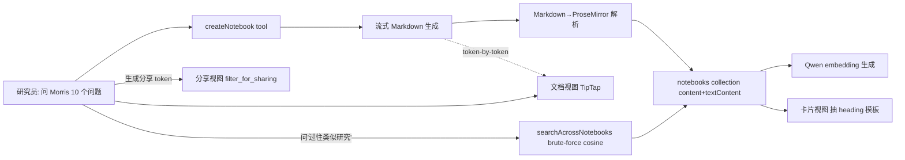

# Design Document — notebooks


> **Footnote (Wave C T17 实施期):** spec 中 R6 / D9 描述的 "share notebook" / "share token" / `filter_for_sharing` / `SHARED_ALLOWLIST` / `Notebook.visibility = "shared"` / `notebook_share_tokens` collection, 在实施时统一重命名为 **publishing** 语义 (`filter_for_publishing` / `PUBLISHED_ALLOWLIST` / `visibility = "published"` / `notebook_publish_tokens`), 以避免与 AGENTS.md scope-guard 中明确禁止的 "team / collaboration sharing" 概念混淆。语义不变 — 仍是 researcher 把 notebook 单向发布给外部受众的只读链接 (类似 publish-to-blog 而非 multi-user collaboration), 不引入第二个用户 / 协作 / 评论 / 权限矩阵。

> Prerequisite: foundation-setup / analysis-report / analysis-report-v2 / morris-agent-hardening 全已落地; ADR-0003 D2 沿用。借鉴 PostHog products/notebooks/ + ee/hogai/tools/create_notebook/, **不作为运行时依赖**。

本设计对应 Spec **notebooks**: 把已 ship 的 Insight 演进为 Notebook(可编辑富文本 + Morris 写 + 跨 study embedding 检索)。

## 1. Overview

落点: contracts insight.ts→notebook.ts; appwrite-schema 加 notebooks collection; apps/web 路由+组件+lib 全 rename+演进; 加 apps/web/lib/notebooks/ 前端模块(tiptap, markdown-to-prose, heading-template, filter-for-sharing); 加 apps/functions/searchAcrossNotebooks/ 新 Function; 加 apps/web/lib/assistant/tools/create-notebook.ts 新 Morris 工具; apps/agent contracts.py 同步。



非目标: 不引入 KernelRuntime / Python 代码块 / DuckSQL; 不引入 ResourceNotebook 关联表; 不做实时多人协作; 不做 Plan mode; 不做 MCP 端点; 不重做 AnalysisReport。

## 2. 借鉴对照表 (PostHog → Merism)

| PostHog 概念 | 来源 | Merism 对应物 | 落地 |
|---|---|---|---|
| `Notebook.short_id` 12 char alphanumeric | `products/notebooks/backend/models.py` | `Notebook.shortId` 同款 | `lib/notebooks/short-id.ts` |
| `content` JSONField (ProseMirror) + `text_content` (mirror) | 同 | `Notebook.content` (string JSON) + `Notebook.textContent` (string fulltext-indexed) | schema |
| ~~`version`~~ | 同上 | **不抄**(D10 Notebook 只读, 无 update 路径) | — |
| `filter_notebook_content_for_sharing` 分享 allow-list | `products/notebooks/backend/util.py` | `filterNotebookContentForSharing` 纯函数 + SHARED_ALLOWLIST | `lib/notebooks/filter-for-sharing.ts` |
| `AssistantTool.CREATE_NOTEBOOK` Max 写 notebook | `ee/hogai/tools/create_notebook/tool.py` | Morris `createNotebook` 工具 | `lib/assistant/tools/create-notebook.ts` |
| Markdown content + `<insight>id</insight>` tag → ProseMirror block | `ee/hogai/tools/create_notebook/parsing.py` | Markdown + `<merism-quote>` 等 tag → ProseMirror node | `lib/notebooks/markdown-to-prose.ts` |
| `NotebookStreamingMixin` token-by-token 流式预览 | `ee/hogai/chat_agent/notebook_streaming.py` | Morris createNotebook 流式 + 前端实时 | AI SDK streamText + 前端增量 parse |
| `content` vs `draft_content` 互斥 | `CreateNotebookToolArgs` | 同: content (流式给用户) / draftContent (AI 草稿) | tool inputSchema 用 zod refine |
| `KernelRuntime` Python sandbox | `products/notebooks/backend/models.py` | ❌ 不抄 | — |
| `ResourceNotebook` 多类资源关联 | 同 | ❌ 不抄 (单 studyId 够) | — |
| Plan mode 写 notebook | `ee/hogai/core/plan_mode/prompts.py` | ❌ 不抄 (已有 TodoWrite) | — |
| MCP `notebooks-create` 端点 | `products/notebooks/mcp/tools.yaml` | ❌ 不抄 (第一阶段) | — |

## 3. 模块边界与文件清单

```
packages/contracts/
  src/notebook.ts                              ← rename from insight.ts; 演进 schema
  src/index.ts                                 ← re-export Notebook 类型
  src/api.ts                                   ← top_insights widget 内部 keep (那是 widget type, 不是 collection)

packages/appwrite-schema/
  src/schema.ts                                ← 加 notebooks collection (旧 insights 保留, 后续 commit 删)

apps/agent/agent/
  contracts.py                                 ← Insight → Notebook Python mirror 同步

apps/web/
  app/notebooks/                               ← rename from insights/
    page.tsx                                   ← 列表
    [shortId]/page.tsx                         ← 详情, route 用 shortId
  app/share/notebook/[token]/page.tsx          ← 第三方分享只读视图 (新)
  components/notebooks/                        ← rename from components/insights/
    notebooks-workbench.tsx                    ← 列表 (rename)
    notebook-detail.tsx                        ← 详情 (rename + 加视图切换按钮)
    card-view.tsx                              ← 卡片视图渲染器 (从 ProseMirror 抽 heading)
    document-view.tsx                          ← 文档视图渲染器 (TipTap 编辑器, 新)
    nodes/                                     ← 8 类 merism-* node 渲染组件 (新)
      merism-quote.tsx
      merism-video-clip.tsx
      merism-theme.tsx
      merism-video-observation.tsx
      merism-insight-link.tsx
      merism-question-stat.tsx
      merism-cross-study-citation.tsx
      merism-session-link.tsx
  lib/notebooks/                               ← 新前端模块
    short-id.ts                                ← 12 char alphanumeric 生成 + 校验
    markdown-to-prose.ts                       ← AI Markdown + <merism-*> tag → ProseMirror JSON 纯函数
    prose-to-markdown.ts                       ← 反向 (导出 / Morris context 注入)
    heading-template.ts                        ← extractCardSections(content) 纯函数 P-NB-02
    filter-for-sharing.ts                      ← filterNotebookContentForSharing(content, allowlist) 纯函数 P-NB-03
    tiptap-extensions.ts                       ← 8 类 merism-* TipTap node spec
    consts.ts                                  ← SHARED_ALLOWLIST / EMBEDDING_MODEL_ID 常量
  lib/actions/notebooks.ts                     ← rename from actions/insights.ts; 加 saveNotebookFromMarkdown
  lib/queries/notebooks.ts                     ← rename from queries/insights.ts
  lib/notebooks.ts                             ← rename from lib/insights.ts (UI 辅助)
  lib/assistant/tools/create-notebook.ts       ← Morris 工具 (新, 借 PostHog AssistantTool.CREATE_NOTEBOOK)
  lib/assistant/tools/search-across-studies.ts ← Morris 工具 (新)

apps/functions/
  searchAcrossNotebooks/                       ← 新 Function (跨 study cosine 检索)
    src/handler.ts
    src/main.ts
    src/embedder-qwen.ts                       ← Qwen DashScope text-embedding-v3 adapter
    src/cosine.ts                              ← 纯函数
    src/deps.ts
    tests/{handler,cosine}.test.ts

tests/properties/notebooks/
  p-nb-01-rename-roundtrip.test.ts
  p-nb-02-heading-template-deterministic.test.ts
  p-nb-03-filter-for-sharing-closure.test.ts
  p-nb-04-embedding-cosine-stability.test.ts

.kiro/specs/notebooks/
  requirements.md / design.md / tasks.md / .config.kiro
```

模块边界严守 AGENTS.md:
- contracts → schema → Function pure core / web 层
- markdown-to-prose / heading-template / filter-for-sharing / cosine 都是**纯函数**, PBT 锁定
- 8 类 node 组件每类独立, 失败回退 placeholder 不影响其他 node

## 4. 契约改动 (contracts-first)

### 4.1 packages/contracts/src/notebook.ts (rename + 演进)

```ts
import { z } from "zod";

// 旧 InsightReport schema 保留作 fallback (旧数据 + Wave A rename 阶段)
export const notebookReportSchema = z.object({
  headline: z.string(),
  directAnswer: z.string(),
  confidence: z.enum(["high", "medium", "low"]),
  confidenceReason: z.string(),
  themes: z.array(z.object({ title: z.string(), analysis: z.string(), quotes: z.array(z.string()) })),
  divergences: z.array(z.object({ group: z.string(), stance: z.string() })),
  actions: z.array(z.object({ priority: z.enum(["P0","P1","P2"]), action: z.string(), rationale: z.string() })),
});
export type NotebookReport = z.infer<typeof notebookReportSchema>;

// 新形态: Notebook 是 Insight 演进版本
export const NotebookVisibilitySchema = z.enum(["internal", "shared"]);

export const NotebookSchema = z.object({
  $id: z.string(),
  studyId: z.string(),
  studyTitle: z.string(),
  shortId: z.string().regex(/^[a-z0-9]{12}$/),    // 12 char alphanumeric, URL 友好
  ownerUserId: z.string(),
  question: z.string(),                            // 研究员的提问 (保留)

  // 新: ProseMirror 文档 + plain-text mirror
  content: z.string().default(""),                 // ProseMirror JSON.stringify; 空 = 旧数据走 report fallback
  textContent: z.string().max(50_000).default(""), // plain mirror, fulltext + embedding 用

  // 卡片视图快速字段 (从 content 抽出冗余存储, 卡片列表查询不展开 content)
  headline: z.string(),
  summary: z.string(),
  confidence: z.enum(["high", "medium", "low"]),
  sampleSize: z.number().int().nonnegative(),

  // 分享相关
  visibility: NotebookVisibilitySchema.default("internal"),

  // 新: embedding (R5 跨 study 检索)
  embedding: z.string().default(""),               // JSON-serialized number[1024]
  embeddingModel: z.string().max(64).default(""),

  // 旧: report 字段保留 nullable, Wave C 完成后 deprecate (新写不再 populate)
  report: notebookReportSchema.nullable().default(null),

  createdAt: z.string().datetime(),
});
export type Notebook = z.infer<typeof NotebookSchema>;
```

### 4.2 packages/contracts/src/api.ts (新增 createNotebook + searchAcrossNotebooks)

```ts
export const CreateNotebookRequestSchema = z.object({
  studyId: z.string(),
  question: z.string().min(1).max(2_000),
  content: z.string().max(100_000).optional(),         // Markdown 字符串
  draftContent: z.string().max(100_000).optional(),    // AI 草稿
  // 注: 不引入 existingNotebookShortId 入参 (D10): 永远 create 新 Notebook,
  // 研究员不满意时让 Morris 重新生成新一份, 旧 Notebook 保留可删。
}).refine(
  (v) => (v.content !== undefined) !== (v.draftContent !== undefined),
  { message: "content 与 draftContent 必须二选一 (互斥)" },
);

export const CreateNotebookResponseSchema = z.object({
  notebookShortId: z.string().regex(/^[a-z0-9]{12}$/),
  // status 永远是 "created" (无 update 路径), 字段保留是为未来扩展不破坏 API
  status: z.literal("created"),
  sectionCount: z.number().int().nonnegative(),
});

export const SearchAcrossNotebooksRequestSchema = z.object({
  query: z.string().min(1).max(500),
  ownerUserId: z.string(),
  studyId: z.string().optional(),                       // 限定到某 study; 不传则跨所有 study
  limit: z.number().int().min(1).max(20).default(5),
});

export const SearchAcrossNotebooksResponseSchema = z.object({
  matches: z.array(z.object({
    notebookShortId: z.string(),
    studyId: z.string(),
    studyTitle: z.string(),
    headline: z.string(),
    snippet: z.string(),
    score: z.number(),
  })),
  fallback: z.enum(["fulltext-only"]).optional(),       // embedding 不可用时的退化标记
});
```

### 4.3 packages/contracts/src/index.ts

```ts
// 旧
export type { Insight, InsightReport } from "./insight.js";
export * from "./insight.js";

// 新 (rename + 演进)
export type { Notebook, NotebookReport, NotebookVisibility } from "./notebook.js";
export * from "./notebook.js";
// Insight 类型保留 alias 让旧 import 不破 (Wave A 末尾 deprecate, Wave F 删除):
export type Insight = Notebook;          // type alias
export const InsightSchema = NotebookSchema;  // const alias
export const insightReportSchema = notebookReportSchema;
```

### 4.4 apps/agent/agent/contracts.py 同步

```python
class Notebook(BaseModel):
    id: str = Field(alias="$id")
    studyId: str
    studyTitle: str
    shortId: str
    ownerUserId: str
    question: str
    content: str
    textContent: str
    headline: str
    summary: str
    confidence: Literal["high","medium","low"]
    sampleSize: int
    visibility: Literal["internal","shared"]
    embedding: str
    embeddingModel: str
    report: NotebookReport | None
    createdAt: str

# 别名让 agent 旧代码不破
Insight = Notebook
```


## 5. Appwrite Schema 改动

### 5.1 新增 notebooks collection

```ts
{
  id: "notebooks",
  name: "Notebook",
  permissions: OWNER_SCOPED,           // 沿用 insights 的 owner-scoped
  documentSecurity: true,
  attributes: [
    { key: "studyId", type: "string", size: 64, required: true },
    { key: "studyTitle", type: "string", size: 400, required: true },
    { key: "shortId", type: "string", size: 12, required: true },
    { key: "ownerUserId", type: "string", size: 64, required: true },
    { key: "question", type: "string", size: 2_000, required: true },

    // 新: ProseMirror content + plain mirror
    { key: "content", type: "string", size: JSON_SIZE, required: false, default: "" },
    { key: "textContent", type: "string", size: 50_000, required: false, default: "" },

    // 卡片视图快速字段
    { key: "headline", type: "string", size: 500, required: true },
    { key: "summary", type: "string", size: 2_000, required: false, default: "" },
    { key: "confidence", type: "enum", elements: ["high","medium","low"], required: true },
    { key: "sampleSize", type: "integer", required: false, default: 0 },

    // 分享
    { key: "visibility", type: "enum", elements: ["internal","shared"], required: false, default: "internal" },

    // embedding
    { key: "embedding", type: "string", size: 16_384, required: false, default: "" }, // 1024 floats JSON ~12KB
    { key: "embeddingModel", type: "string", size: 64, required: false, default: "" },

    // 旧 fallback
    { key: "report", type: "string", size: JSON_SIZE, required: false, default: "" },
  ],
  indexes: [
    { key: "by_owner", type: "key", attributes: ["ownerUserId"] },
    { key: "by_study", type: "key", attributes: ["studyId"] },
    { key: "by_owner_short", type: "unique", attributes: ["ownerUserId","shortId"] },
    { key: "by_text_search", type: "fulltext", attributes: ["textContent"] },
  ],
}
```

### 5.2 旧 insights collection

第一版 schema:apply 后旧 `insights` collection 保留挂着不读 (用户已确认无真实数据), Wave F 末尾单独 commit 删除 + scope-guard 加 forbidden 词避免回流。

### 5.3 notebook_share_tokens collection (R6 分享)

```ts
{
  id: "notebook_share_tokens",
  permissions: [],                     // server-write only via Function
  attributes: [
    { key: "ownerUserId", type: "string", size: 64, required: true },
    { key: "notebookShortId", type: "string", size: 12, required: true },
    { key: "token", type: "string", size: 64, required: true },        // 32-byte random hex
    { key: "expiresAt", type: "datetime", required: true },
    { key: "isRevoked", type: "boolean", required: false, default: false },
    { key: "createdAt", type: "datetime", required: true },
  ],
  indexes: [
    { key: "by_token", type: "unique", attributes: ["token"] },
    { key: "by_notebook", type: "key", attributes: ["notebookShortId"] },
  ],
}
```


## 6. 迁移路径 (insights → notebooks)

用户确认无真实 insights 数据, 简化迁移:

### 6.1 Wave A 阶段 (rename, schema 形态保持等价)

1. `pnpm schema:apply` 创建 `notebooks` collection — **字段集与 insights 完全相同**(不加 content/textContent/shortId/embedding 等新字段, Wave B 才加)。旧 `insights` collection 保留挂着不读, Wave F 末尾删除。
2. contracts: `git mv src/insight.ts src/notebook.ts`(物理删旧文件), 文件内容 `Insight` 全替 `Notebook`; `index.ts` 加 backward-compat alias `export type Insight = Notebook; export const InsightSchema = NotebookSchema; export const insightReportSchema = notebookReportSchema`(让旧 import 暂不破, Wave F 删别名)。
3. apps/web: `git mv app/insights/ app/notebooks/`, `git mv components/insights/ components/notebooks/`, `git mv lib/actions/insights.ts lib/actions/notebooks.ts`, `git mv lib/queries/insights.ts lib/queries/notebooks.ts`, `git mv lib/insights.ts lib/notebooks.ts` —— **全部物理 mv, 不留旧路径占位**, 旧路径如有残留即视为 git mv 失败需修。
4. **路由参数仍是 `[id]` 不改 `[shortId]`**(因 Wave A schema 还没加 shortId 字段, 强行改路由参数会读不到 shortId 报错; Wave B T15 才改)。
5. Python mirror `Insight = Notebook` 别名同。
6. 跑 `pnpm typecheck && pnpm test && pnpm test:properties` 验证, P-NB-01a 跑通。

### 6.2 Wave A 末尾 cleanup (单独 commit, T9 内执行)

7. 此时若 grep 发现还有任何 `Insight*` 命名引用 — 在本 commit 内一并修正成 `Notebook*`。alias 暂保留到 Wave F (避免 contracts 消费方还有遗漏)。
8. (本 spec 的 T46 在 Wave F 才删 contracts alias + 旧 insights collection。)

### 6.3 Wave F 末尾 (清理空 collection)

8. `pnpm schema:apply` 删除 `insights` collection (单独 cleanup commit, 走 destructive flag 显式确认)。
9. scope-guard 加 forbidden pattern `\bInsight\b` 防止回流(白名单 `AnalysisReport.insights` 字段名 / DashboardWidgetType "top_insights" 等正在使用的合法词)。

### 6.4 关于 Notebook.report fallback

- Wave A: rename 完成时 Notebook.report 字段 populated (保留卡片视图渲染)
- Wave C: TipTap 集成完成, 卡片视图改为从 ProseMirror content 抽 heading 段渲染, 不再读 report 字段
- Wave D: Morris createNotebook 写新 notebook 时只 populate content + textContent, 不再 populate report
- Wave F: 单独 commit 把 Notebook.report 字段从 schema + contracts 删除 (旧 notebook 的 report 字段 lazy-clean: 写入新 content 时清空 report)


## 7. TipTap (ProseMirror) 集成

### 7.1 依赖

`apps/web/package.json` 加:
- `@tiptap/react` (React 集成)
- `@tiptap/starter-kit` (paragraph / heading / list / blockquote / codeBlock 等内置 node)
- `@tiptap/pm` (ProseMirror core, 让 starter-kit 共享版本)
- `prosemirror-markdown` (Markdown ↔ ProseMirror 转换)

### 7.2 8 类 merism-* node spec

每类 node 定义:`apps/web/lib/notebooks/tiptap-extensions.ts`:

```ts
import { Node, mergeAttributes } from "@tiptap/core";

// merism-quote
export const MerismQuote = Node.create({
  name: "merism-quote",
  group: "block",
  atom: true,                                // 不可被光标进入, 整体一个 unit
  addAttributes: () => ({
    sessionId: { default: null },
    transcriptId: { default: null },
    segmentIndex: { default: null },
    quote: { default: "" },                  // quote 文本作为 attr 而非 content (atom node)
    themeIds: { default: [] },
  }),
  parseHTML: () => [{ tag: "merism-quote" }],
  renderHTML: ({ HTMLAttributes }) => ["merism-quote", mergeAttributes(HTMLAttributes)],
  addNodeView: () => ReactNodeViewRenderer(MerismQuoteView),
});

// 同模式定义另外 7 类: MerismVideoClip / MerismTheme / MerismVideoObservation /
// MerismInsightLink / MerismQuestionStat / MerismCrossStudyCitation / MerismSessionLink
```

### 7.3 Markdown → ProseMirror 解析 (markdown-to-prose.ts, 纯函数)

```ts
export function markdownToProseMirror(markdown: string): ProseMirrorJSON {
  // 步骤 1: 用 prosemirror-markdown 把基础 Markdown 转成 ProseMirror JSON
  // 步骤 2: 扫 Markdown 中的 <merism-quote ...>...</merism-quote> 等 tag
  // 步骤 3: 替换 tag 节点为对应 merism-* ProseMirror node, attrs 来自 tag 属性
  // 步骤 4: 返回完整 ProseMirror JSON
}
```

### 7.4 卡片视图 (heading-template.ts, P-NB-02 锁定)

```ts
export const HEADING_TEMPLATE = {
  questionH1: 0,                             // 第一个 # 是 question
  coreConclusionH2: "核心结论",
  themesAnalysisH2: "主题分析",
  divergencesH2: "立场分歧",
  actionsH2: "行动建议",
} as const;

export interface CardSections {
  question: string;                          // H1 内容
  headline: string;                          // 核心结论第一句
  directAnswer: string;                      // 核心结论后续
  confidence?: { level: "high"|"medium"|"low"; reason: string };
  themes: Array<{ title: string; analysis: string; quotes: string[] }>;
  divergences: Array<{ group: string; stance: string }>;
  actions: Array<{ priority: "P0"|"P1"|"P2"; action: string; rationale: string }>;
}

export function extractCardSections(content: ProseMirrorJSON): CardSections | null {
  // 找 H1 → question
  // 找 ## 核心结论 → headline + directAnswer (含 confidence pattern 匹配)
  // 找 ## 主题分析 → 每个 ### 是一个 theme
  // 找 ## 立场分歧 → bullet list 解析
  // 找 ## 行动建议 → bullet list with [P0]/[P1]/[P2] prefix 解析
  // 任一段缺 → return null (前端退化为文档视图)
}
```

### 7.5 文档视图 (document-view.tsx) — 只读

研究员在文档视图**只能查看不能编辑**(D10 决策):
- 用 `EditorContent editable={false}` 模式 (Tiptap) 或 `prosemirror-view` 直接渲染
- 完整 ProseMirror 渲染含 paragraph / heading / list / blockquote 等内置 node + 8 类 merism-* node
- 8 类 merism-* node 仍可点击跳转(quote 跳 transcript / video-clip 跳录像 startMs 等)
- **不引入** Tiptap StarterKit 的编辑能力 (slash command / drag handle / 工具栏 / Cmd+S 保存路径)
- 研究员要"修改 notebook" 唯一路径: 跟 Morris 对话让 AI 重新生成新一份(R3.7), 不在文档视图内编辑

### 7.6 Tiptap 依赖最小化

只用 `@tiptap/react` 的 `EditorContent` + 8 类 merism-* node spec(只读路径)。**不引入** `@tiptap/starter-kit` 的编辑工具栏 / 历史 / placeholder 等编辑相关 extension。或者更轻: 直接用 `prosemirror-view` + `prosemirror-model` 渲染 ProseMirror JSON, Tiptap 仅用作 node spec 工具。具体技术选型在 Wave C T17 决定。


## 8. Morris createNotebook 工具

### 8.1 工具定义

`apps/web/lib/assistant/tools/create-notebook.ts`:

```ts
import { tool } from "ai";
import { CreateNotebookRequestSchema } from "@merism/contracts";
import { wrapEnvelope } from "../envelope";
import { saveNotebookFromMarkdown } from "@/lib/server/notebooks";
import { markdownToProseMirror } from "@/lib/notebooks/markdown-to-prose";

export const createNotebookTool = tool({
  description: "Create or update a research Notebook with rich content (Markdown + merism-* tags).",
  inputSchema: CreateNotebookRequestSchema,
  execute: async (input, ctx) => {
    try {
      const markdown = input.content ?? input.draftContent ?? "";
      const isDraft = !!input.draftContent;
      const proseMirror = markdownToProseMirror(markdown);
      const sectionCount = countSectionsByH2(proseMirror);
      const result = await saveNotebookFromMarkdown({
        ownerUserId: ctx.ownerUserId,
        studyId: input.studyId,
        question: input.question,
        markdown,
        proseMirror,
        isDraft,                 // draft 不流式给前端用, 不 visibility 但落 collection 标 draftContent
        // 注: 永远 create 新 Notebook (D10), 不传 existingShortId
      });
      const summary = `Wrote notebook covering ${sectionCount} sections (${isDraft ? "draft" : "live"}).`;
      return wrapEnvelope(summary, {
        notebookShortId: result.shortId,
        sectionCount,
        isDraft,
      });
    } catch (err) {
      return wrapEnvelope("Failed to create notebook.", {
        error: true,
        message: err instanceof Error ? err.message : String(err),
      });
    }
  },
});
```

### 8.2 system prompt 段

`apps/web/lib/assistant/system-prompt.ts` 在 `<rules>` 段加:

```xml
<rule name="create-notebook-for-reports">
When the researcher asks for a report / summary / analysis covering multiple
research questions or substantive findings (whether 1 question or 10), DO NOT
answer with plain text. Call the createNotebook tool with `content` parameter
populated as Markdown. Default Markdown structure:

  # {Researcher question or "Study Analysis"}
  ## 核心结论
  ## 主题分析
    ### Theme 1
    ### Theme 2
  ## 立场分歧
  ## 行动建议

Embed structured citations using these tags (NOT links, NOT plain quotes):
  - <merism-quote sessionId="..." segmentIndex="..." quote="..."/>
  - <merism-video-clip recordingId="..." startMs="..." endMs="..." label="..."/>
  - <merism-theme themeId="..." label="..."/>
  - <merism-video-observation observationId="..."/>
  - <merism-cross-study-citation sourceNotebookShortId="..."/>

Each H2 section answers ONE research question or covers ONE finding. Don't
repeat the same citation across sections.
</rule>
```

### 8.3 流式生成 + 前端实时预览

借 PostHog `NotebookStreamingMixin`:

1. Morris ToolLoopAgent 用 AI SDK 6 `streamText` + `experimental_toolCallStreaming: true`, 让 tool args (含 `content` 字段) token-by-token 流到客户端。
2. 客户端 `apps/web/components/assistant/conversation.tsx` 监听 `onChunk`, 发现 toolCall 是 createNotebook → 把 `content` 增量 append 到一个临时 buffer。
3. 每接到新 chunk 就调 `markdownToProseMirror(buffer)` 解析为 ProseMirror, 渲染到一个 `NotebookPreviewPanel` 组件 (在 conversation 旁边或下方)。
4. tool 调用结束 → 拿到 `notebookShortId` → 跳转 `/notebooks/{shortId}` 或在 conversation 内展示一个"打开 notebook"卡片。

draft 路径: `draftContent` 字段不流式给前端 (只在 envelope artifact 里返回 shortId), 让 AI 能"先写草稿再决定是否 promote"。

### 8.4 PageContext 自动注入

`apps/web/lib/assistant/agent.ts` 的 `prepareStep`:

- 当 `pageContext.surveyId` 存在 (研究员在 study workspace) → createNotebook 工具的 `studyId` 入参默认填 surveyId, 研究员不必手动指定。
- 在全局 `/assistant` 页面 (无 surveyId) → 研究员问"分析一下 study X" → Morris 调 listStudies 找到 X 的 surveyId 再调 createNotebook。


## 9. 跨 study Embedding 检索

### 9.1 Embedding 生成

Wave E 加 `apps/functions/searchAcrossNotebooks/src/embedder-qwen.ts` (与未来 research-context-files 等 spec 共享同款 Qwen embedder, 暂在本 Function 内独立实现):

```ts
import OpenAI from "openai";   // DashScope OpenAI 兼容端点

export async function embedText(text: string): Promise<number[]> {
  const client = new OpenAI({
    apiKey: process.env.DASHSCOPE_API_KEY!,
    baseURL: "https://dashscope.aliyuncs.com/compatible-mode/v1",
  });
  const r = await client.embeddings.create({
    model: "text-embedding-v3",
    input: text,
    dimensions: 1024,
  });
  return r.data[0].embedding;
}
```

**Notebook 写入触发 embedding**:`apps/web/lib/server/notebooks.ts::saveNotebookFromMarkdown` 内, content 写入后同步调一次 embedText(textContent) → 落 `embedding` 字段。content 不变时跳过 (sha256(textContent) 比较)。

### 9.2 brute-force cosine 检索

`apps/functions/searchAcrossNotebooks/src/handler.ts`:

```
searchAcrossNotebooks(input)
 → 1. 校验 input via SearchAcrossNotebooksRequestSchema
 → 2. queryEmbedding = await embedText(input.query)
 → 3. allNotebooks = Database.listDocuments("notebooks", [
        Query.equal("ownerUserId", input.ownerUserId),
        ...(input.studyId ? [Query.equal("studyId", input.studyId)] : []),
        Query.select(["$id","shortId","studyId","studyTitle","headline","summary","embedding"]),
        Query.limit(1000),    // Merism owner 级 notebook 数千级, brute-force OK
      ])
 → 4. for each n: cosine = cosineSimilarity(queryEmbedding, JSON.parse(n.embedding))
 → 5. top input.limit by cosine 降序
 → 6. 每条返回 { notebookShortId, studyId, studyTitle, headline, snippet=summary.slice(0,200), score=cosine }
```

**fallback**: 步骤 2 (query embedding) 或步骤 4 (chunk embeddings 缺失) 失败 → 退化为 `Query.search("textContent", input.query)` fulltext, 返回时附 `fallback: "fulltext-only"`。

### 9.3 cosine.ts 纯函数 (P-NB-04)

```ts
export function cosineSimilarity(a: number[], b: number[]): number {
  if (a.length !== b.length) throw new Error("dim mismatch");
  let dot = 0, na = 0, nb = 0;
  for (let i = 0; i < a.length; i++) {
    dot += a[i] * b[i];
    na += a[i] ** 2;
    nb += b[i] ** 2;
  }
  return dot / (Math.sqrt(na) * Math.sqrt(nb) || 1);
}
```

### 9.4 Morris searchAcrossStudies 工具

`apps/web/lib/assistant/tools/search-across-studies.ts`:

```ts
export const searchAcrossStudiesTool = tool({
  description: "Search the researcher's past notebooks (across all studies) by semantic similarity.",
  inputSchema: SearchAcrossNotebooksRequestSchema.omit({ ownerUserId: true }),
  execute: async (input, ctx) => {
    const result = await searchAcrossNotebooks({ ...input, ownerUserId: ctx.ownerUserId });
    const summary = result.matches.length === 0
      ? "No past notebooks match this query."
      : `Found ${result.matches.length} past notebooks across ${
          new Set(result.matches.map(m => m.studyId)).size
        } studies${result.fallback ? " (fulltext fallback)" : ""}.`;
    return wrapEnvelope(summary, { matches: result.matches });
  },
});
```

system prompt 段 (在 `<rules>` 加):

```xml
<rule name="search-past-research">
When the researcher asks about past or related research (e.g. "have I studied
pricing before?", "what have my users said about X across all my studies?"),
ALWAYS call the searchAcrossStudies tool first. Use the returned matches to
populate <merism-cross-study-citation> tags in any new notebook you create.
</rule>
```


## 10. 关键决策

- **D1 Insight 演进而非新建 Notebook 并存**:严格遵守 AGENTS.md "optimize technology not change purpose"。Insight collection 改名为 notebooks, 旧 InsightReport schema 保留作 fallback (Wave A-C), 完成演进后 Wave F 删除。**不引入跟 Insight 平行的新 collection**。
- **D2 AI 写 Markdown 而非直接构造 ProseMirror JSON**:借 PostHog `create_notebook` 同款。Markdown 字符串对 LLM 友好(字符串接龙生成), `<merism-*>` tag 简单不易出错; 前端 / 后端解析为 ProseMirror。直接让 LLM 输出 ProseMirror JSON 工程上可行但 token 消耗大 + 错误率高 + 流式增量解析复杂。
- **D3 HeadingTemplate 约定让卡片视图无缝兼容**:研究员现有 Insight 卡片 UX 不破坏。AI 默认输出 `# Question / ## 核心结论 / ## 主题分析 / ## 立场分歧 / ## 行动建议` 5 段 → 前端按模板抽段渲染卡片。研究员手工编辑破坏模板 → 自动退化为文档视图。这是兼容老 UX + 解锁新可能的最小破坏路径。
- **D4 8 类 merism-* node 而非沿用 PostHog `ph-*`**:命名要承载 Merism 用例。`merism-quote` / `merism-video-clip` / `merism-theme` 等直接对应 Merism 实体, 不引入 `ph-recording` 等 PostHog 私有命名。
- **D5 流式生成借 PostHog NotebookStreamingMixin 模式**:前端 token-by-token 渲染 Markdown→ProseMirror, 让用户感受到"AI 边写边来"。这是 ChatGPT Canvas / Notion AI 研究员体验的关键差异化, 不能事后塞回文档让研究员等。
- **D6 content vs draftContent 互斥**:借 PostHog `CreateNotebookToolArgs`。content = 立即流式给用户, draftContent = AI 内部"先想再写"草稿 (落 collection 但不流式给前端用户看)。让 Morris 在复杂任务时有"先打草稿再 polish"能力, 不强迫"一次写到底"。
- **D7 brute-force cosine 而非 vector DB**:Merism owner 级 notebook 数千级 (单 owner 5-50 个 study, 每 study 5-30 个 notebook, 上限千级), 单次查询 O(N) 内存计算 ~50ms 内可接受。引入 pgvector / qdrant 引入新 infra, 第一阶段 YAGNI; 等数千级再考虑迁移。
- **D8 Embedding model = Qwen DashScope text-embedding-v3 (1024 维)**:沿用现有 DashScope key 体系 (与 Qwen ASR/TTS 同 vendor), 不引入新 provider 凭据。1024 维是 brute-force cosine 的 sweet spot。中文表现好 (C-MTEB top 5)。
- **D9 SHARED_ALLOWLIST 默认含业务卡片排除 PII**:`merism-quote` / `merism-theme` / `merism-question-stat` / `merism-cross-study-citation` 默认在 allowlist; `merism-video-clip` / `merism-session-link` / `merism-video-observation` / `merism-insight-link` 默认剥(含受访者 PII / 跨内部链接)。研究员可在分享时调整。
- **D10 Notebook 只读 + 不满意就重新生成新一份(无 update 路径)**:Notebook 一旦由 Morris 创建就**完全不可手工编辑**(卡片视图与文档视图都只读)。研究员要"修改" → 跟 Morris 对话让 AI 重新生成**一份全新 Notebook**(新 shortId / 新 createdAt), 旧 Notebook 仍保留在 collection, 研究员可在 `/notebooks` 列表删除。这跟 ChatGPT Canvas / Claude Artifacts 是一类产品形态 — AI 写的文档就是 AI 产物, 用户通过对话调整, 不混合手工编辑。**连锁简化**: 删 `Notebook.version` / `lastModifiedAt` / `lastModifiedBy` 字段(永远 ≡ createdAt, owner); 删 `existingNotebookShortId` 入参(无 update 路径); 不引入 Tiptap 编辑工具栏 / slash command / drag handle / 多 tab 冲突检测; Wave C 工作量大幅降低; B2 (slash command picker UX) 修订项自动消失。这是最简最严的"AI-mediated document" 范式。
- **D11 不做 MCP 端点**: 第一阶段不暴露 createNotebook 给外部 agent。等 Merism 作为平台对外开放时再加 MCP, 届时统一加授权 + 限流 + audit log。
- **D12 不做 Plan mode (PostHog 用 notebook 做规划)**: morris-agent-hardening 已有 TodoWrite 工具承载"多步任务计划", 不再加 Plan-mode-as-notebook 平行能力。

## 11. Correctness Properties (本 Spec 拥有)

- **P-NB-01a** `tests/properties/notebooks/p-nb-01a-rename-equivalent.test.ts` (Wave A 末尾跑): fast-check 生成任意旧 Insight document → Wave A 字面 rename 后 schema 形态等价 → 字段一一映射(headline / themes / divergences / actions / report 全部一致, 不丢)。
- **P-NB-01b** `tests/properties/notebooks/p-nb-01b-fallback-defaults.test.ts` (Wave B 末尾跑): fast-check 生成任意 Wave A 阶段 Notebook(无 shortId / content / textContent / embedding 字段) → Wave B schema 演进后用默认值 fallback 读出 + NotebookSchema.parse 通过 + 后端 lazy 补 shortId 路径走通。
- **P-NB-02** `tests/properties/notebooks/p-nb-02-heading-template-deterministic.test.ts`: fast-check 生成任意符合 HeadingTemplate 的 Markdown → markdownToProseMirror → extractCardSections → 解析成 CardSections 结构, 多次调用结果完全相等 (deterministic); 对故意打破模板的 Markdown(缺 `## 主题分析` 段 / heading 顺序乱) → extractCardSections 返回 null。
- **P-NB-03** `tests/properties/notebooks/p-nb-03-filter-for-sharing-closure.test.ts`: fast-check 生成任意 ProseMirror content + allowlist → filterNotebookContentForSharing 输出: (a) 不在 allowlist 中的 merism-* node 被剥到只剩 type (无 attrs/content); (b) ProseMirror 内置 node (paragraph/heading/list 等) 不被影响; (c) 幂等 filter(filter(c)) === filter(c)。
- **P-NB-04** `tests/properties/notebooks/p-nb-04-embedding-cosine-stability.test.ts`: 对 mock Qwen embedder 注入确定性向量, 验证 (a) 同 textContent 多次 embed 后 cosine ≥ 0.99 (允许浮点抖动); (b) 不同 textContent cosine < 0.5 (向量空间合理); (c) 跨 N 个 notebook 的 cosine 排序 deterministic, 同输入多次调用顺序完全相等。

普通单测:
- `lib/notebooks/short-id.test.ts`: 12 char alphanumeric / 唯一性 / 校验
- `lib/notebooks/markdown-to-prose.test.ts`: 基础 Markdown / 各类 merism-* tag / 嵌套 / 边界
- `lib/notebooks/heading-template.test.ts`: 5 段完整 / 缺 1 段 / heading 顺序乱 / 多 H1
- `lib/notebooks/filter-for-sharing.test.ts`: 各 allowlist / 嵌套 node / paragraph 不动
- `apps/functions/searchAcrossNotebooks/tests/handler.test.ts`: ownership / studyId 过滤 / cosine 排序 / fallback
- `apps/web/lib/assistant/__tests__/create-notebook.test.ts`: tool 调用 / Markdown 解析失败处理 / draft 路径

端到端 (轻): 本地 stack 上 schema:apply → 创建 study → 问 Morris → Morris 调 createNotebook 流式 → 落 notebooks collection → 切到文档视图编辑 → 保存 → 跨 study 检索能找到。

## 12. 实施顺序

按"契约 → schema → rename → schema 演进 → TipTap → Morris → embedding → 验证" 分波次:

```
A 契约 + Schema + Rename (Insight → Notebook 字面替换)
   ↓
B Schema 演进 (加 content / textContent / shortId / visibility / embedding 字段)
   ↓
C TipTap 集成 (8 类 merism-* node + 卡片视图 + 文档视图)
   ↓
D Morris createNotebook 工具 + 流式生成 + system prompt 段
   ↓
E Embedding 生成 + 跨 study 检索 + searchAcrossStudies 工具
   ↓
F 验证 (P-NB-01..04 + 全量绿) + cleanup (删旧 Insight 别名 + 删 insights collection)
```

详见 `tasks.md`。每波次完成跑 `pnpm typecheck && pnpm test && pnpm test:properties` 三件套, 全绿才入下一波。

