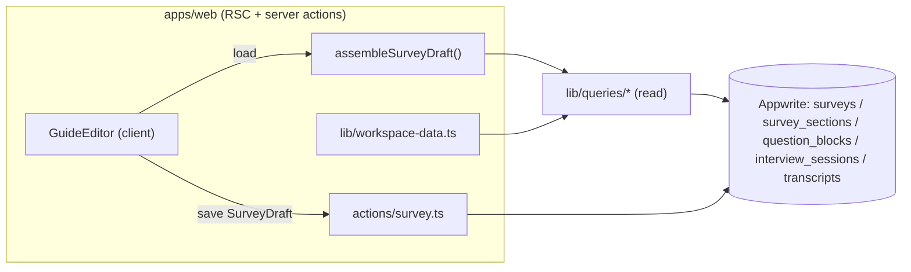

# Design Document — survey-editor

> Prerequisite: `foundation-setup/design.md §Components and Interfaces` 与 §Data Models；`analysis-report/design.md`（已落地的 `apps/web/lib/queries/*` 读出层与 ownership 模式）；`.kiro/steering/design-system.md`（Mauve Quiet）。

本设计对应 Spec **survey-editor**。UI 已在 `feat/studies-workspace` 分支落地；本文档只展开**数据层迁移与契约收敛**如何落到契约、读写层、schema、权限与测试。

## 1. Overview

把"调研编辑器 + 工作台"从 Drizzle/Postgres + mock 迁到 Appwrite：

1. 契约：编辑态唯一真源 = `@merism/contracts` `SurveyDraft`（本 Spec 给问题加 `allowSkip`）。
2. 读：复用 analysis-report 落地的 read layer `getStudy(ownerUserId, surveyId)`，新增一个纯函数把 `{survey, sections, questions}` 组装为 `SurveyDraft`。
3. 写：新增 server actions 把 `SurveyDraft` 规范化落三个 collection。
4. 工作台只读视图：`lib/workspace-data.ts` seam 接 read layer，带 mock 回退。
5. 退役 Drizzle。

非目标：UI 重做、skip 运行时语义、受访者门户、screener/招募后端。

## 2. 数据流



## 3. 契约改动（contracts-first）

`packages/contracts/src/api.ts`：

```ts
export const SurveyDraftQuestionSchema = z.object({
  questionText: z.string().min(1),
  questionType: StudyQuestionTypeSchema,
  probeLevel: StudyProbeLevelSchema.default("standard"),
  probeInstruction: z.string().default(""),
  options: z.array(z.string().min(1)).default([]),
  allowSkip: z.boolean().default(false), // 新增
  stimulus: StimulusSchema.optional(),
}).superRefine(/* 选项校验不变 */);
```

影响面与处理：
- `buildInterviewRuntimeStudy` / `buildInterviewWorkflowConfigFromDraft`：`allowSkip` 暂不进运行时配置（运行时消费属 `ai-interview-engine`），仅透传或忽略；保持 `pnpm typecheck` 绿。
- `apps/agent/agent/contracts.py`：若镜像了 draft question，则同步加 `allow_skip`（字段名对齐）；否则不动。
- `apps/web/lib/guide.ts`：删除与契约重复的 `QUESTION_TYPES`/`ProbeLevel`/`guide*Schema`，保留**纯编辑态辅助**（本地 id 工厂 `localId`、`emptyQuestion`/`emptySection`、`countQuestions`、`normalizeGuide`），其类型改为引用 `@merism/contracts`。

> `lib/guide.ts` 的 `QUESTION_TYPE_LABELS`/`PROBE_LEVEL_LABELS`/`STATUS_LABELS` 是 UI 文案映射（非契约），保留在 web 侧。

## 4. 编辑器读路径

新增纯函数（可单测，无 SDK）：

```ts
// apps/web/lib/survey-draft.ts
export function assembleSurveyDraft(
  survey: Survey,
  sections: SurveySection[],
  questions: QuestionBlock[],
): SurveyDraft
```

- 按 `section.order` 排序 sections；按 `question.orderInSection` 排序每节问题。
- `Survey.flowConfig` 存 draft 级 meta（`researchGoal`/`targetAudience`/`introScript`）——见 §6 决策。
- `QuestionBlock.type → questionType`，`probeConfig.level/instruction → probeLevel/probeInstruction`，`config.options → options`，`config.allowSkip → allowSkip`，`stimulus` 直传。
- 编辑器入口（`app/studies/[id]/guide/page.tsx` + `layout.tsx`）改为：`getCurrentUserId()` → `getStudy(ownerUserId, id)` → `assembleSurveyDraft(...)`；null 时渲染未授权/空态。

`GuideEditor` 的 props 从 `StudyDetail` 改为 `{ surveyId: string; draft: SurveyDraft }`，内部状态用 draft + 本地 id（挂载时由 `localId` 补一次，保存时剥除）。

## 5. 编辑器写路径

```
apps/web/lib/actions/survey.ts   ("use server")
  createSurvey(title): Promise<string>            // 建 surveys 文档（ownerUserId=当前用户）
  saveSurveyDraft(surveyId, draft): Promise<void> // 规范化落三表 + version++
  updateSurveyStatus(surveyId, status)
  deleteSurvey(surveyId)
```

- 边界用 `SurveyDraftSchema.parse` 校验；失败抛具名错误（不产生副作用）。
- 每个 action 先 `getCurrentUserId()`，再用 read layer 校验 survey 属当前用户（与 `lib/queries` 同一 ownership 闸门），否则拒绝（P-SEC-04）。
- 规范化写：以 `surveyId` 为根，**全量替换**该 survey 的 sections/questions（先列出旧 doc → 删 → 按 draft 顺序建新 doc，`order`/`orderInSection` 由数组下标决定）。全量替换避免 diff 复杂度，配合 P-DATA-01 往返测试。
- 写权限：sections/questions 文档权限只授予 owner 的研究员角色；匿名角色无写（schema permissions，见 §7）。
- 复用 `@merism/observability` 的 `withErrorBoundary`/`createLogger`/`traceId`；回滚为 best-effort（建 survey 成功但写 section 失败 → 删除刚建的 survey）。

## 6. 关键决策

- **D1 meta 存哪**：`researchGoal/targetAudience/introScript` 存 `Survey.flowConfig`（json），不新增列。理由：契约里它们属 draft 顶层而非分节/问题；`flowConfig` 已是 json 自由位；避免改 schema attributes。
- **D2 全量替换 vs 增量 diff**：保存时全量替换 sections/questions。理由：编辑器是小规模文档（数十题），全量替换实现简单且天然满足往返无损（P-DATA-01）；增量 diff 收益不抵复杂度。
- **D3 本地 id 不持久化**：拖拽/React key 用的 `localId` 仅内存；持久层用 Appwrite `$id` + `order`。读时不依赖旧 id。
- **D4 工作台只读 seam 回退**：任一 Appwrite 读在未配置/未登录/空结果时回退 mock，保证本地开发与演示不依赖 stack。
- **D5 status 取值**：编辑器用 `draft|live|closed`（现 UI 文案），映射到 Appwrite `SurveyStatus`（`draft|published|archived`）：live↔published、closed↔archived。映射集中在 write/read 层一处。

## 7. Appwrite schema / 权限

`@merism/appwrite-schema`：确认 `surveys` / `survey_sections` / `question_blocks` 的 attributes 覆盖 §4 映射所需字段（`question_blocks.config` 容纳 `options`/`allowSkip`；`probeConfig` 已在契约）。索引：`survey_sections.surveyId`、`question_blocks.surveyId`（read layer 已按其查询）。权限：三表写权限仅授予研究员（owner），匿名角色无任何写、无跨用户读。`apply` 保持幂等非破坏。

## 8. 工作台只读视图映射

`lib/workspace-data.ts` 各 loader 改为"试 Appwrite，失败/空回退 mock"：
- `loadStudyOverview`：`countCompletedSessions` + `listSessions` 取最近 N，`InterviewSession.state` → `SessionDisplayStatus`（`completed`；`in_progress`；其余→`incomplete`），`startedAt` 格式化为 `datetime`。
- `loadStudyResults`：`listSessions` → 行；答案列来自 `collectedAnswers`（按该 survey 的问题顺序取值），`state` 映射同上。
- `loadStudyTranscript`：按 `sessionId` 取 `Transcript.segments`（speaker→`interviewer|respondent`，text，按问题边界打 `questionTag`），AI 摘要取该 session 的 `AnalysisReport.insights`/summary（若有）。
- 回退判定：捕获 `appwrite_not_configured`、`getCurrentUserId()===null`、空结果 → 返回 `getMock*`。

## 9. 退役 Drizzle

迁移并验证后：删除 `apps/web/lib/db/*`、`apps/web/lib/actions/studies.ts`、`apps/web/lib/actions/guide-ai.ts`（AI 生成提纲若保留，迁为调用 DeepSeek 的 server action，产出 `SurveyDraft`），`lib/guide.ts` 收敛为纯编辑态辅助。从 `apps/web/package.json` 移除 `drizzle-orm`/`pg`/`@types/pg`，刷新 `pnpm-lock.yaml`。`app/page.tsx`/`lib/mock-session.ts` 等历史预览不在本 Spec 范围（见 AGENTS.md 已知漂移）。

## 10. Correctness Properties

- **P-DATA-01**（`tests/properties/survey-editor/draft-roundtrip.test.ts`）：fast-check 生成合法 `SurveyDraft` → `saveSurveyDraft` →（内存 Deps 模拟三表）→ `assembleSurveyDraft` → 与原 draft 语义等价。
- **P-SEC-04**（`tests/properties/survey-editor/owner-scope.test.ts`）：对随机 `ownerUserId`/`surveyId` 组合，非属主的读写一律空/拒绝。

二者均以纯函数 + 内存 Deps 测，不依赖 live stack；端到端再在 stack 上以 `smoke` 验证。

## 11. 实施顺序

见 `tasks.md`。总原则：契约先行 → 读路径 → 写路径 → 只读视图接线 → 退役 Drizzle → 验证。每步保持 `pnpm typecheck` 绿，可独立提交与回退。
