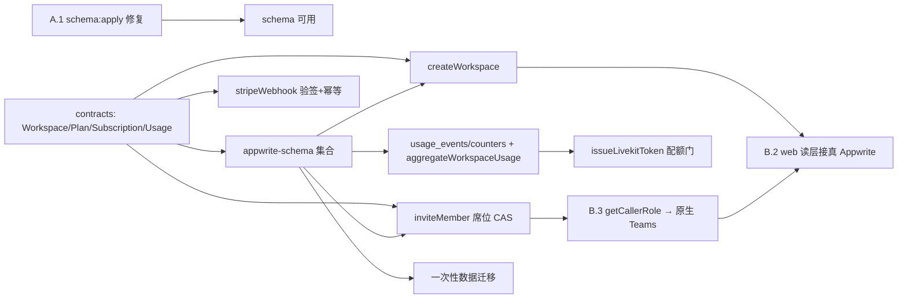

# Implementation Plan — workspaces-billing

## Introduction

> **状态（2026-06-12）**：契约 / schema / Functions 形态 + 席位上限 + 三角色 + 租户隔离 + web 读层 已落地。本批收口完成 **A.1（schema:apply 阻断）、B.3（成员真相源统一原生 Teams）、B.2（web 读层接真 Appwrite）**。剩余为 Stripe 端到端、用量聚合/配额门全链路、数据迁移、fake-provider 前置——形状就位，端到端接线为后续波次。

本任务清单对应 Spec **workspaces-billing**（ADR-0006 落地）。每个任务标注 `Validates: FR-N`。实现遵守 `architecture.md` 跨模块次序（contracts → schema → functions → agent → web，单 PR 一个内聚切片）与 `pre-implementation.md` no-MVP（每切片同 PR 带错误路径 + property + 回滚）。

## 依赖图

## 已完成

- [x] **C. 契约**：Workspace / WorkspaceMembership(role) / Plan / Subscription / UsageEvent / QuotaState；既有实体加 `workspaceId` + `authorId`；`hardCeilingFor` 等纯谓词。`Validates: FR-1,FR-5`
- [x] **SC. Appwrite schema**：`plans` / `subscriptions` / `workspace_quota` / `workspace_memberships`(席位台账) / usage 集合，团队读权限。`Validates: FR-5,FR-7`
- [x] **F1. createWorkspace**：建 Team + owner membership + seed subscription(trial) + quota；纯核 + deps。`Validates: FR-1,FR-2`
- [x] **F2. inviteMember 席位上限**：确定性 id CAS；handler + P-WB-01 deps-agnostic。`Validates: FR-4`
- [x] **租户隔离（ADR-0006 B 迁移）**：team-read/author-write 文档权限 + session-client 读层；live stack e2e 证明跨工作区读为空。`Validates: FR-3`
- [x] **A.1 schema:apply 阻断修复**：去掉 `morris_memories.metadataKeys` 数组属性的 default；`schema:apply OK` 已 live 验证。(commit `adfba26`)
- [x] **B.3 成员真相源统一原生 Teams**：`inviteMember.getCallerRole` 改读 `teams.listMemberships`；`createInvite` 返回真 Team membership id；`workspace_memberships` 降级为纯席位 CAS 台账。(commit `cfb3747`) `Validates: FR-1,FR-2`
- [x] **B.2 web 读层接真 Appwrite**：`loadWorkspaceMembers`(Teams) + `loadBilling`(subscriptions+quota+plans) 去 mock；无 workspace 给真单人视图；仅 404 降级；live stack 验证。(commit `a6530d5`) `Validates: FR-8`

## 待办（后续波次，形状就位 / 端到端接线）

- [x] **SEED. plans 目录播种**：`scripts/seed-plans.ts` 幂等 seed Plus(included=50, features=[core]) / Pro(included=200, features=[core,visual_analysis,survey_rollup])，priceRef 占位（STRIPE_PRICE_* 可覆盖）。已在 dev stack 跑通；账单页 `includedInterviews` 现走真值 fallback。`Validates: FR-5`
- [x] **QG-wire. checkQuota 已注入（核对）**：`issueLivekitToken` main.ts `createRealDeps()` 返回的 deps 含 `checkQuota`，handler 在 link 有 workspaceId 时调用 → 端到端配额阻断闭环已通。`Validates: FR-7`
- [ ] **ST. stripeWebhook 端到端**：真实验签 + 重放幂等 + 订阅状态同步；Checkout/Portal 接线；密钥按 errors-and-observability 处理。`Validates: FR-6` `Property: webhook 验签幂等`
- [x] **US-capture. 会话完成 emit 幂等 UsageEvent**：supervisor 在 `complete_session` 后按时长(>=60s wall-clock)+ 实质回答数(>=1)调 `emit_usage_event`；repo 经 `resolve_survey_tenancy` 取 workspaceId(无则跳过)，确定性 id `ue_<sessionId>` create(409=已计费,幂等)。`isBillableInterview` + `UsageEvent` 已 mirror 到 `agent/contracts.py`;+5 py 测试。`Validates: FR-6` `Property: P-WB-02(每会话至多一次)`
- [x] **QG. issueLivekitToken 配额门（已存在）**：link 有 workspaceId 且 `checkQuota` 接入时 `quotaState==="over"` 返回 402 `quota_exceeded`，不动既有数据。`Validates: FR-7`
- [x] **US-aggregate 纯核（已存在）**：`aggregateWorkspaceUsage.deriveUsageRollup` 把周期完成数 + 套餐额度算成 UsageCounter + QuotaState（degrade-never-delete）。`Validates: FR-7`
- [x] **US-aggregate 内部链路（已存在 + e2e 验证）**：`aggregateWorkspaceUsage` 纯核 + `createRealDeps` 真扫 `usage_events`（按 workspace + 当月 occurredAt 计 `res.total`）写 `usage_counters` + `workspace_quota`，scheduled main.ts 入口。live e2e 已证：3 个 usage_events → 聚合 → `quota.usedInterviews=3 / includedInterviews=50（来自 seeded plus）/ state=ok`。`deriveUsageRollup` 纯核 + handler.test 覆盖 over 态。`Validates: FR-7`
- [ ] **US-wire. CRON 调度声明 + Stripe metered 上报**：aggregateWorkspaceUsage 的 Appwrite CRON schedule 声明（部署配置，非代码）+ M5 的 Stripe metered/invoice-item 上报。`Validates: FR-6`
- [x] **MIG. 一次性数据迁移：现存账号 → 个人默认工作区**（`scripts/migrate-default-workspaces.ts`）。`Validates: FR-1` `NFR-3`
  - **实现**：遍历所有 Appwrite 账号 → `users.listMemberships` 判断已有 Team 则跳过 → 否则建确定性 id `ws_default_<uid>` 的默认 Workspace（Team + owner membership + seat-0 预留行 + trial `subscriptions` + `workspace_quota`，allowance 读 `plans.plus`）。**dry-run 默认，`MIG_APPLY=1` 才写**；确定性 id + 409 幂等；非破坏（只增不删）；可回滚（id 确定可定位清理）；APPLY 时打印"先备份"提示。
  - **与 backfill 的边界**：本脚本只"保证每 owner 有默认 Team"；存量行打标（`workspaceId` + `read(team)`）交给 `scripts/backfill-workspace-tenancy.ts`（它从 seat-0 行解析 owner→ws），脚本末尾提示按序运行。
  - **验证**：dev stack 构造"有 survey 但无 Team 的 owner" → MIG apply + backfill → 默认 Team/sub/quota 已建、survey 带 `workspaceId`+`read(team:ws)`、owner 的 session client 解析出 Team 并读到自己的 survey；二次 apply `provisioned=0`（幂等）。8/8 断言 PASS。
- [ ] **FAKE. MERISM_FAKE_PROVIDERS**：实现确定性 fake **AI provider**(DeepSeek LLM + Qwen ASR/TTS)工厂,解锁 Layer-4 live 集成测试不烧真 key/不依赖网络。**注意:这与 LiveKit 无关**——LiveKit 是实时媒体通道(Docker stack + `--extra realtime`),FAKE 只替换那颗"AI 大脑/耳朵/嘴";语音 live 测试两者都要。与 ai-interview-engine 共享此前置。
- [ ] **SCOPE. scope-guard 收窄复核**：确认 `scope.md` 解禁项已"ADR-0006 治理下在范围"、保留项仍禁；`scope-guard` 豁免与 ADR 范围一致。`NFR-4`
- [ ] **E2E. 端到端 smoke**：本地栈下手工跑通 建工作区 → 邀请 → 成员读共享 → 套餐/账单页 → 完成访谈累计用量 → 超配额挡新访谈，完成后勾选。
